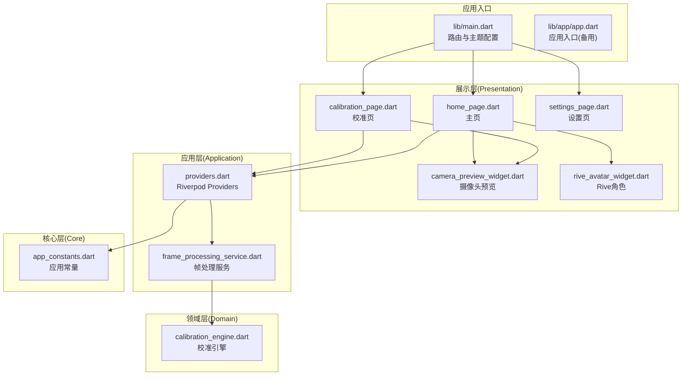
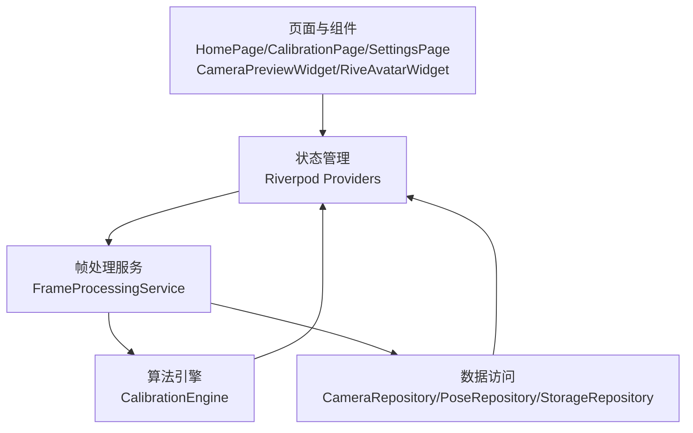
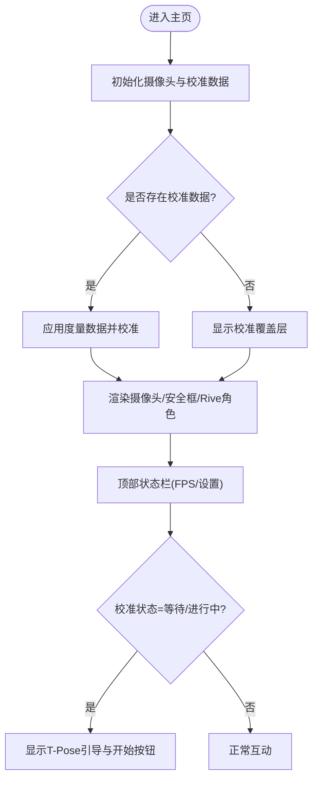
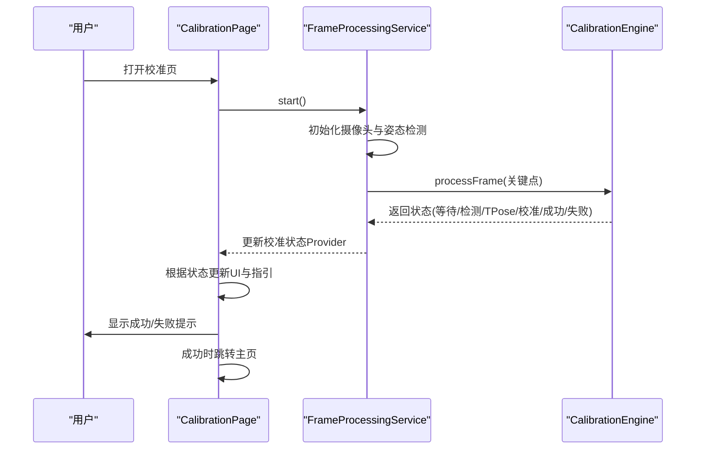
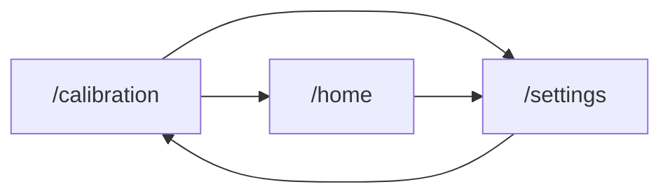
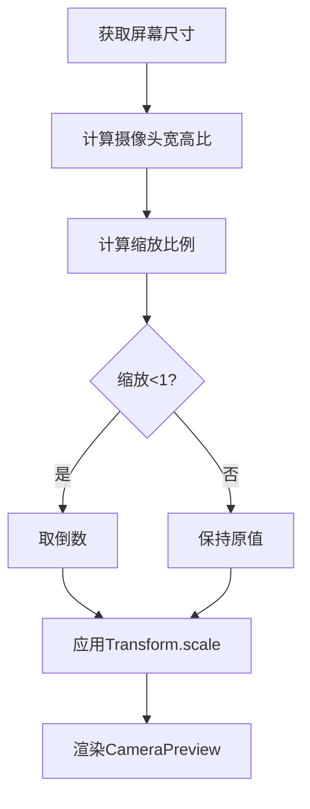
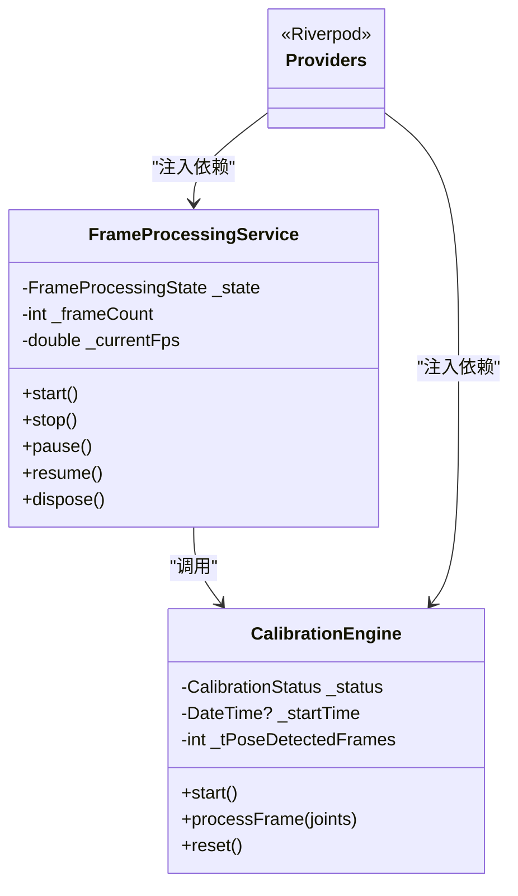
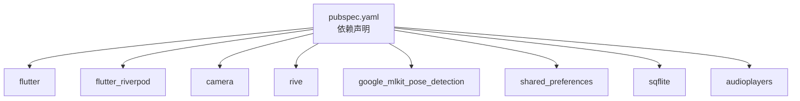

# 主页设计与布局

<cite>
**本文档引用的文件**
- [main.dart](file://lib/main.dart)
- [app.dart](file://lib/app/app.dart)
- [home_page.dart](file://lib/presentation/pages/home_page.dart)
- [calibration_page.dart](file://lib/presentation/pages/calibration_page.dart)
- [settings_page.dart](file://lib/presentation/pages/settings_page.dart)
- [providers.dart](file://lib/application/providers/providers.dart)
- [frame_processing_service.dart](file://lib/application/services/frame_processing_service.dart)
- [calibration_engine.dart](file://lib/domain/engines/calibration/calibration_engine.dart)
- [camera_preview_widget.dart](file://lib/presentation/widgets/camera_preview_widget.dart)
- [rive_avatar_widget.dart](file://lib/presentation/widgets/rive_avatar_widget.dart)
- [app_constants.dart](file://lib/core/constants/app_constants.dart)
- [pubspec.yaml](file://pubspec.yaml)
</cite>

## 目录
1. [引言](#引言)
2. [项目结构](#项目结构)
3. [核心组件](#核心组件)
4. [架构总览](#架构总览)
5. [详细组件分析](#详细组件分析)
6. [依赖关系分析](#依赖关系分析)
7. [性能考虑](#性能考虑)
8. [故障排除指南](#故障排除指南)
9. [结论](#结论)
10. [附录](#附录)

## 引言
本文件面向Mimo项目的主页设计与布局，系统性阐述整体架构、页面布局策略、CalibrationPage校准页面的实现原理与用户交互流程、页面导航与路由管理、响应式布局与跨平台适配、页面状态管理与生命周期、性能优化技巧、组件属性与事件配置、页面间数据传递与状态同步，以及用户体验设计原则与界面一致性保障。

## 项目结构
Mimo采用基于功能域的分层组织：presentation层负责页面与UI组件；application层封装业务服务与Provider；domain层包含算法引擎与实体；data层提供数据访问实现；core层存放通用常量与工具；根目录lib包含入口与平台桥接。

**图表来源**
- [main.dart:11-34](file://lib/main.dart#L11-L34)
- [home_page.dart:1-215](file://lib/presentation/pages/home_page.dart#L1-L215)
- [calibration_page.dart:1-286](file://lib/presentation/pages/calibration_page.dart#L1-L286)
- [settings_page.dart:1-284](file://lib/presentation/pages/settings_page.dart#L1-L284)
- [providers.dart:1-103](file://lib/application/providers/providers.dart#L1-L103)
- [frame_processing_service.dart:1-254](file://lib/application/services/frame_processing_service.dart#L1-L254)
- [calibration_engine.dart:1-302](file://lib/domain/engines/calibration/calibration_engine.dart#L1-L302)
- [camera_preview_widget.dart:1-76](file://lib/presentation/widgets/camera_preview_widget.dart#L1-L76)
- [rive_avatar_widget.dart:1-118](file://lib/presentation/widgets/rive_avatar_widget.dart#L1-L118)
- [app_constants.dart:1-35](file://lib/core/constants/app_constants.dart#L1-L35)

**章节来源**
- [main.dart:11-34](file://lib/main.dart#L11-L34)
- [pubspec.yaml:73-80](file://pubspec.yaml#L73-L80)

## 核心组件
- 路由与主题：应用通过MaterialApp配置初始路由与全局主题，使用Riverpod作为状态管理。
- 页面层：主页、校准页、设置页分别承担实时互动、校准流程与参数配置职责。
- 服务层：帧处理服务连接摄像头、姿态检测与处理管道，驱动UI状态更新。
- 引擎层：校准引擎实现T-Pose检测与人体度量计算。
- 组件层：摄像头预览与Rive角色渲染组件，支持响应式布局与跨平台适配。

**章节来源**
- [main.dart:16-32](file://lib/main.dart#L16-L32)
- [providers.dart:85-103](file://lib/application/providers/providers.dart#L85-L103)
- [frame_processing_service.dart:32-249](file://lib/application/services/frame_processing_service.dart#L32-L249)
- [calibration_engine.dart:62-302](file://lib/domain/engines/calibration/calibration_engine.dart#L62-L302)

## 架构总览
Mimo采用“页面-组件-服务-引擎-数据”的分层架构，页面通过Riverpod订阅Provider状态，服务层协调摄像头与算法引擎，引擎层执行核心算法逻辑，数据层负责持久化与外部集成。

**图表来源**
- [providers.dart:16-83](file://lib/application/providers/providers.dart#L16-L83)
- [frame_processing_service.dart:32-249](file://lib/application/services/frame_processing_service.dart#L32-L249)
- [calibration_engine.dart:62-302](file://lib/domain/engines/calibration/calibration_engine.dart#L62-L302)

## 详细组件分析

### 主页布局与交互策略
- 层叠布局(Stack)：通过Positioned定位摄像头预览、安全框叠加层与Rive角色层，形成多层渲染。
- 响应式高度：底部摄像头区域高度按屏幕高度比例设定，确保不同设备适配。
- 顶部状态栏：包含应用标题、FPS指示器与设置入口，使用SafeArea保证刘海屏安全区域。
- 校准覆盖层：根据校准状态动态显示，指导用户进行T-Pose姿势并触发校准流程。

**图表来源**
- [home_page.dart:24-36](file://lib/presentation/pages/home_page.dart#L24-L36)
- [home_page.dart:42-88](file://lib/presentation/pages/home_page.dart#L42-L88)
- [home_page.dart:90-215](file://lib/presentation/pages/home_page.dart#L90-L215)

**章节来源**
- [home_page.dart:17-88](file://lib/presentation/pages/home_page.dart#L17-L88)

### CalibrationPage校准页面实现原理与用户交互
- 帧处理启动：页面初始化时读取帧处理服务并启动，进入校准状态。
- 状态机驱动：根据校准引擎返回的状态更新UI，包括等待检测、检测到人体、检测到T-Pose、校准中、成功、失败等。
- 用户引导：底部指引文本随状态动态变化，成功后提供“开始互动”按钮跳转主页，失败后提供“重新校准”按钮。
- 实时反馈：顶部显示当前FPS，帮助用户感知性能状况。

**图表来源**
- [calibration_page.dart:31-45](file://lib/presentation/pages/calibration_page.dart#L31-L45)
- [frame_processing_service.dart:109-148](file://lib/application/services/frame_processing_service.dart#L109-L148)
- [calibration_engine.dart:119-176](file://lib/domain/engines/calibration/calibration_engine.dart#L119-L176)

**章节来源**
- [calibration_page.dart:19-112](file://lib/presentation/pages/calibration_page.dart#L19-L112)
- [frame_processing_service.dart:70-88](file://lib/application/services/frame_processing_service.dart#L70-L88)
- [calibration_engine.dart:106-176](file://lib/domain/engines/calibration/calibration_engine.dart#L106-L176)

### 页面导航与路由管理
- 路由配置：应用在MaterialApp中配置初始路由为校准页，并注册主页与设置页路由。
- 导航策略：设置页提供“重新校准”按钮直接跳转校准路由；校准成功后通过替换路由进入主页。
- 主题与外观：统一使用Material3主题，深色主题与种子色配置一致。

**图表来源**
- [main.dart:26-31](file://lib/main.dart#L26-L31)

**章节来源**
- [main.dart:26-31](file://lib/main.dart#L26-L31)

### 响应式布局与跨平台适配
- 布局策略：主页使用Stack与Positioned定位，底部摄像头区域高度按屏幕高度比例设置，确保在不同尺寸设备上保持一致的视觉比例。
- 摄像头适配：摄像头预览组件根据设备宽高比计算缩放比例，使用Transform.scale确保画面完整填充且不裁剪。
- 平台适配：通过pubspec声明多平台支持，assets资源在web、iOS、Android等平台共享。

**图表来源**
- [camera_preview_widget.dart:63-75](file://lib/presentation/widgets/camera_preview_widget.dart#L63-L75)
- [home_page.dart:51-52](file://lib/presentation/pages/home_page.dart#L51-L52)

**章节来源**
- [camera_preview_widget.dart:63-75](file://lib/presentation/widgets/camera_preview_widget.dart#L63-L75)
- [home_page.dart:44-71](file://lib/presentation/pages/home_page.dart#L44-L71)

### 页面状态管理、生命周期与性能优化
- 状态管理：使用Riverpod Provider管理摄像头、姿态检测、归一化、运动学、滤波、性能调度、角度计算、校准引擎、校准状态、人体度量、追踪状态与FPS等状态。
- 生命周期：页面在initState中初始化摄像头与校准数据；组件在dispose中释放资源；帧处理服务在停止时取消订阅与释放资源。
- 性能优化：帧处理服务内置FPS统计与更新；校准引擎通过阈值与帧数控制提升稳定性；设置页提供高性能模式与目标FPS调节。

**图表来源**
- [frame_processing_service.dart:32-249](file://lib/application/services/frame_processing_service.dart#L32-L249)
- [calibration_engine.dart:62-302](file://lib/domain/engines/calibration/calibration_engine.dart#L62-L302)
- [providers.dart:16-83](file://lib/application/providers/providers.dart#L16-L83)

**章节来源**
- [providers.dart:85-103](file://lib/application/providers/providers.dart#L85-L103)
- [frame_processing_service.dart:46-95](file://lib/application/services/frame_processing_service.dart#L46-L95)
- [settings_page.dart:135-143](file://lib/presentation/pages/settings_page.dart#L135-L143)

### 组件属性配置、事件处理与自定义选项
- 摄像头预览组件：暴露初始化、缩放计算与资源释放接口，支持错误处理与加载指示。
- Rive角色组件：提供骨架控制器抽象，支持关节角度设置、动画触发与表情控制，便于扩展真实Rive集成。
- 设置页组件：提供滑块与开关控件，支持参数范围与描述文案配置，保存至存储仓库并可触发引擎重建。

**章节来源**
- [camera_preview_widget.dart:15-76](file://lib/presentation/widgets/camera_preview_widget.dart#L15-L76)
- [rive_avatar_widget.dart:10-71](file://lib/presentation/widgets/rive_avatar_widget.dart#L10-L71)
- [settings_page.dart:190-283](file://lib/presentation/pages/settings_page.dart#L190-L283)

### 页面间数据传递与状态同步
- 路由跳转：校准成功后通过路由替换进入主页，避免返回栈冗余。
- 状态同步：校准成功后将人体度量写入Provider并触发归一化引擎校准，随后在主页监听状态变化以渲染角色与安全框。
- 数据持久化：校准数据保存至存储仓库，应用启动时自动加载并应用。

**章节来源**
- [calibration_page.dart:248-257](file://lib/presentation/pages/calibration_page.dart#L248-L257)
- [home_page.dart:24-36](file://lib/presentation/pages/home_page.dart#L24-L36)
- [frame_processing_service.dart:156-166](file://lib/application/services/frame_processing_service.dart#L156-L166)

## 依赖关系分析
- 外部依赖：Flutter SDK、Riverpod、camera、rive、google_mlkit_pose_detection、shared_preferences、sqflite、audioplayers等。
- 内部依赖：页面依赖Provider与服务层；服务层依赖引擎与数据访问；引擎依赖常量与实体。

**图表来源**
- [pubspec.yaml:30-60](file://pubspec.yaml#L30-L60)

**章节来源**
- [pubspec.yaml:30-60](file://pubspec.yaml#L30-L60)

## 性能考虑
- 目标帧率：应用常量定义目标FPS与最低帧率，建议在设置页启用高性能模式并调整目标FPS以平衡流畅度与功耗。
- 帧率监控：帧处理服务每秒统计一次FPS并更新Provider，页面可据此提示用户。
- 降级策略：当温度或性能指标达到阈值时，可考虑降低目标FPS或启用低性能模式。
- 资源释放：页面与组件在dispose中及时释放摄像头与服务资源，避免内存泄漏。

**章节来源**
- [app_constants.dart:11-14](file://lib/core/constants/app_constants.dart#L11-L14)
- [frame_processing_service.dart:231-241](file://lib/application/services/frame_processing_service.dart#L231-L241)
- [settings_page.dart:129-143](file://lib/presentation/pages/settings_page.dart#L129-L143)

## 故障排除指南
- 摄像头初始化失败：检查权限与设备可用性，查看日志输出并确认初始化流程。
- 校准失败：确保光线充足、全身可见，维持T-Pose稳定，超过超时时间会自动失败。
- FPS过低：降低目标FPS或关闭高性能模式，检查设备负载情况。
- 路由异常：确认路由表配置与命名正确，避免重复跳转导致的栈溢出。

**章节来源**
- [frame_processing_service.dart:85-87](file://lib/application/services/frame_processing_service.dart#L85-L87)
- [calibration_engine.dart:124-132](file://lib/domain/engines/calibration/calibration_engine.dart#L124-L132)
- [main.dart:26-31](file://lib/main.dart#L26-L31)

## 结论
Mimo主页与校准页通过清晰的分层架构与Riverpod状态管理实现了稳定的实时互动体验。主页采用多层堆叠布局与响应式适配，校准页通过状态机驱动与用户引导确保高成功率。配合帧处理服务与算法引擎，系统在多平台环境下具备良好的可维护性与扩展性。

## 附录
- 设计原则：一致性、可发现性、反馈及时性、容错性。
- 界面一致性：统一颜色体系、字体与间距规范，确保跨页面风格一致。
- 可访问性：提供足够的对比度与触控目标尺寸，支持深色主题。