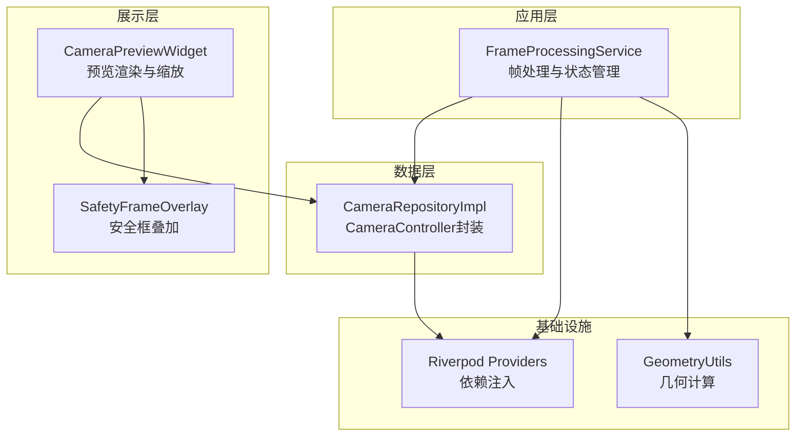
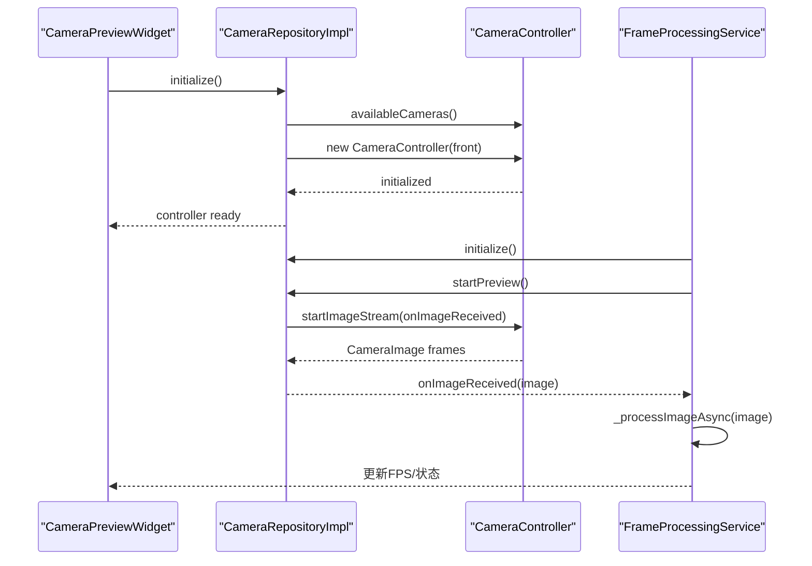
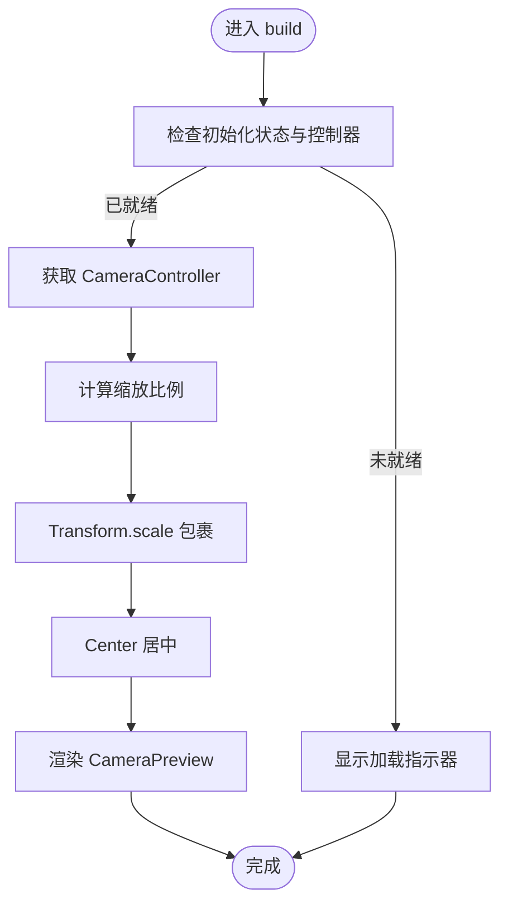
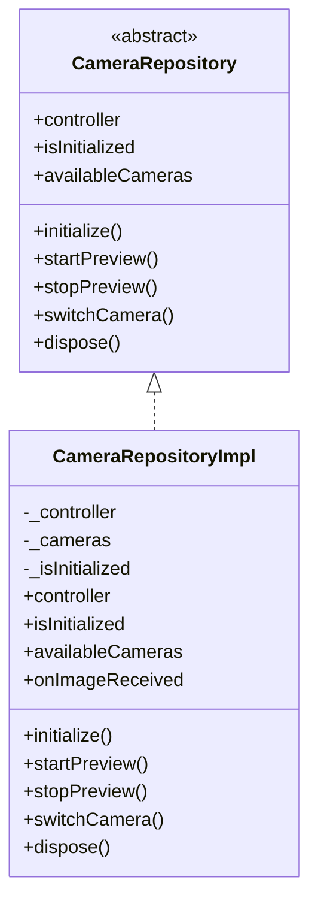
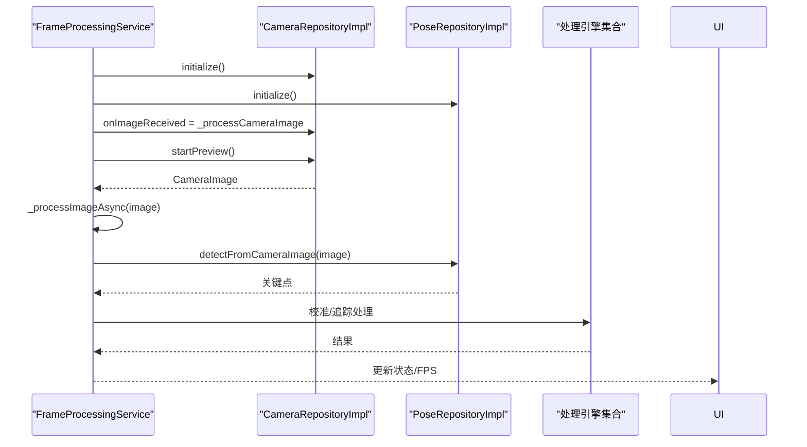
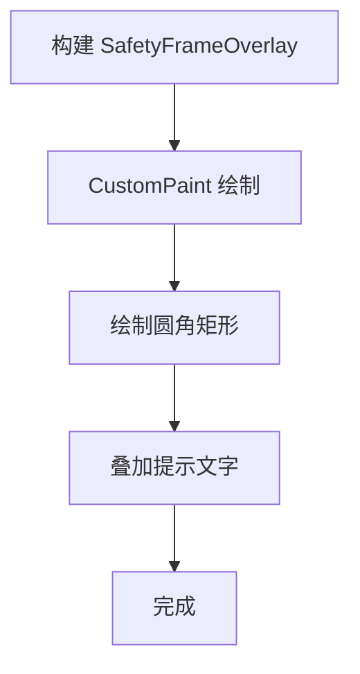
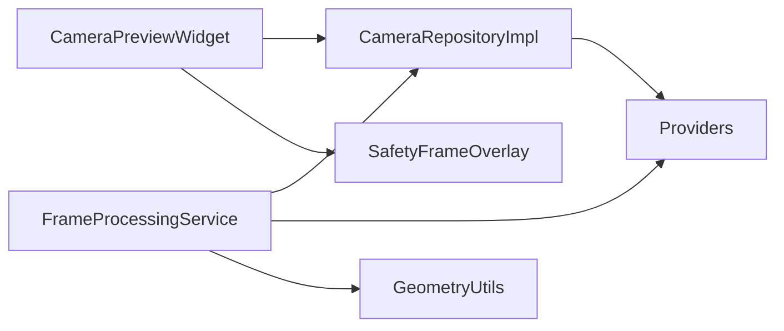

# 摄像头预览组件

<cite>
**本文引用的文件**
- [lib/presentation/widgets/camera_preview_widget.dart](file://lib/presentation/widgets/camera_preview_widget.dart)
- [lib/data/repositories_impl/camera_repository_impl.dart](file://lib/data/repositories_impl/camera_repository_impl.dart)
- [lib/domain/repositories/camera_repository.dart](file://lib/domain/repositories/camera_repository.dart)
- [lib/application/providers/providers.dart](file://lib/application/providers/providers.dart)
- [lib/presentation/widgets/safety_frame_overlay.dart](file://lib/presentation/widgets/safety_frame_overlay.dart)
- [lib/application/services/frame_processing_service.dart](file://lib/application/services/frame_processing_service.dart)
- [lib/core/utils/geometry_utils.dart](file://lib/core/utils/geometry_utils.dart)
- [lib/main.dart](file://lib/main.dart)
</cite>

## 目录
1. [简介](#简介)
2. [项目结构](#项目结构)
3. [核心组件](#核心组件)
4. [架构总览](#架构总览)
5. [详细组件分析](#详细组件分析)
6. [依赖关系分析](#依赖关系分析)
7. [性能考虑](#性能考虑)
8. [故障排查指南](#故障排查指南)
9. [结论](#结论)
10. [附录](#附录)

## 简介
本文件针对 Mimo 项目中的“摄像头预览组件”进行系统化技术文档整理，重点覆盖以下方面：
- 技术架构与实现原理：基于 Flutter Riverpod 的状态与依赖注入，结合 camera 插件的预览流控制。
- 权限管理、设备检测与预览流处理：初始化摄像头、选择前置摄像头、启动预览流、切换摄像头等。
- 渲染优化与性能调优：缩放适配、裁剪与居中、异步图像处理与 FPS 统计。
- 安全框叠加与视觉反馈：安全框绘制与提示文本，辅助用户正确站位。
- 多平台适配与兼容性：Android/iOS 平台的摄像头访问与权限声明。
- 属性配置、事件回调与自定义参数：Provider 注入、回调扩展点、状态管理。
- 预览画面的缩放、旋转与镜像：缩放计算逻辑、镜像与旋转的扩展建议。
- 错误处理、异常恢复与用户体验优化：初始化失败、空控制器、异常捕获与 UI 提示。

## 项目结构
摄像头预览组件位于应用的展示层与数据层之间，采用分层设计：
- 展示层：CameraPreviewWidget 负责渲染预览画面与安全框叠加。
- 应用层：FrameProcessingService 负责连接摄像头与姿态检测流水线，并提供状态与 FPS 管理。
- 数据层：CameraRepositoryImpl 封装 camera 插件的具体实现，提供初始化、预览流、切换摄像头等能力。
- 基础设施：Riverpod Provider 提供依赖注入与全局状态；GeometryUtils 提供几何计算支持。

图表来源
- [lib/presentation/widgets/camera_preview_widget.dart:1-76](file://lib/presentation/widgets/camera_preview_widget.dart#L1-L76)
- [lib/presentation/widgets/safety_frame_overlay.dart:1-49](file://lib/presentation/widgets/safety_frame_overlay.dart#L1-L49)
- [lib/application/services/frame_processing_service.dart:1-254](file://lib/application/services/frame_processing_service.dart#L1-L254)
- [lib/data/repositories_impl/camera_repository_impl.dart:1-97](file://lib/data/repositories_impl/camera_repository_impl.dart#L1-L97)
- [lib/application/providers/providers.dart:1-103](file://lib/application/providers/providers.dart#L1-L103)
- [lib/core/utils/geometry_utils.dart:1-117](file://lib/core/utils/geometry_utils.dart#L1-L117)

章节来源
- [lib/presentation/widgets/camera_preview_widget.dart:1-76](file://lib/presentation/widgets/camera_preview_widget.dart#L1-L76)
- [lib/application/providers/providers.dart:1-103](file://lib/application/providers/providers.dart#L1-L103)
- [lib/application/services/frame_processing_service.dart:1-254](file://lib/application/services/frame_processing_service.dart#L1-L254)
- [lib/data/repositories_impl/camera_repository_impl.dart:1-97](file://lib/data/repositories_impl/camera_repository_impl.dart#L1-L97)
- [lib/presentation/widgets/safety_frame_overlay.dart:1-49](file://lib/presentation/widgets/safety_frame_overlay.dart#L1-L49)
- [lib/core/utils/geometry_utils.dart:1-117](file://lib/core/utils/geometry_utils.dart#L1-L117)

## 核心组件
- CameraPreviewWidget：负责初始化摄像头、渲染预览画面、计算缩放比例并居中显示，同时提供安全框叠加层。
- CameraRepositoryImpl：封装 camera 插件的 CameraController，提供初始化、开始/停止预览流、切换摄像头、释放资源等能力。
- FrameProcessingService：连接摄像头与姿态检测流水线，管理帧处理状态、FPS 统计与异常处理。
- SafetyFrameOverlay：绘制安全框与提示文本，指导用户站位。
- GeometryUtils：提供关键点距离、角度计算与安全框内判断等几何工具方法。
- Riverpod Providers：通过 Provider 注入 CameraRepositoryImpl，以及状态管理（如 FPS、校准状态）。

章节来源
- [lib/presentation/widgets/camera_preview_widget.dart:1-76](file://lib/presentation/widgets/camera_preview_widget.dart#L1-L76)
- [lib/data/repositories_impl/camera_repository_impl.dart:1-97](file://lib/data/repositories_impl/camera_repository_impl.dart#L1-L97)
- [lib/application/services/frame_processing_service.dart:1-254](file://lib/application/services/frame_processing_service.dart#L1-L254)
- [lib/presentation/widgets/safety_frame_overlay.dart:1-49](file://lib/presentation/widgets/safety_frame_overlay.dart#L1-L49)
- [lib/core/utils/geometry_utils.dart:1-117](file://lib/core/utils/geometry_utils.dart#L1-L117)
- [lib/application/providers/providers.dart:1-103](file://lib/application/providers/providers.dart#L1-L103)

## 架构总览
摄像头预览组件采用“展示层 + 应用层 + 数据层 + 基础设施”的分层架构，通过 Riverpod 进行依赖注入与状态共享。FrameProcessingService 作为协调者，负责启动摄像头、订阅图像流并将帧传递给姿态检测与后续处理引擎；CameraPreviewWidget 负责渲染预览与叠加层。

图表来源
- [lib/presentation/widgets/camera_preview_widget.dart:25-35](file://lib/presentation/widgets/camera_preview_widget.dart#L25-L35)
- [lib/data/repositories_impl/camera_repository_impl.dart:20-47](file://lib/data/repositories_impl/camera_repository_impl.dart#L20-L47)
- [lib/application/services/frame_processing_service.dart:70-88](file://lib/application/services/frame_processing_service.dart#L70-L88)

## 详细组件分析

### CameraPreviewWidget 组件
职责与行为：
- 初始化摄像头：通过 Provider 读取 CameraRepositoryImpl，调用 initialize() 并设置初始化状态。
- 渲染预览：当控制器可用时，使用 CameraPreview 渲染画面；通过 Transform.scale 与 ClipRect 实现缩放与裁剪，Center 实现居中。
- 缩放计算：根据屏幕宽高比与摄像头画面宽高比计算缩放比例，确保画面完整覆盖或不溢出。
- 生命周期：在 dispose 中释放摄像头资源。

图表来源
- [lib/presentation/widgets/camera_preview_widget.dart:44-75](file://lib/presentation/widgets/camera_preview_widget.dart#L44-L75)

章节来源
- [lib/presentation/widgets/camera_preview_widget.dart:1-76](file://lib/presentation/widgets/camera_preview_widget.dart#L1-L76)

### CameraRepositoryImpl 组件
职责与行为：
- 设备检测：调用 availableCameras() 获取设备列表，默认优先选择前置摄像头。
- 控制器初始化：创建 CameraController，设置分辨率预设、禁用音频、指定图像格式组，随后 initialize()。
- 预览流控制：startPreview()/stopPreview() 启动/停止图像流，并通过回调 onImageReceived 分发帧。
- 摄像头切换：在多摄像头场景下，停止预览、释放当前控制器，创建新控制器并初始化。
- 资源释放：dispose() 释放控制器并重置状态。

图表来源
- [lib/domain/repositories/camera_repository.dart:1-28](file://lib/domain/repositories/camera_repository.dart#L1-L28)
- [lib/data/repositories_impl/camera_repository_impl.dart:1-97](file://lib/data/repositories_impl/camera_repository_impl.dart#L1-L97)

章节来源
- [lib/data/repositories_impl/camera_repository_impl.dart:1-97](file://lib/data/repositories_impl/camera_repository_impl.dart#L1-L97)
- [lib/domain/repositories/camera_repository.dart:1-28](file://lib/domain/repositories/camera_repository.dart#L1-L28)

### FrameProcessingService 组件
职责与行为：
- 状态管理：维护帧处理状态（空闲、校准、追踪、暂停），并提供 start/stop/pause/resume。
- 启动流程：初始化摄像头与姿态检测仓库，注册 onImageReceived 回调，启动预览流。
- 帧处理：异步处理图像，按状态执行校准或追踪逻辑，计算 FPS 并更新 Provider。
- 异常处理：捕获启动与处理过程中的异常并打印日志，避免 UI 崩溃。

图表来源
- [lib/application/services/frame_processing_service.dart:70-148](file://lib/application/services/frame_processing_service.dart#L70-L148)

章节来源
- [lib/application/services/frame_processing_service.dart:1-254](file://lib/application/services/frame_processing_service.dart#L1-L254)

### SafetyFrameOverlay 组件
职责与行为：
- 自定义绘制：使用 CustomPainter 在画布上绘制带圆角的矩形作为安全框。
- 文字提示：在叠加层中央显示提示文本，引导用户站位。
- 透明度与样式：通过 Paint 设置半透明描边样式，提升视觉反馈。

图表来源
- [lib/presentation/widgets/safety_frame_overlay.dart:10-49](file://lib/presentation/widgets/safety_frame_overlay.dart#L10-L49)

章节来源
- [lib/presentation/widgets/safety_frame_overlay.dart:1-49](file://lib/presentation/widgets/safety_frame_overlay.dart#L1-L49)

### 几何工具与安全框判定
职责与行为：
- 角度与距离：提供两点间距离、关节角度计算等基础几何方法。
- 安全框判定：判断关键点是否落入安全框范围，用于状态反馈与校准判断。

章节来源
- [lib/core/utils/geometry_utils.dart:1-117](file://lib/core/utils/geometry_utils.dart#L1-L117)

## 依赖关系分析
- CameraPreviewWidget 依赖 CameraRepositoryImpl 与 Riverpod Provider，通过 ref.read(cameraRepositoryProvider) 获取实例。
- FrameProcessingService 通过 Provider 注入多个引擎与仓库，统一协调摄像头与姿态检测流水线。
- SafetyFrameOverlay 与 CameraPreviewWidget 并列，共同组成预览界面的视觉层。
- GeometryUtils 为姿态处理提供几何计算支持，服务于安全框判定与角度计算。

图表来源
- [lib/presentation/widgets/camera_preview_widget.dart:4-5](file://lib/presentation/widgets/camera_preview_widget.dart#L4-L5)
- [lib/application/providers/providers.dart:17-19](file://lib/application/providers/providers.dart#L17-L19)
- [lib/application/services/frame_processing_service.dart:52-62](file://lib/application/services/frame_processing_service.dart#L52-L62)
- [lib/presentation/widgets/safety_frame_overlay.dart:11-22](file://lib/presentation/widgets/safety_frame_overlay.dart#L11-L22)
- [lib/core/utils/geometry_utils.dart:1-4](file://lib/core/utils/geometry_utils.dart#L1-L4)

章节来源
- [lib/application/providers/providers.dart:1-103](file://lib/application/providers/providers.dart#L1-L103)
- [lib/presentation/widgets/camera_preview_widget.dart:1-76](file://lib/presentation/widgets/camera_preview_widget.dart#L1-L76)
- [lib/application/services/frame_processing_service.dart:1-254](file://lib/application/services/frame_processing_service.dart#L1-L254)
- [lib/presentation/widgets/safety_frame_overlay.dart:1-49](file://lib/presentation/widgets/safety_frame_overlay.dart#L1-L49)
- [lib/core/utils/geometry_utils.dart:1-117](file://lib/core/utils/geometry_utils.dart#L1-L117)

## 性能考虑
- 预览缩放与裁剪：通过计算屏幕与画面的宽高比差异，使用 Transform.scale 保证画面完整覆盖或不溢出，减少不必要的重绘。
- 异步图像处理：FrameProcessingService 对图像处理采用异步方式，避免阻塞主线程，提升流畅度。
- FPS 统计：每秒统计帧数并更新 Provider，便于监控与调试。
- 解析度与格式：CameraController 使用中等解析度与 NV21 格式，平衡质量与性能。
- 资源释放：在组件 dispose 与服务 stop 中及时释放摄像头与订阅，防止内存泄漏与资源占用。

章节来源
- [lib/presentation/widgets/camera_preview_widget.dart:63-75](file://lib/presentation/widgets/camera_preview_widget.dart#L63-L75)
- [lib/application/services/frame_processing_service.dart:230-241](file://lib/application/services/frame_processing_service.dart#L230-L241)
- [lib/data/repositories_impl/camera_repository_impl.dart:34-39](file://lib/data/repositories_impl/camera_repository_impl.dart#L34-L39)

## 故障排查指南
- 初始化失败：CameraPreviewWidget 在初始化失败时会打印日志并保持加载状态，检查设备权限与相机可用性。
- 控制器为空：build 中若控制器为空则显示加载指示器，确认 initialize() 已完成且无异常。
- 预览流未启动：检查 FrameProcessingService 的 start() 是否调用 initialize() 与 startPreview()，并确认 onImageReceived 回调已注册。
- 多摄像头切换：switchCamera() 需要至少两个摄像头，否则直接返回；确保在切换前后正确停止与释放预览流。
- 资源释放：在页面销毁或服务停止时，确保调用 dispose() 释放 CameraController 与订阅。

章节来源
- [lib/presentation/widgets/camera_preview_widget.dart:25-35](file://lib/presentation/widgets/camera_preview_widget.dart#L25-L35)
- [lib/application/services/frame_processing_service.dart:70-88](file://lib/application/services/frame_processing_service.dart#L70-L88)
- [lib/data/repositories_impl/camera_repository_impl.dart:64-82](file://lib/data/repositories_impl/camera_repository_impl.dart#L64-L82)

## 结论
摄像头预览组件通过清晰的分层设计与 Riverpod 依赖注入，实现了从设备检测、预览流控制到渲染与叠加层的完整闭环。结合异步处理与 FPS 统计，组件在保证用户体验的同时兼顾了性能与稳定性。安全框叠加与几何工具为后续的姿态检测与动作识别提供了良好的视觉反馈与判定基础。

## 附录

### 多平台摄像头适配与兼容性
- Android：需在清单文件中声明相机权限与网络权限（开发用途）。参考路径：android/app/src/main/AndroidManifest.xml。
- iOS：在 Info.plist 中配置相机使用说明与隐私权限；确保 Xcode 工程签名与设备授权正确。
- Web：camera 插件对 Web 平台的支持有限，需关注浏览器兼容性与权限弹窗行为。

章节来源
- [lib/main.dart:1-34](file://lib/main.dart#L1-L34)

### 属性配置、事件回调与自定义参数
- Provider 注入：通过 cameraRepositoryProvider 获取 CameraRepositoryImpl 实例，便于替换实现与测试。
- 回调扩展：CameraRepositoryImpl 提供 onImageReceived 回调，可在子类中覆写以接入自定义图像处理逻辑。
- 状态管理：currentFpsProvider 与 calibrationStatusProvider 用于 UI 状态同步与反馈。

章节来源
- [lib/application/providers/providers.dart:17-19](file://lib/application/providers/providers.dart#L17-L19)
- [lib/data/repositories_impl/camera_repository_impl.dart:91-96](file://lib/data/repositories_impl/camera_repository_impl.dart#L91-L96)
- [lib/application/services/frame_processing_service.dart:108-121](file://lib/application/services/frame_processing_service.dart#L108-L121)

### 预览画面的缩放、旋转与镜像
- 缩放：通过 _calculateScale 计算屏幕与画面的宽高比差异，使用 Transform.scale 实现适配。
- 旋转：FrameProcessingService 中注释指出旋转应从设备获取，当前固定为 0，建议扩展以支持设备方向变化。
- 镜像：可通过 CameraController 的镜像参数进行配置（当前实现未启用镜像），在切换摄像头或设备方向变化时可动态调整。

章节来源
- [lib/presentation/widgets/camera_preview_widget.dart:63-75](file://lib/presentation/widgets/camera_preview_widget.dart#L63-L75)
- [lib/application/services/frame_processing_service.dart:131-132](file://lib/application/services/frame_processing_service.dart#L131-L132)
- [lib/data/repositories_impl/camera_repository_impl.dart:34-39](file://lib/data/repositories_impl/camera_repository_impl.dart#L34-L39)