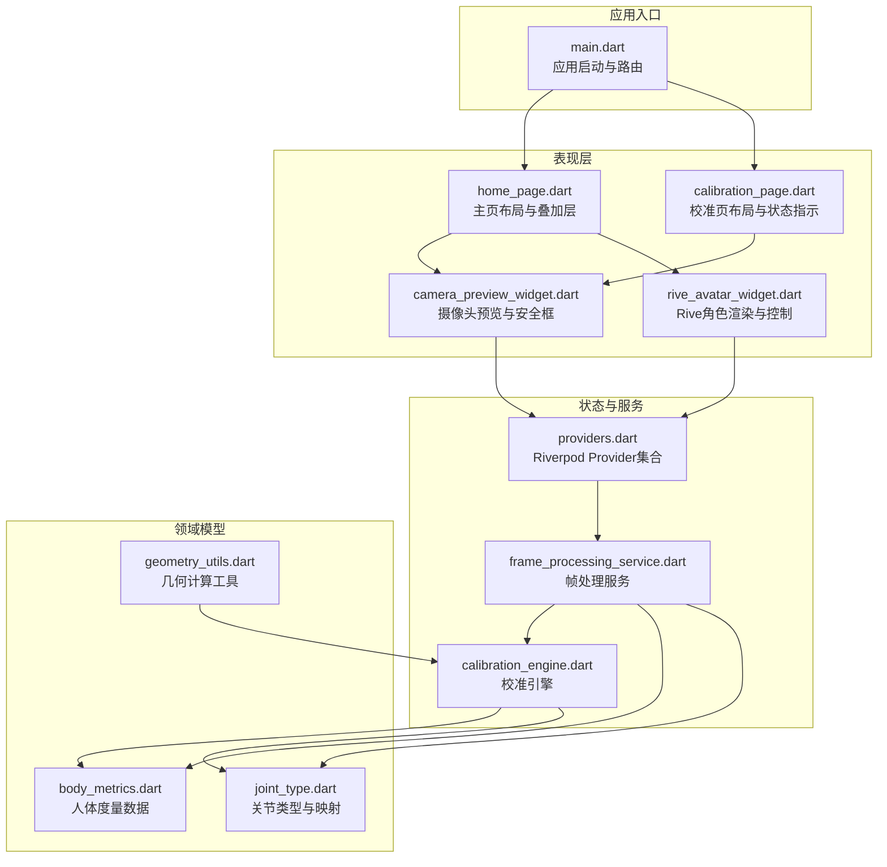
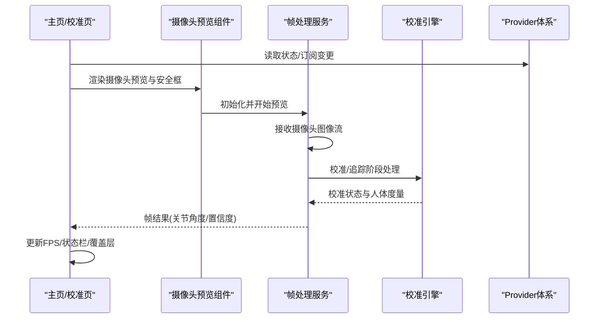
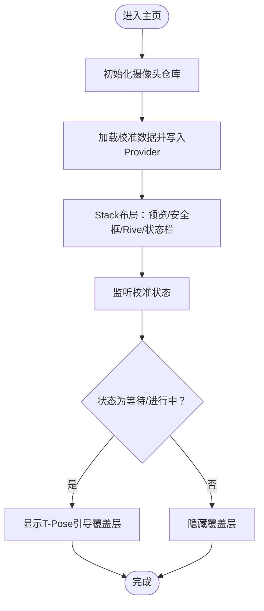
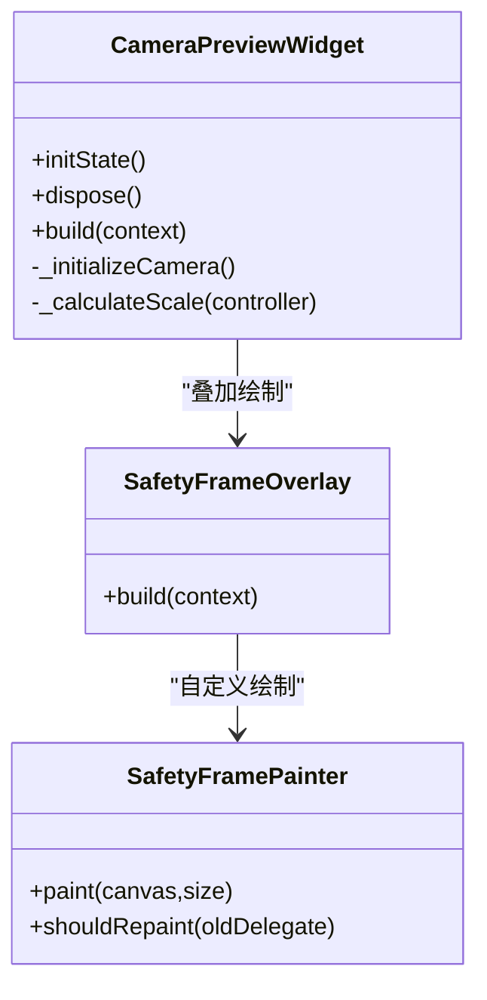
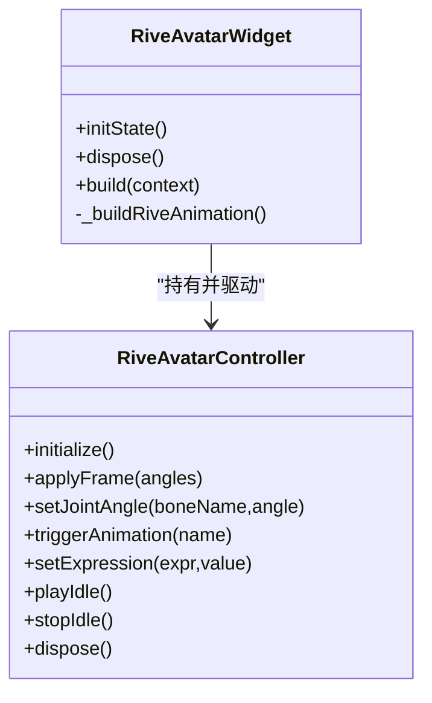
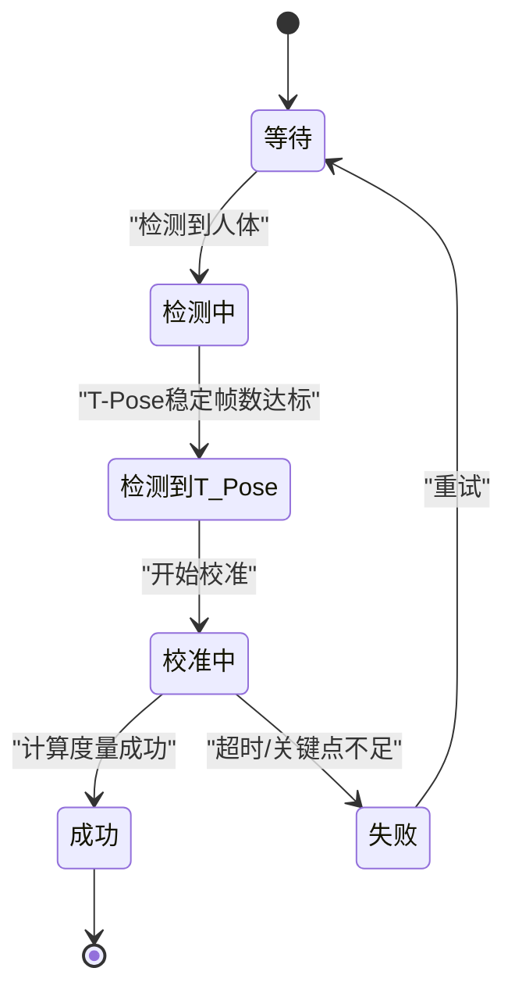
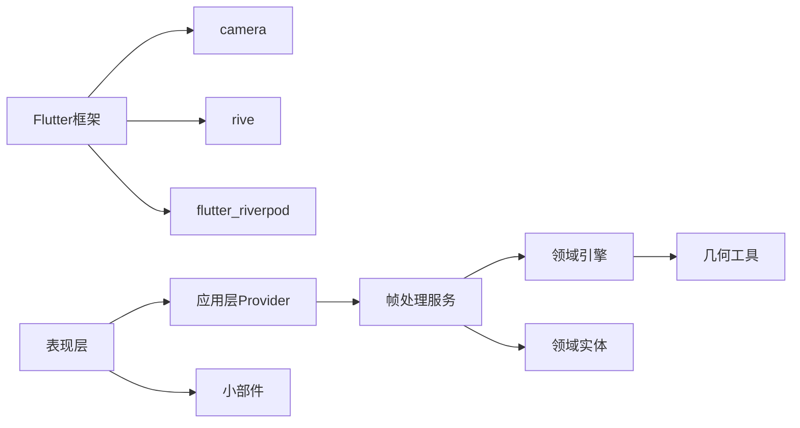

# 表现层组件

<cite>
**本文引用的文件**
- [lib/main.dart](file://lib/main.dart)
- [pubspec.yaml](file://pubspec.yaml)
- [lib/presentation/pages/home_page.dart](file://lib/presentation/pages/home_page.dart)
- [lib/presentation/pages/calibration_page.dart](file://lib/presentation/pages/calibration_page.dart)
- [lib/presentation/widgets/camera_preview_widget.dart](file://lib/presentation/widgets/camera_preview_widget.dart)
- [lib/presentation/widgets/rive_avatar_widget.dart](file://lib/presentation/widgets/rive_avatar_widget.dart)
- [lib/application/providers/providers.dart](file://lib/application/providers/providers.dart)
- [lib/application/services/frame_processing_service.dart](file://lib/application/services/frame_processing_service.dart)
- [lib/domain/engines/calibration/calibration_engine.dart](file://lib/domain/engines/calibration/calibration_engine.dart)
- [lib/domain/entities/body_metrics.dart](file://lib/domain/entities/body_metrics.dart)
- [lib/domain/entities/joint_type.dart](file://lib/domain/entities/joint_type.dart)
- [lib/core/utils/geometry_utils.dart](file://lib/core/utils/geometry_utils.dart)
</cite>

## 目录
1. [简介](#简介)
2. [项目结构](#项目结构)
3. [核心组件](#核心组件)
4. [架构总览](#架构总览)
5. [组件详解](#组件详解)
6. [依赖关系分析](#依赖关系分析)
7. [性能考量](#性能考量)
8. [故障排查指南](#故障排查指南)
9. [结论](#结论)
10. [附录](#附录)

## 简介
本文件聚焦于 Mimo 项目的“表现层组件”，系统性阐述主页设计与布局实现、摄像头预览组件技术架构、Rive 动画组件集成与实时驱动机制、UI 组件架构设计模式与复用策略、响应式设计与跨平台适配、组件属性与事件规范、状态管理与动画/过渡效果、主题系统与样式定制、可访问性支持以及组件组合与集成方式。

## 项目结构
Mimo 的表现层位于 lib/presentation 目录，采用“页面 + 小部件”的分层组织：页面负责布局与业务编排，小部件封装可复用 UI 元素；状态管理通过 Riverpod Provider 注入，数据流贯穿摄像头、姿态检测、校准与归一化、运动学与滤波等处理链路。

图表来源
- [lib/main.dart:1-34](file://lib/main.dart#L1-L34)
- [lib/presentation/pages/home_page.dart:1-214](file://lib/presentation/pages/home_page.dart#L1-L214)
- [lib/presentation/pages/calibration_page.dart:1-286](file://lib/presentation/pages/calibration_page.dart#L1-L286)
- [lib/presentation/widgets/camera_preview_widget.dart:1-122](file://lib/presentation/widgets/camera_preview_widget.dart#L1-L122)
- [lib/presentation/widgets/rive_avatar_widget.dart:1-118](file://lib/presentation/widgets/rive_avatar_widget.dart#L1-L118)
- [lib/application/providers/providers.dart:1-103](file://lib/application/providers/providers.dart#L1-L103)
- [lib/application/services/frame_processing_service.dart:1-254](file://lib/application/services/frame_processing_service.dart#L1-L254)
- [lib/domain/engines/calibration/calibration_engine.dart:1-302](file://lib/domain/engines/calibration/calibration_engine.dart#L1-L302)
- [lib/domain/entities/body_metrics.dart:1-109](file://lib/domain/entities/body_metrics.dart#L1-L109)
- [lib/domain/entities/joint_type.dart:1-66](file://lib/domain/entities/joint_type.dart#L1-L66)
- [lib/core/utils/geometry_utils.dart:1-117](file://lib/core/utils/geometry_utils.dart#L1-L117)

章节来源
- [lib/main.dart:1-34](file://lib/main.dart#L1-L34)
- [pubspec.yaml:1-80](file://pubspec.yaml#L1-L80)

## 核心组件
- 主页布局组件：负责摄像头预览层、安全框叠加层、Rive 角色层、顶部状态栏与校准引导覆盖层的堆叠与响应式定位。
- 摄像头预览组件：封装 CameraController 初始化、缩放适配、裁剪与安全框绘制。
- Rive 角色组件：封装 Rive 动画加载、骨骼控制器占位、关节角度应用与动画触发接口。
- 校准页面：串联帧处理服务、摄像头预览与安全框、校准状态指示与底部指引。
- Provider 体系：集中管理摄像头、姿态检测、归一化、运动学、滤波、语义、性能调度、角度计算、校准引擎与状态 Provider。
- 帧处理服务：连接摄像头与姿态检测，构建处理流水线，输出帧结果并驱动 UI 更新。
- 校准引擎：实现 T-Pose 校准流程，生成人体度量数据并推进状态机。
- 领域实体：人体度量、关节类型与映射、几何工具，支撑姿态计算与校准逻辑。

章节来源
- [lib/presentation/pages/home_page.dart:1-214](file://lib/presentation/pages/home_page.dart#L1-L214)
- [lib/presentation/widgets/camera_preview_widget.dart:1-122](file://lib/presentation/widgets/camera_preview_widget.dart#L1-L122)
- [lib/presentation/widgets/rive_avatar_widget.dart:1-118](file://lib/presentation/widgets/rive_avatar_widget.dart#L1-L118)
- [lib/presentation/pages/calibration_page.dart:1-286](file://lib/presentation/pages/calibration_page.dart#L1-L286)
- [lib/application/providers/providers.dart:1-103](file://lib/application/providers/providers.dart#L1-L103)
- [lib/application/services/frame_processing_service.dart:1-254](file://lib/application/services/frame_processing_service.dart#L1-L254)
- [lib/domain/engines/calibration/calibration_engine.dart:1-302](file://lib/domain/engines/calibration/calibration_engine.dart#L1-L302)
- [lib/domain/entities/body_metrics.dart:1-109](file://lib/domain/entities/body_metrics.dart#L1-L109)
- [lib/domain/entities/joint_type.dart:1-66](file://lib/domain/entities/joint_type.dart#L1-L66)
- [lib/core/utils/geometry_utils.dart:1-117](file://lib/core/utils/geometry_utils.dart#L1-L117)

## 架构总览
表现层通过 Riverpod Provider 注入状态与服务，帧处理服务作为中枢协调摄像头与姿态检测，并将处理结果推送到 UI。主页与校准页分别消费这些状态，驱动摄像头预览、安全框绘制与 Rive 角色动画。

图表来源
- [lib/presentation/pages/home_page.dart:37-87](file://lib/presentation/pages/home_page.dart#L37-L87)
- [lib/presentation/pages/calibration_page.dart:54-112](file://lib/presentation/pages/calibration_page.dart#L54-L112)
- [lib/presentation/widgets/camera_preview_widget.dart:25-76](file://lib/presentation/widgets/camera_preview_widget.dart#L25-L76)
- [lib/application/services/frame_processing_service.dart:70-148](file://lib/application/services/frame_processing_service.dart#L70-L148)
- [lib/domain/engines/calibration/calibration_engine.dart:114-176](file://lib/domain/engines/calibration/calibration_engine.dart#L114-L176)
- [lib/application/providers/providers.dart:85-103](file://lib/application/providers/providers.dart#L85-L103)

## 组件详解

### 主页设计与布局
- 布局容器：Scaffold + Stack，按层叠顺序从下至上排列摄像头预览层、安全框叠加层、Rive 角色层，顶部放置状态栏，必要时叠加校准引导覆盖层。
- 响应式高度：摄像头预览层高度固定为屏幕高度的 35%，保证角色层与预览层的空间分配。
- 顶部状态栏：包含应用标题、当前 FPS 指示与设置入口；FPS 来源于 Provider 状态。
- 校准覆盖层：根据校准状态显示 T-Pose 引导图与提示文案，支持开始校准按钮切换状态。

图表来源
- [lib/presentation/pages/home_page.dart:23-35](file://lib/presentation/pages/home_page.dart#L23-L35)
- [lib/presentation/pages/home_page.dart:41-87](file://lib/presentation/pages/home_page.dart#L41-L87)
- [lib/application/providers/providers.dart:85-93](file://lib/application/providers/providers.dart#L85-L93)

章节来源
- [lib/presentation/pages/home_page.dart:1-214](file://lib/presentation/pages/home_page.dart#L1-L214)

### 摄像头预览组件
- 初始化与生命周期：在 initState 中读取 CameraRepositoryImpl 并初始化，异常时记录日志；dispose 时释放资源。
- 预览渲染：当控制器可用时，使用 Transform.scale 与 Center 实现摄像头画面的等比缩放与居中；ClipRect 确保超出屏幕部分被裁剪。
- 缩放算法：根据屏幕宽高比与摄像头画面纵横比计算缩放系数，避免画面拉伸或留边。
- 安全框叠加：通过 CustomPaint 绘制圆角矩形安全框，配合提示文本增强用户引导。

图表来源
- [lib/presentation/widgets/camera_preview_widget.dart:8-76](file://lib/presentation/widgets/camera_preview_widget.dart#L8-L76)
- [lib/presentation/widgets/camera_preview_widget.dart:78-122](file://lib/presentation/widgets/camera_preview_widget.dart#L78-L122)

章节来源
- [lib/presentation/widgets/camera_preview_widget.dart:1-122](file://lib/presentation/widgets/camera_preview_widget.dart#L1-L122)

### Rive 动画组件
- 控制器占位：RiveAvatarController 提供初始化、关节角度设置、动画触发、表情设置与 idle 控制等接口，当前为占位实现，便于后续接入真实 Rive 骨骼与动画。
- 渲染组件：RiveAvatarWidget 使用 Provider 监听人体度量变化，占位加载 Rive 文件并居中渲染；实际项目中应替换为真实资产路径。
- 实时驱动：通过监听 bodyMetricsProvider 或帧结果中的关节角度，调用控制器接口更新角色骨骼角度，实现与姿态检测结果的联动。

图表来源
- [lib/presentation/widgets/rive_avatar_widget.dart:9-71](file://lib/presentation/widgets/rive_avatar_widget.dart#L9-L71)
- [lib/presentation/widgets/rive_avatar_widget.dart:73-118](file://lib/presentation/widgets/rive_avatar_widget.dart#L73-L118)

章节来源
- [lib/presentation/widgets/rive_avatar_widget.dart:1-118](file://lib/presentation/widgets/rive_avatar_widget.dart#L1-L118)

### 校准页面与状态机
- 帧处理服务：启动摄像头与姿态检测，接收图像流并异步处理；根据状态在“等待检测”“检测到人体”“检测到T-Pose”“校准中”“成功/失败”之间流转。
- 校准引擎：实现 T-Pose 检测、连续帧计数、超时判断与人体度量计算；成功后写入 Provider 并保存至存储。
- UI 指示：顶部状态条显示当前阶段图标与颜色；底部指引根据状态动态展示提示与按钮（继续/重试）。

图表来源
- [lib/domain/engines/calibration/calibration_engine.dart:8-32](file://lib/domain/engines/calibration/calibration_engine.dart#L8-L32)
- [lib/domain/engines/calibration/calibration_engine.dart:114-176](file://lib/domain/engines/calibration/calibration_engine.dart#L114-L176)
- [lib/presentation/pages/calibration_page.dart:114-182](file://lib/presentation/pages/calibration_page.dart#L114-L182)

章节来源
- [lib/presentation/pages/calibration_page.dart:1-286](file://lib/presentation/pages/calibration_page.dart#L1-L286)
- [lib/application/services/frame_processing_service.dart:1-254](file://lib/application/services/frame_processing_service.dart#L1-L254)
- [lib/domain/engines/calibration/calibration_engine.dart:1-302](file://lib/domain/engines/calibration/calibration_engine.dart#L1-L302)

### UI 组件架构与复用策略
- 分层设计：页面负责布局与编排，小部件封装可复用 UI 元素（如摄像头预览、安全框），降低耦合度。
- Provider 驱动：通过 Provider 与 StateProvider 管理全局状态（校准状态、人体度量、FPS），组件通过 ref.watch/ref.listen 订阅变化，实现解耦的数据流。
- 组合模式：主页与校准页通过组合摄像头预览与安全框小部件，实现一致的视觉与交互体验；Rive 角色作为独立层叠加在预览之上。

章节来源
- [lib/application/providers/providers.dart:1-103](file://lib/application/providers/providers.dart#L1-L103)
- [lib/presentation/pages/home_page.dart:37-87](file://lib/presentation/pages/home_page.dart#L37-L87)
- [lib/presentation/pages/calibration_page.dart:54-112](file://lib/presentation/pages/calibration_page.dart#L54-L112)

### 响应式设计与跨平台适配
- 布局适配：使用 MediaQuery 获取屏幕尺寸，摄像头预览层高度固定为屏幕高度的 35%，保证在不同设备上的空间比例一致。
- 预览缩放：根据摄像头纵横比与屏幕纵横比计算缩放系数，避免画面变形；通过 Transform.scale 与 ClipRect 确保画面居中与裁剪。
- 主题与样式：应用入口使用 Material3 主题与深色方案，统一颜色与字体风格；各组件内部使用局部装饰与透明背景，确保跨平台一致性。

章节来源
- [lib/presentation/pages/home_page.dart:40-70](file://lib/presentation/pages/home_page.dart#L40-L70)
- [lib/presentation/widgets/camera_preview_widget.dart:63-75](file://lib/presentation/widgets/camera_preview_widget.dart#L63-L75)
- [lib/main.dart:16-26](file://lib/main.dart#L16-L26)

### 组件属性、事件与自定义选项
- 摄像头预览组件
  - 属性：无外部输入属性（占位实现），内部通过 Provider 注入控制器。
  - 事件：初始化失败时打印调试信息；生命周期 dispose 释放资源。
  - 自定义：可扩展为支持多摄像头、前置/后置切换、闪光灯控制等。
- 安全框叠加组件
  - 属性：安全框比例（默认 20%/10% 宽高偏移）、描边与圆角半径。
  - 事件：绘制完成（shouldRepaint=false）。
  - 自定义：支持动态调整比例、颜色与透明度。
- Rive 角色组件
  - 属性：Rive 文件路径（占位）、fit 模式、透明背景。
  - 事件：初始化完成、帧结果驱动骨骼角度、动画触发。
  - 自定义：支持多动画状态、表情参数与 idle 控制。
- 校准页面
  - 属性：校准状态 Provider、FPS Provider、帧结果回调。
  - 事件：状态变化时更新 UI、成功/失败按钮回调。
  - 自定义：支持自定义阈值、超时时间与提示文案。

章节来源
- [lib/presentation/widgets/camera_preview_widget.dart:1-122](file://lib/presentation/widgets/camera_preview_widget.dart#L1-L122)
- [lib/presentation/widgets/rive_avatar_widget.dart:1-118](file://lib/presentation/widgets/rive_avatar_widget.dart#L1-L118)
- [lib/presentation/pages/calibration_page.dart:1-286](file://lib/presentation/pages/calibration_page.dart#L1-L286)

### 组件状态管理、动画与过渡
- 状态管理：通过 StateProvider 管理校准状态、人体度量、是否追踪、当前 FPS；ConsumerStatefulWidget 通过 ref.watch/ref.listen 订阅状态变化并重建 UI。
- 动画效果：Rive 角色组件预留动画触发接口；idle 动画播放/停止方法为后续接入提供基础。
- 过渡效果：主页与校准页通过 Stack 层叠与条件渲染实现覆盖层切换；校准状态条使用颜色与图标表达状态变化。

章节来源
- [lib/application/providers/providers.dart:85-103](file://lib/application/providers/providers.dart#L85-L103)
- [lib/presentation/widgets/rive_avatar_widget.dart:55-63](file://lib/presentation/widgets/rive_avatar_widget.dart#L55-L63)
- [lib/presentation/pages/home_page.dart:72-84](file://lib/presentation/pages/home_page.dart#L72-L84)

### 主题系统、样式定制与可访问性
- 主题系统：应用入口配置 Material3 与深色主题，统一色彩方案；页面内使用局部装饰与透明背景，避免主题冲突。
- 样式定制：通过局部 Container/Decoration 与 Text 样式实现一致的视觉风格；颜色与字号遵循 Material 设计规范。
- 可访问性：使用白色高对比度文本与图标；提供清晰的提示文案与状态指示；按钮具备明确的前景色与背景色区分。

章节来源
- [lib/main.dart:16-26](file://lib/main.dart#L16-L26)
- [lib/presentation/pages/home_page.dart:96-145](file://lib/presentation/pages/home_page.dart#L96-L145)
- [lib/presentation/pages/calibration_page.dart:114-182](file://lib/presentation/pages/calibration_page.dart#L114-L182)

### 组件组合与集成
- 页面与小部件组合：主页与校准页通过组合摄像头预览与安全框小部件，实现一致的视觉与交互体验。
- Provider 集成：小部件通过 Provider 读取状态与服务实例，实现松耦合的数据流。
- 帧处理集成：帧处理服务作为中枢，将摄像头与姿态检测结果传递给校准引擎与运动处理链路，最终驱动 UI 更新。

章节来源
- [lib/presentation/pages/home_page.dart:37-87](file://lib/presentation/pages/home_page.dart#L37-L87)
- [lib/presentation/pages/calibration_page.dart:54-112](file://lib/presentation/pages/calibration_page.dart#L54-L112)
- [lib/application/services/frame_processing_service.dart:70-148](file://lib/application/services/frame_processing_service.dart#L70-L148)

## 依赖关系分析
- 外部依赖：Flutter、camera、rive、google_mlkit_pose_detection、shared_preferences、sqflite、path、audioplayers、uuid、intl、flutter_riverpod。
- 内部依赖：表现层依赖应用层 Provider 与服务层帧处理服务；帧处理服务依赖领域层引擎与实体；几何工具为校准与姿态计算提供支撑。

图表来源
- [pubspec.yaml:30-60](file://pubspec.yaml#L30-L60)
- [lib/application/providers/providers.dart:1-103](file://lib/application/providers/providers.dart#L1-L103)
- [lib/application/services/frame_processing_service.dart:1-254](file://lib/application/services/frame_processing_service.dart#L1-L254)
- [lib/domain/engines/calibration/calibration_engine.dart:1-302](file://lib/domain/engines/calibration/calibration_engine.dart#L1-L302)
- [lib/core/utils/geometry_utils.dart:1-117](file://lib/core/utils/geometry_utils.dart#L1-L117)

章节来源
- [pubspec.yaml:1-80](file://pubspec.yaml#L1-L80)

## 性能考量
- FPS 监控：帧处理服务每秒统计帧数并写入 Provider，主页与校准页可据此优化渲染与处理负载。
- 处理链路：姿态检测、归一化、运动学约束、滤波与语义识别按需执行，避免不必要的计算。
- 预览渲染：通过 Transform.scale 与 ClipRect 控制渲染范围，减少无效绘制区域。
- 资源释放：组件 dispose 时及时释放摄像头与动画资源，防止内存泄漏。

章节来源
- [lib/application/services/frame_processing_service.dart:230-241](file://lib/application/services/frame_processing_service.dart#L230-L241)
- [lib/presentation/widgets/camera_preview_widget.dart:37-41](file://lib/presentation/widgets/camera_preview_widget.dart#L37-L41)
- [lib/presentation/widgets/rive_avatar_widget.dart:89-94](file://lib/presentation/widgets/rive_avatar_widget.dart#L89-L94)

## 故障排查指南
- 摄像头初始化失败：检查权限与设备可用性；查看日志输出；确认 CameraRepositoryImpl 初始化流程。
- 预览画面变形：检查缩放算法与屏幕纵横比计算；确认 Transform.scale 与 ClipRect 配置。
- 校准失败：检查关键点可见性阈值、T-Pose 检测阈值与超时设置；确认帧处理服务状态流转。
- Rive 动画不更新：确认控制器初始化与关节角度映射；检查 Provider 数据流与监听逻辑。

章节来源
- [lib/presentation/widgets/camera_preview_widget.dart:25-35](file://lib/presentation/widgets/camera_preview_widget.dart#L25-L35)
- [lib/domain/engines/calibration/calibration_engine.dart:124-132](file://lib/domain/engines/calibration/calibration_engine.dart#L124-L132)
- [lib/application/services/frame_processing_service.dart:108-148](file://lib/application/services/frame_processing_service.dart#L108-L148)

## 结论
Mimo 的表现层以页面与小部件为核心，结合 Riverpod Provider 实现清晰的状态管理与数据流；摄像头预览与安全框叠加提供良好的用户引导；Rive 角色组件为实时驱动动画奠定基础；帧处理服务与校准引擎构成闭环，驱动 UI 实时更新。整体架构具备良好的可扩展性与跨平台适配能力，建议后续完善 Rive 骨骼驱动与动画系统，进一步提升用户体验。

## 附录
- 术语说明：关节类型与映射用于将 MediaPipe 关键点索引转换为 Rive 骨骼名称；人体度量数据用于归一化不同用户的动作幅度。
- 常用常量：校准阈值、超时时间、所需连续帧数等参数可在应用常量中统一管理。

章节来源
- [lib/domain/entities/joint_type.dart:1-66](file://lib/domain/entities/joint_type.dart#L1-L66)
- [lib/domain/entities/body_metrics.dart:28-40](file://lib/domain/entities/body_metrics.dart#L28-L40)
- [lib/domain/engines/calibration/calibration_engine.dart:84-88](file://lib/domain/engines/calibration/calibration_engine.dart#L84-L88)