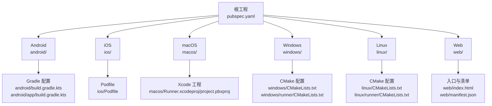
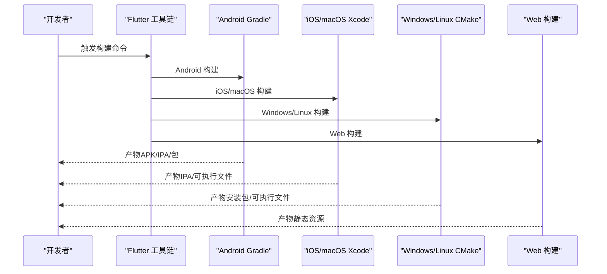
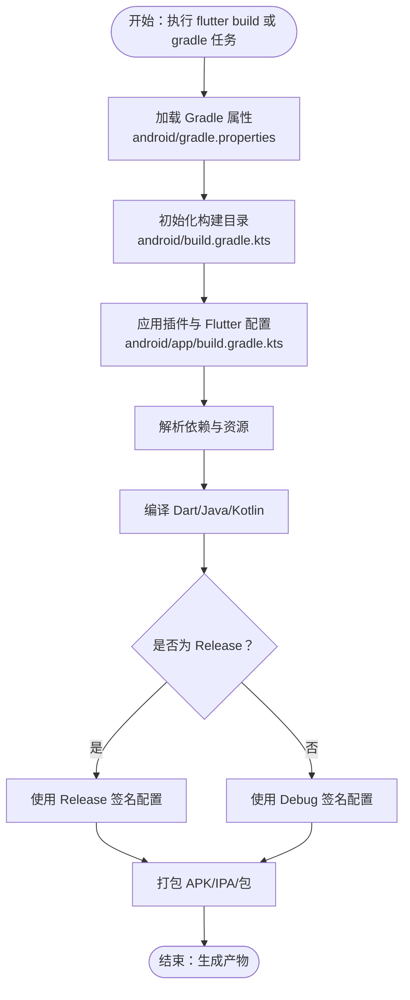
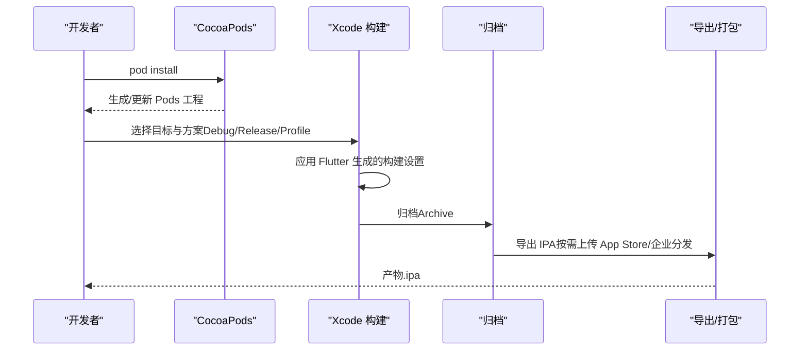
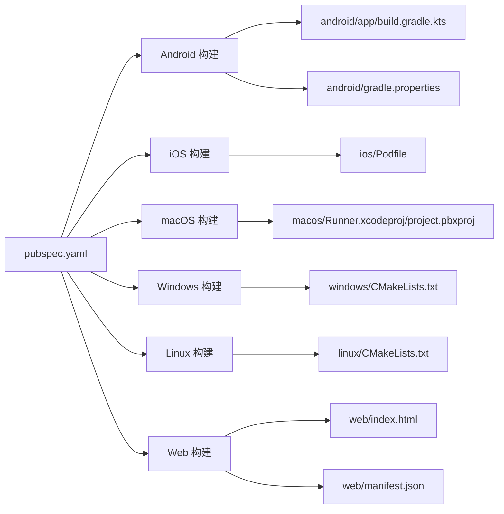

# 多平台构建流程

<cite>
**本文引用的文件**
- [pubspec.yaml](file://pubspec.yaml)
- [android/build.gradle.kts](file://android/build.gradle.kts)
- [android/app/build.gradle.kts](file://android/app/build.gradle.kts)
- [android/gradle.properties](file://android/gradle.properties)
- [android/settings.gradle.kts](file://android/settings.gradle.kts)
- [android/app/src/main/AndroidManifest.xml](file://android/app/src/main/AndroidManifest.xml)
- [ios/Podfile](file://ios/Podfile)
- [ios/Runner/Info.plist](file://ios/Runner/Info.plist)
- [macos/Runner.xcodeproj/project.pbxproj](file://macos/Runner.xcodeproj/project.pbxproj)
- [linux/CMakeLists.txt](file://linux/CMakeLists.txt)
- [linux/runner/CMakeLists.txt](file://linux/runner/CMakeLists.txt)
- [windows/CMakeLists.txt](file://windows/CMakeLists.txt)
- [windows/runner/CMakeLists.txt](file://windows/runner/CMakeLists.txt)
- [web/index.html](file://web/index.html)
- [web/manifest.json](file://web/manifest.json)
</cite>

## 目录
1. [简介](#简介)
2. [项目结构](#项目结构)
3. [核心组件](#核心组件)
4. [架构总览](#架构总览)
5. [详细组件分析](#详细组件分析)
6. [依赖关系分析](#依赖关系分析)
7. [性能考量](#性能考量)
8. [故障排查指南](#故障排查指南)
9. [结论](#结论)
10. [附录](#附录)

## 简介
本文件系统性梳理 Mimo 项目的多平台构建流程，覆盖 Android、iOS、macOS、Windows、Linux 和 Web 平台。内容包括：
- Flutter 跨平台构建原理与各平台特定配置
- Android Gradle 构建、签名与 APK 产出
- iOS Xcode 构建、证书与 IPA 打包
- Web 平台构建优化与 PWA 配置
- 桌面平台（Windows、macOS、Linux）原生构建与打包策略
- 构建缓存、增量与并行优化
- 常见失败原因与解决方案
- 构建产物验证与测试建议

## 项目结构
Mimo 采用 Flutter 标准多平台工程布局，根目录包含各平台子工程与公共资源：
- android：Android 应用与 Gradle 配置
- ios：iOS 应用与 CocoaPods 集成
- macos：macOS 应用与 Xcode 工程
- windows：Windows 应用与 CMake 配置
- linux：Linux 应用与 CMake 配置
- web：Web 平台入口与 PWA 清单
- lib：Flutter 应用源码
- assets：公共资源
- pubspec.yaml：Flutter 依赖与版本信息

图表来源
- [pubspec.yaml](file://pubspec.yaml)
- [android/build.gradle.kts](file://android/build.gradle.kts)
- [android/app/build.gradle.kts](file://android/app/build.gradle.kts)
- [ios/Podfile](file://ios/Podfile)
- [macos/Runner.xcodeproj/project.pbxproj](file://macos/Runner.xcodeproj/project.pbxproj)
- [windows/CMakeLists.txt](file://windows/CMakeLists.txt)
- [windows/runner/CMakeLists.txt](file://windows/runner/CMakeLists.txt)
- [linux/CMakeLists.txt](file://linux/CMakeLists.txt)
- [linux/runner/CMakeLists.txt](file://linux/runner/CMakeLists.txt)
- [web/index.html](file://web/index.html)
- [web/manifest.json](file://web/manifest.json)

章节来源
- [pubspec.yaml](file://pubspec.yaml)

## 核心组件
- 版本与依赖管理：通过 pubspec.yaml 统一声明版本号、构建号与依赖，Android/iOS/Windows 使用 Flutter 提供的版本映射规则。
- 平台适配层：各平台独立的构建脚本与配置文件，统一由 Flutter 工具链驱动。
- 资源与清单：Android 的 AndroidManifest.xml、iOS/macOS 的 Info.plist、Web 的 manifest.json 与 index.html。

章节来源
- [pubspec.yaml](file://pubspec.yaml)
- [android/app/src/main/AndroidManifest.xml](file://android/app/src/main/AndroidManifest.xml)
- [ios/Runner/Info.plist](file://ios/Runner/Info.plist)
- [macos/Runner/Info.plist](file://macos/Runner/Info.plist)
- [web/manifest.json](file://web/manifest.json)
- [web/index.html](file://web/index.html)

## 架构总览
Flutter 多平台构建以“共享 Dart 代码 + 平台适配层”为核心。构建时序概览如下：

图表来源
- [android/app/build.gradle.kts](file://android/app/build.gradle.kts)
- [ios/Podfile](file://ios/Podfile)
- [macos/Runner.xcodeproj/project.pbxproj](file://macos/Runner.xcodeproj/project.pbxproj)
- [windows/CMakeLists.txt](file://windows/CMakeLists.txt)
- [linux/CMakeLists.txt](file://linux/CMakeLists.txt)
- [web/index.html](file://web/index.html)

## 详细组件分析

### Android 构建流程与签名配置
- Gradle 插件与版本：应用级 build.gradle.kts 引入 Android 应用插件、Kotlin 插件与 Flutter Gradle 插件，并使用 Flutter 提供的 SDK/NDK/版本参数。
- 编译与目标：compileSdk/targetSdk/minSdk 由 Flutter 注入；Java/Kotlin 目标兼容至 11。
- 构建类型：release 默认复用 debug 签名配置以便调试运行；生产发布需替换为正式签名配置。
- 全局构建目录：根级 build.gradle.kts 将所有子工程输出到统一构建目录，便于缓存与清理。
- Gradle 属性：启用 AndroidX/Jetifier，并设置 JVM 内存参数以提升大工程稳定性。

图表来源
- [android/gradle.properties](file://android/gradle.properties)
- [android/build.gradle.kts](file://android/build.gradle.kts)
- [android/app/build.gradle.kts](file://android/app/build.gradle.kts)

章节来源
- [android/app/build.gradle.kts](file://android/app/build.gradle.kts)
- [android/build.gradle.kts](file://android/build.gradle.kts)
- [android/gradle.properties](file://android/gradle.properties)
- [android/app/src/main/AndroidManifest.xml](file://android/app/src/main/AndroidManifest.xml)

### iOS 构建配置、证书与 IPA 打包
- CocoaPods 集成：Podfile 定义目标、平台与 Pods 安装逻辑，确保 Flutter 生成的 xconfig 与构建设置正确注入。
- Xcode 工程：Runner.xcodeproj 包含 Runner 可执行目标、测试目标与 Flutter Assemble 聚合目标；构建阶段包含 Flutter 资产装配脚本。
- Info.plist：定义 Bundle 标识、版本、启动画面、方向支持等元数据。
- 证书与签名：当前配置未指定具体证书/描述文件，实际打包需在 Xcode 中选择正确的 Team、证书与 Provisioning Profile；Entitlements 文件用于沙箱与系统能力授权。

图表来源
- [ios/Podfile](file://ios/Podfile)
- [macos/Runner.xcodeproj/project.pbxproj](file://macos/Runner.xcodeproj/project.pbxproj)
- [ios/Runner/Info.plist](file://ios/Runner/Info.plist)

章节来源
- [ios/Podfile](file://ios/Podfile)
- [macos/Runner.xcodeproj/project.pbxproj](file://macos/Runner.xcodeproj/project.pbxproj)
- [ios/Runner/Info.plist](file://ios/Runner/Info.plist)

### macOS 构建与打包策略
- Xcode 工程与目标：Runner 目标负责应用可执行文件；RunnerTests 为目标测试；Flutter Assemble 负责 Flutter 资产装配。
- 构建脚本：Shell Script 构建阶段调用 Flutter 工具脚本完成嵌入与装配。
- 证书与权限：DebugProfile/Release entitlements 控制沙箱与系统权限；Info.plist 定义版本与最低系统版本。
- 打包：通常通过 Xcode Archive 导出 .app 或 .dmg；如需 App Store 分发，需配置 Team 与签名。

章节来源
- [macos/Runner.xcodeproj/project.pbxproj](file://macos/Runner.xcodeproj/project.pbxproj)
- [macos/Runner/Info.plist](file://macos/Runner/Info.plist)

### Windows 构建与打包策略
- CMake 配置：顶层 CMakeLists.txt 定义目标名称、构建类型与安装路径；runner 子目录定义可执行文件与链接库。
- 依赖与安装：安装阶段复制 ICU 数据、Flutter 动态库、插件库与资源到 bundle 目录；非 Debug 构建安装 AOT 库。
- 运行与调试：Visual Studio 默认包含安装步骤，便于直接运行；也可在命令行中执行安装后运行。

章节来源
- [windows/CMakeLists.txt](file://windows/CMakeLists.txt)
- [windows/runner/CMakeLists.txt](file://windows/runner/CMakeLists.txt)

### Linux 构建与打包策略
- CMake 配置：顶层 CMakeLists.txt 定义二进制名称、应用 ID、标准编译选项与安装规则；runner 子目录定义可执行文件与链接 GTK 库。
- 安装与打包：安装阶段复制资源、Flutter 库与插件库；非 Debug 构建安装 AOT 库；最终生成可重定位的 bundle。
- 运行：需要满足 GTK 环境依赖；可通过包管理器或 AppImage 等方式分发。

章节来源
- [linux/CMakeLists.txt](file://linux/CMakeLists.txt)
- [linux/runner/CMakeLists.txt](file://linux/runner/CMakeLists.txt)

### Web 平台构建优化与 PWA 配置
- 入口页面：index.html 支持通过 --base-href 注入基础路径；预加载 flutter_bootstrap.js。
- PWA 清单：manifest.json 定义应用名称、图标、显示模式、主题色与方向偏好。
- 构建要点：确保静态资源路径正确、Service Worker 与缓存策略按需配置；在 CI 中设置 base href 与 CDN 前缀。

章节来源
- [web/index.html](file://web/index.html)
- [web/manifest.json](file://web/manifest.json)

## 依赖关系分析
- Android：Gradle 插件与 Flutter 工具链耦合，构建目录统一由根级配置控制；release 签名需独立配置。
- iOS/macOS：Xcode 工程与 Flutter 生成的 xconfig 强关联；Pods 与 Flutter 工具链共同决定构建设置。
- Windows/Linux：CMake 作为统一构建入口，依赖 Flutter 生成的装配目标与安装规则。
- Web：静态资源与清单决定 PWA 行为；构建产物为纯静态文件。

图表来源
- [pubspec.yaml](file://pubspec.yaml)
- [android/app/build.gradle.kts](file://android/app/build.gradle.kts)
- [android/gradle.properties](file://android/gradle.properties)
- [ios/Podfile](file://ios/Podfile)
- [macos/Runner.xcodeproj/project.pbxproj](file://macos/Runner.xcodeproj/project.pbxproj)
- [windows/CMakeLists.txt](file://windows/CMakeLists.txt)
- [linux/CMakeLists.txt](file://linux/CMakeLists.txt)
- [web/index.html](file://web/index.html)
- [web/manifest.json](file://web/manifest.json)

## 性能考量
- 构建缓存与并行
  - Android：通过统一构建目录减少重复扫描；Gradle JVM 参数已设置较大堆与元空间，适合大型工程。
  - iOS/macOS：Xcode 工程启用了并行构建属性，可充分利用多核 CPU。
  - Windows/Linux：CMake 与 Flutter 工具链默认启用多配置与并行编译选项。
- 增量构建
  - 各平台均依赖 Flutter 工具链的增量处理；Android 使用 Gradle 增量编译，iOS/macOS 使用 Xcode 增量构建，Windows/Linux 使用 CMake 增量规则。
- 并行构建
  - Android：JVM 参数与 Gradle 配置支持并行任务；建议在 CI 中开启并行以缩短构建时间。
  - iOS/macOS：Xcode 并行构建属性已启用；Pods 安装可在本地或 CI 中预热。
  - Windows/Linux：CMake 并行编译与多配置支持；合理设置编译器线程数可提升效率。

章节来源
- [android/gradle.properties](file://android/gradle.properties)
- [android/build.gradle.kts](file://android/build.gradle.kts)
- [macos/Runner.xcodeproj/project.pbxproj](file://macos/Runner.xcodeproj/project.pbxproj)
- [windows/CMakeLists.txt](file://windows/CMakeLists.txt)
- [linux/CMakeLists.txt](file://linux/CMakeLists.txt)

## 故障排查指南
- Android 常见问题
  - 无法找到 Flutter SDK：检查 local.properties 是否正确指向 Flutter SDK。
  - 构建目录冲突：确认根级构建目录已被统一设置且无权限问题。
  - 签名错误：release 必须配置正式签名；若仍提示签名问题，检查 keystore 路径与密码。
  - 依赖冲突：升级 Gradle 插件或 Kotlin 版本时，确保与 Flutter 版本兼容。
- iOS 常见问题
  - Pods 未生成：先执行 flutter pub get，再执行 pod install；确保 Generated.xcconfig 存在。
  - 证书/描述文件无效：在 Xcode 中选择正确的 Team、证书与 Provisioning Profile；必要时刷新描述文件。
  - 构建设置缺失：检查 Flutter 生成的 xconfig 是否被正确引入。
- macOS 常见问题
  - 无法签名：确认 DebugProfile/Release entitlements 文件存在且路径正确；选择正确的 Team 与证书。
  - 依赖缺失：确保 Xcode 工程中包含 Flutter 生成的注册文件与装配脚本。
- Windows 常见问题
  - 缺少运行时库：确保安装了对应版本的 Visual C++ 运行库；检查安装阶段是否成功复制动态库。
  - 资源路径错误：确认安装前会清理旧资源，且新资源已复制到 bundle/data。
- Linux 常见问题
  - GTK 依赖：确保系统已安装 GTK+3 开发包；否则运行时报错。
  - 权限与路径：检查安装目录权限与 RPATH 设置。
- Web 常见问题
  - PWA 图标缺失：确保 manifest.json 中的图标路径与实际资源一致。
  - 基础路径错误：CI 中通过 --base-href 正确设置；本地预览时注意相对路径。

章节来源
- [android/settings.gradle.kts](file://android/settings.gradle.kts)
- [android/build.gradle.kts](file://android/build.gradle.kts)
- [ios/Podfile](file://ios/Podfile)
- [macos/Runner.xcodeproj/project.pbxproj](file://macos/Runner.xcodeproj/project.pbxproj)
- [windows/CMakeLists.txt](file://windows/CMakeLists.txt)
- [linux/CMakeLists.txt](file://linux/CMakeLists.txt)
- [web/manifest.json](file://web/manifest.json)
- [web/index.html](file://web/index.html)

## 结论
Mimo 的多平台构建体系以 Flutter 工具链为核心，结合各平台原生构建系统实现统一与高效的构建流程。通过合理的 Gradle/Xcode/CMake 配置、签名与证书管理、以及 Web 的 PWA 配置，项目能够在多平台上稳定产出高质量的构建产物。建议在 CI 中启用并行与缓存策略，并针对各平台的签名/证书/依赖进行规范化管理，以进一步提升构建稳定性与效率。

## 附录
- 版本与构建号映射
  - Android：构建名映射为 versionName，构建号映射为 versionCode。
  - iOS：构建名映射为 CFBundleShortVersionString，构建号映射为 CFBundleVersion。
  - Windows：构建名映射为产品与文件版本的主次补丁部分，构建号映射为构建后缀。
- 资源与清单
  - Android：AndroidManifest.xml 定义应用入口与查询意图。
  - iOS/macOS：Info.plist 定义 Bundle 标识、版本与系统要求。
  - Web：manifest.json 定义 PWA 行为；index.html 提供入口与基础路径。

章节来源
- [pubspec.yaml](file://pubspec.yaml)
- [android/app/src/main/AndroidManifest.xml](file://android/app/src/main/AndroidManifest.xml)
- [ios/Runner/Info.plist](file://ios/Runner/Info.plist)
- [macos/Runner/Info.plist](file://macos/Runner/Info.plist)
- [web/manifest.json](file://web/manifest.json)
- [web/index.html](file://web/index.html)