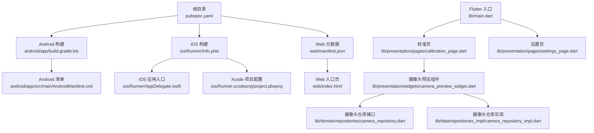
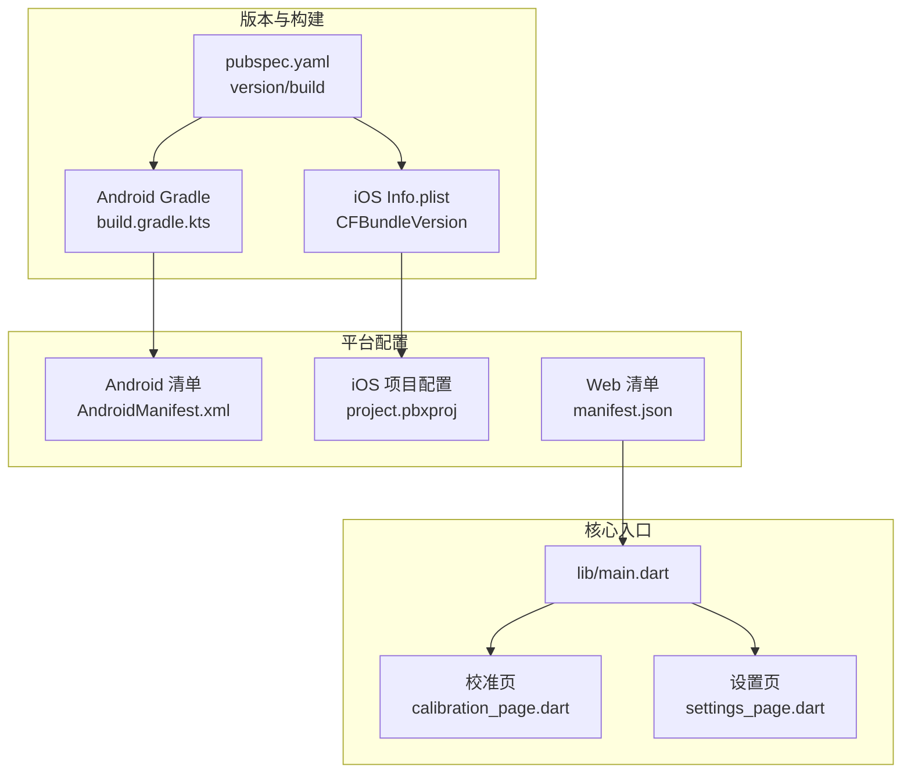
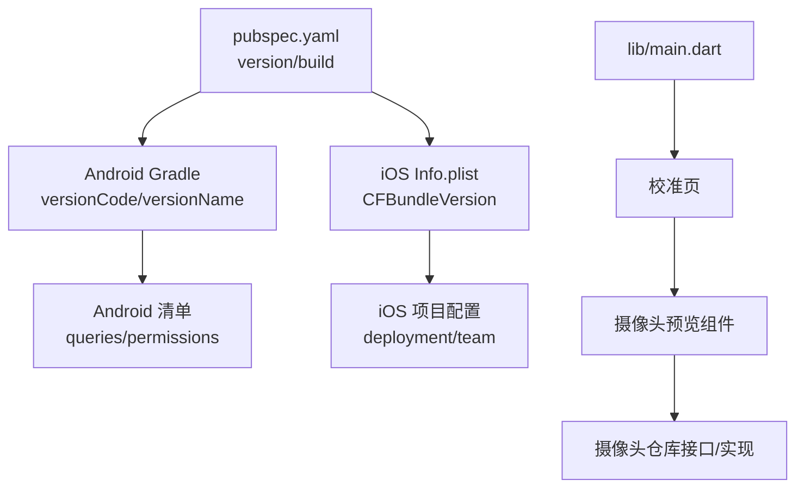

# 应用商店发布

<cite>
**本文引用的文件**
- [pubspec.yaml](file://pubspec.yaml)
- [android/app/build.gradle.kts](file://android/app/build.gradle.kts)
- [android/app/src/main/AndroidManifest.xml](file://android/app/src/main/AndroidManifest.xml)
- [android/app/src/debug/AndroidManifest.xml](file://android/app/src/debug/AndroidManifest.xml)
- [android/app/src/profile/AndroidManifest.xml](file://android/app/src/profile/AndroidManifest.xml)
- [android/gradle.properties](file://android/gradle.properties)
- [ios/Runner/Info.plist](file://ios/Runner/Info.plist)
- [ios/Runner/AppDelegate.swift](file://ios/Runner/AppDelegate.swift)
- [ios/Runner/Runner-Bridging-Header.h](file://ios/Runner/Runner-Bridging-Header.h)
- [ios/Runner.xcodeproj/project.pbxproj](file://ios/Runner.xcodeproj/project.pbxproj)
- [macos/Runner/Configs/AppInfo.xcconfig](file://macos/Runner/Configs/AppInfo.xcconfig)
- [macos/Runner/Release.entitlements](file://macos/Runner/Release.entitlements)
- [web/manifest.json](file://web/manifest.json)
- [web/index.html](file://web/index.html)
- [lib/main.dart](file://lib/main.dart)
- [lib/presentation/pages/calibration_page.dart](file://lib/presentation/pages/calibration_page.dart)
- [lib/presentation/pages/settings_page.dart](file://lib/presentation/pages/settings_page.dart)
- [lib/presentation/widgets/camera_preview_widget.dart](file://lib/presentation/widgets/camera_preview_widget.dart)
- [lib/domain/repositories/camera_repository.dart](file://lib/domain/repositories/camera_repository.dart)
- [lib/data/repositories_impl/camera_repository_impl.dart](file://lib/data/repositories_impl/camera_repository_impl.dart)
- [README.md](file://README.md)
</cite>

## 目录
1. [简介](#简介)
2. [项目结构](#项目结构)
3. [核心组件](#核心组件)
4. [架构总览](#架构总览)
5. [详细组件分析](#详细组件分析)
6. [依赖分析](#依赖分析)
7. [性能考虑](#性能考虑)
8. [故障排查指南](#故障排查指南)
9. [结论](#结论)
10. [附录](#附录)

## 简介
本指南面向Mimo项目的应用商店发布，覆盖Google Play Store与Apple App Store两大平台的发布准备、元数据与合规配置、版本号策略、发布计划、质量检查清单、发布后监控与用户反馈处理、常见失败原因与补救措施，以及A/B测试与渐进式发布策略。内容结合仓库现有配置与代码，确保发布流程可执行、可追溯。

## 项目结构
Mimo为Flutter跨平台项目，包含Android、iOS、macOS、Windows、Linux与Web多端。发布相关的关键位置如下：
- 版本与构建信息：根目录pubspec.yaml
- Android构建与签名：android/app/build.gradle.kts、android/app/src/main/AndroidManifest.xml、android/gradle.properties
- iOS构建与元数据：ios/Runner/Info.plist、ios/Runner/AppDelegate.swift、ios/Runner.xcodeproj/project.pbxproj
- Web元数据：web/manifest.json、web/index.html
- 核心入口与页面：lib/main.dart、lib/presentation/pages/calibration_page.dart、lib/presentation/pages/settings_page.dart
- 摄像头与权限：lib/presentation/widgets/camera_preview_widget.dart、lib/domain/repositories/camera_repository.dart、lib/data/repositories_impl/camera_repository_impl.dart

图表来源
- [pubspec.yaml:1-80](file://pubspec.yaml#L1-L80)
- [android/app/build.gradle.kts:1-45](file://android/app/build.gradle.kts#L1-L45)
- [android/app/src/main/AndroidManifest.xml:1-46](file://android/app/src/main/AndroidManifest.xml#L1-L46)
- [ios/Runner/Info.plist:1-50](file://ios/Runner/Info.plist#L1-L50)
- [ios/Runner/AppDelegate.swift:1-14](file://ios/Runner/AppDelegate.swift#L1-L14)
- [ios/Runner.xcodeproj/project.pbxproj:513-583](file://ios/Runner.xcodeproj/project.pbxproj#L513-L583)
- [web/manifest.json:1-35](file://web/manifest.json#L1-L35)
- [web/index.html:1-38](file://web/index.html#L1-L38)
- [lib/main.dart:1-34](file://lib/main.dart#L1-L34)
- [lib/presentation/pages/calibration_page.dart:58-112](file://lib/presentation/pages/calibration_page.dart#L58-L112)
- [lib/presentation/pages/settings_page.dart:65-232](file://lib/presentation/pages/settings_page.dart#L65-L232)
- [lib/presentation/widgets/camera_preview_widget.dart:1-76](file://lib/presentation/widgets/camera_preview_widget.dart#L1-L76)
- [lib/domain/repositories/camera_repository.dart:1-28](file://lib/domain/repositories/camera_repository.dart#L1-L28)
- [lib/data/repositories_impl/camera_repository_impl.dart:1-54](file://lib/data/repositories_impl/camera_repository_impl.dart#L1-L54)

章节来源
- [pubspec.yaml:1-80](file://pubspec.yaml#L1-L80)
- [android/app/build.gradle.kts:1-45](file://android/app/build.gradle.kts#L1-L45)
- [android/app/src/main/AndroidManifest.xml:1-46](file://android/app/src/main/AndroidManifest.xml#L1-L46)
- [ios/Runner/Info.plist:1-50](file://ios/Runner/Info.plist#L1-L50)
- [ios/Runner/AppDelegate.swift:1-14](file://ios/Runner/AppDelegate.swift#L1-L14)
- [ios/Runner.xcodeproj/project.pbxproj:513-583](file://ios/Runner.xcodeproj/project.pbxproj#L513-L583)
- [web/manifest.json:1-35](file://web/manifest.json#L1-L35)
- [web/index.html:1-38](file://web/index.html#L1-L38)
- [lib/main.dart:1-34](file://lib/main.dart#L1-L34)
- [lib/presentation/pages/calibration_page.dart:58-112](file://lib/presentation/pages/calibration_page.dart#L58-L112)
- [lib/presentation/pages/settings_page.dart:65-232](file://lib/presentation/pages/settings_page.dart#L65-L232)
- [lib/presentation/widgets/camera_preview_widget.dart:1-76](file://lib/presentation/widgets/camera_preview_widget.dart#L1-L76)
- [lib/domain/repositories/camera_repository.dart:1-28](file://lib/domain/repositories/camera_repository.dart#L1-L28)
- [lib/data/repositories_impl/camera_repository_impl.dart:1-54](file://lib/data/repositories_impl/camera_repository_impl.dart#L1-L54)

## 核心组件
- 版本与构建号
  - Flutter版本与构建号在根目录pubspec.yaml中统一定义，Android与iOS分别读取并映射为versionName/versionCode与CFBundleShortVersionString/CFBundleVersion。
- Android构建与清单
  - 应用ID、最低/目标SDK、版本号由Gradle读取Flutter配置；清单文件声明Activity、查询意图与权限占位。
- iOS元数据与签名
  - Info.plist包含Bundle标识、版本字符串与系统能力；Xcode项目配置包含部署目标、签名团队与构建设置。
- Web元数据
  - manifest.json定义应用名称、图标与用途；index.html包含Web端描述与Apple Touch Icon链接。
- 核心入口与页面
  - main.dart定义应用主题、路由与初始页面；校准页与设置页承载核心交互与参数调整。
- 摄像头与权限
  - 摄像头预览组件负责初始化与预览；仓库接口与实现封装相机生命周期与切换。

章节来源
- [pubspec.yaml:19](file://pubspec.yaml#L19)
- [android/app/build.gradle.kts:22-31](file://android/app/build.gradle.kts#L22-L31)
- [android/app/src/main/AndroidManifest.xml:1-46](file://android/app/src/main/AndroidManifest.xml#L1-L46)
- [ios/Runner/Info.plist:19-24](file://ios/Runner/Info.plist#L19-L24)
- [ios/Runner.xcodeproj/project.pbxproj:527](file://ios/Runner.xcodeproj/project.pbxproj#L527)
- [web/manifest.json:1-35](file://web/manifest.json#L1-L35)
- [web/index.html:21-33](file://web/index.html#L21-L33)
- [lib/main.dart:16-33](file://lib/main.dart#L16-L33)
- [lib/presentation/pages/calibration_page.dart:58-112](file://lib/presentation/pages/calibration_page.dart#L58-L112)
- [lib/presentation/pages/settings_page.dart:65-232](file://lib/presentation/pages/settings_page.dart#L65-L232)
- [lib/presentation/widgets/camera_preview_widget.dart:15-76](file://lib/presentation/widgets/camera_preview_widget.dart#L15-L76)
- [lib/domain/repositories/camera_repository.dart:1-28](file://lib/domain/repositories/camera_repository.dart#L1-L28)
- [lib/data/repositories_impl/camera_repository_impl.dart:1-54](file://lib/data/repositories_impl/camera_repository_impl.dart#L1-L54)

## 架构总览
发布相关的架构关注点：
- 版本与构建号在pubspec.yaml集中管理，Android/iOS通过Flutter Gradle与Xcode读取，确保一致性。
- Android清单与权限占位满足通用查询意图与包可见性需求；iOS通过Info.plist与Xcode配置版本与能力。
- Web端通过manifest与index.html提供PWA元数据，便于应用商店识别与展示。
- 核心页面与组件围绕摄像头与校准展开，体现隐私与权限策略（仅本地处理、首次授权）。

图表来源
- [pubspec.yaml:19](file://pubspec.yaml#L19)
- [android/app/build.gradle.kts:22-31](file://android/app/build.gradle.kts#L22-L31)
- [ios/Runner/Info.plist:19-24](file://ios/Runner/Info.plist#L19-L24)
- [android/app/src/main/AndroidManifest.xml:1-46](file://android/app/src/main/AndroidManifest.xml#L1-L46)
- [ios/Runner.xcodeproj/project.pbxproj:527](file://ios/Runner.xcodeproj/project.pbxproj#L527)
- [web/manifest.json:1-35](file://web/manifest.json#L1-L35)
- [lib/main.dart:16-33](file://lib/main.dart#L16-L33)
- [lib/presentation/pages/calibration_page.dart:58-112](file://lib/presentation/pages/calibration_page.dart#L58-L112)
- [lib/presentation/pages/settings_page.dart:65-232](file://lib/presentation/pages/settings_page.dart#L65-L232)

## 详细组件分析

### Google Play Store 发布准备
- 应用截图与描述
  - 截图建议覆盖核心交互（校准流程、实时驱动、设置页）与无障碍说明（仅本地处理、首次授权）。
  - 描述可参考README中的核心价值与隐私承诺，强调“所有计算本地完成，不上传视频数据”。
- 隐私政策与权限
  - Android清单包含查询意图与包可见性声明，满足平台要求；实际权限在运行时申请，需在隐私政策中明确说明。
- 发布轨迹与版本号
  - 使用pubspec.yaml的version字段作为发布依据；Android映射为versionName/versionCode，建议每次发布递增构建号。
- 发布前检查
  - 确认release签名配置、ProGuard/R8混淆规则（如使用）、内购与订阅配置（如适用）。

章节来源
- [README.md:100-105](file://README.md#L100-L105)
- [android/app/src/main/AndroidManifest.xml:34-44](file://android/app/src/main/AndroidManifest.xml#L34-L44)
- [pubspec.yaml:19](file://pubspec.yaml#L19)
- [android/app/build.gradle.kts:29-30](file://android/app/build.gradle.kts#L29-L30)

### Apple App Store 发布准备
- App Store Connect 配置
  - 应用名称、SKU、分类、关键词、家族评级与年龄分级；首次发布选择“即将上线”。
- 元数据与截图
  - 使用校准页与设置页截图；描述突出“实时2D动捕互动”“隐私本地处理”“支持iOS 12+”。
- 截图与说明
  - 截图尺寸遵循App Store规范；审核说明中强调“仅本地处理、无云端上传”。
- 审核流程
  - Xcode构建Release，配置签名与证书；通过TestFlight进行内部测试后再提交审核。

章节来源
- [ios/Runner/Info.plist:19-24](file://ios/Runner/Info.plist#L19-L24)
- [ios/Runner.xcodeproj/project.pbxproj:527](file://ios/Runner.xcodeproj/project.pbxproj#L527)
- [README.md:100-105](file://README.md#L100-L105)

### 版本号管理与发布计划
- 版本号策略
  - 使用语义化版本：主版本.次版本.修订号+构建号；Android映射为versionName与versionCode；iOS映射为CFBundleShortVersionString与CFBundleVersion。
- 发布节奏
  - 建议采用渐进式发布：先小范围灰度（如10%），观察崩溃率与留存后逐步扩大。
- A/B测试
  - 可在发布前通过TestFlight或第三方平台进行A/B测试，对比不同UI/交互策略（如校准引导时长、滤波参数）。

章节来源
- [pubspec.yaml:19](file://pubspec.yaml#L19)
- [android/app/build.gradle.kts:29-30](file://android/app/build.gradle.kts#L29-L30)
- [ios/Runner/Info.plist:19-24](file://ios/Runner/Info.plist#L19-L24)

### 发布前质量检查清单
- 功能与性能
  - 校准成功率、端到端延迟、帧率与发热控制；确保低端机型稳定运行。
- 隐私与合规
  - 隐私政策明确“本地处理、不上传”；权限申请与使用说明清晰。
- 平台适配
  - Android：权限请求、包可见性、签名；iOS：签名、部署目标、能力配置。
- Web/PWA
  - manifest与index.html元数据完善，图标与描述符合平台要求。

章节来源
- [README.md:23-29](file://README.md#L23-L29)
- [README.md:75-98](file://README.md#L75-L98)
- [README.md:100-105](file://README.md#L100-L105)
- [web/manifest.json:1-35](file://web/manifest.json#L1-L35)
- [web/index.html:21-33](file://web/index.html#L21-L33)

### 发布后监控与用户反馈
- 监控指标
  - 崩溃率、启动时长、帧率、发热趋势、校准成功率与用户留存。
- 用户反馈
  - 通过应用内设置页提供反馈入口；建立渠道收集问题并快速迭代。

章节来源
- [lib/presentation/pages/settings_page.dart:65-232](file://lib/presentation/pages/settings_page.dart#L65-L232)

### 发布失败常见原因与补救
- Google Play
  - 权限滥用、隐私政策缺失、截图不符合规范、混淆配置不当。
  - 补救：完善隐私政策、修正截图、调整权限说明、确认混淆规则。
- Apple App Store
  - 审核说明不清晰、描述违反规定、截图与实际不符、权限滥用。
  - 补救：更新审核说明、修正描述与截图、删除不必要的权限请求。

章节来源
- [README.md:100-105](file://README.md#L100-L105)
- [web/manifest.json:1-35](file://web/manifest.json#L1-L35)

## 依赖分析
- 版本与构建号耦合
  - pubspec.yaml的version与构建号映射到Android/iOS，确保发布一致性。
- 平台配置耦合
  - Android清单与Xcode项目配置分别影响应用标识、版本与能力，需与pubspec.yaml保持一致。
- 核心页面与组件耦合
  - 校准页与设置页依赖摄像头组件与仓库实现，构成发布前功能闭环。

图表来源
- [pubspec.yaml:19](file://pubspec.yaml#L19)
- [android/app/build.gradle.kts:29-30](file://android/app/build.gradle.kts#L29-L30)
- [ios/Runner/Info.plist:19-24](file://ios/Runner/Info.plist#L19-L24)
- [android/app/src/main/AndroidManifest.xml:34-44](file://android/app/src/main/AndroidManifest.xml#L34-L44)
- [ios/Runner.xcodeproj/project.pbxproj:527](file://ios/Runner.xcodeproj/project.pbxproj#L527)
- [lib/main.dart:16-33](file://lib/main.dart#L16-L33)
- [lib/presentation/pages/calibration_page.dart:58-112](file://lib/presentation/pages/calibration_page.dart#L58-L112)
- [lib/presentation/widgets/camera_preview_widget.dart:15-76](file://lib/presentation/widgets/camera_preview_widget.dart#L15-L76)
- [lib/domain/repositories/camera_repository.dart:1-28](file://lib/domain/repositories/camera_repository.dart#L1-L28)
- [lib/data/repositories_impl/camera_repository_impl.dart:1-54](file://lib/data/repositories_impl/camera_repository_impl.dart#L1-L54)

## 性能考虑
- Android
  - Gradle JVM与AndroidX/Jetifier配置已在工程中设置，建议在发布构建中启用ProGuard/R8并验证混淆规则。
- iOS
  - Release构建配置包含禁用bitcode与调试信息格式设置，确保产物体积与性能。
- Web
  - manifest与index.html完善有助于PWA体验与应用商店识别。

章节来源
- [android/gradle.properties:1-4](file://android/gradle.properties#L1-L4)
- [ios/Runner.xcodeproj/project.pbxproj:513-583](file://ios/Runner.xcodeproj/project.pbxproj#L513-L583)
- [web/manifest.json:1-35](file://web/manifest.json#L1-L35)
- [web/index.html:21-33](file://web/index.html#L21-L33)

## 故障排查指南
- Android
  - 无法签名或混淆异常：检查release签名配置与混淆规则；确认AndroidManifest.xml权限占位与queries声明。
- iOS
  - 构建失败或签名错误：检查Xcode项目配置、签名团队与证书；确认Info.plist版本字段正确。
- Web
  - PWA元数据缺失：检查manifest.json与index.html链接与描述字段。

章节来源
- [android/app/build.gradle.kts:33-39](file://android/app/build.gradle.kts#L33-L39)
- [android/app/src/main/AndroidManifest.xml:34-44](file://android/app/src/main/AndroidManifest.xml#L34-L44)
- [ios/Runner/Info.plist:19-24](file://ios/Runner/Info.plist#L19-L24)
- [ios/Runner.xcodeproj/project.pbxproj:513-583](file://ios/Runner.xcodeproj/project.pbxproj#L513-L583)
- [web/manifest.json:1-35](file://web/manifest.json#L1-L35)
- [web/index.html:21-33](file://web/index.html#L21-L33)

## 结论
本指南基于Mimo仓库现有配置，明确了Google Play与Apple App Store的发布准备要点、版本号策略、发布计划、质量检查与合规验证，并提供了发布后监控与故障排查建议。建议在发布前完成截图与元数据校对、隐私政策完善与平台审核说明准备，配合渐进式发布与A/B测试，以稳健推进产品上线与迭代。

## 附录
- 参考配置文件路径
  - 版本与构建：[pubspec.yaml](file://pubspec.yaml)
  - Android构建与清单：[android/app/build.gradle.kts](file://android/app/build.gradle.kts)、[android/app/src/main/AndroidManifest.xml](file://android/app/src/main/AndroidManifest.xml)
  - iOS元数据与项目：[ios/Runner/Info.plist](file://ios/Runner/Info.plist)、[ios/Runner.xcodeproj/project.pbxproj](file://ios/Runner.xcodeproj/project.pbxproj)
  - Web元数据：[web/manifest.json](file://web/manifest.json)、[web/index.html](file://web/index.html)
  - 核心入口与页面：[lib/main.dart](file://lib/main.dart)、[lib/presentation/pages/calibration_page.dart](file://lib/presentation/pages/calibration_page.dart)、[lib/presentation/pages/settings_page.dart](file://lib/presentation/pages/settings_page.dart)
  - 摄像头组件与仓库：[lib/presentation/widgets/camera_preview_widget.dart](file://lib/presentation/widgets/camera_preview_widget.dart)、[lib/domain/repositories/camera_repository.dart](file://lib/domain/repositories/camera_repository.dart)、[lib/data/repositories_impl/camera_repository_impl.dart](file://lib/data/repositories_impl/camera_repository_impl.dart)