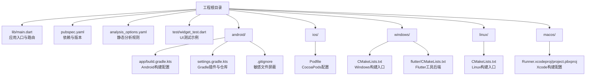
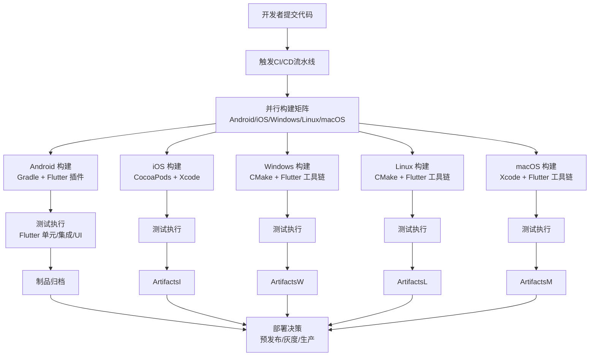
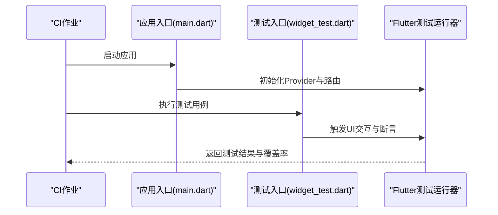
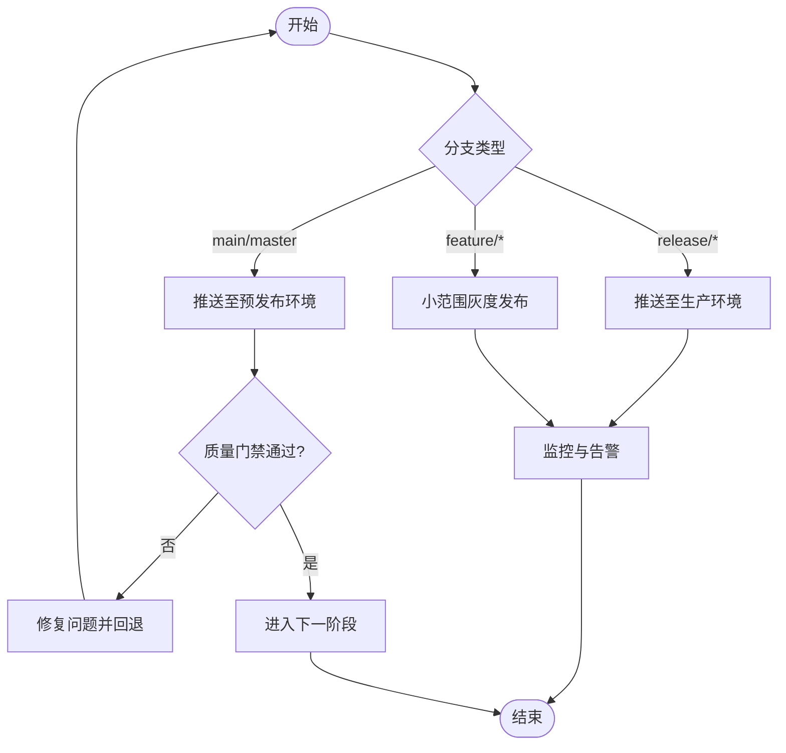
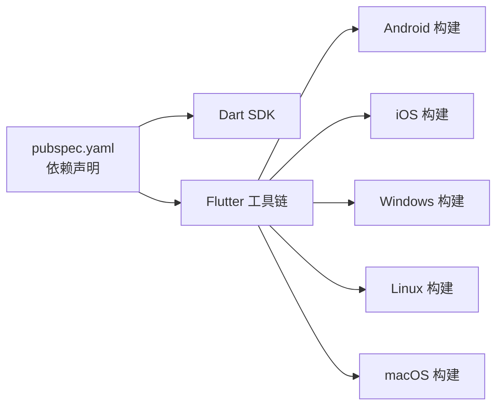

# 持续集成与自动化部署

<cite>
**本文引用的文件**   
- [pubspec.yaml](file://pubspec.yaml)
- [analysis_options.yaml](file://analysis_options.yaml)
- [lib/main.dart](file://lib/main.dart)
- [test/widget_test.dart](file://test/widget_test.dart)
- [android/app/build.gradle.kts](file://android/app/build.gradle.kts)
- [android/settings.gradle.kts](file://android/settings.gradle.kts)
- [android/.gitignore](file://android/.gitignore)
- [ios/Podfile](file://ios/Podfile)
- [windows/CMakeLists.txt](file://windows/CMakeLists.txt)
- [windows/flutter/CMakeLists.txt](file://windows/flutter/CMakeLists.txt)
- [linux/CMakeLists.txt](file://linux/CMakeLists.txt)
- [macos/Runner.xcodeproj/project.pbxproj](file://macos/Runner.xcodeproj/project.pbxproj)
- [ios/Runner.xcodeproj/project.pbxproj](file://ios/Runner.xcodeproj/project.pbxproj)
</cite>

## 目录
1. [简介](#简介)
2. [项目结构](#项目结构)
3. [核心组件](#核心组件)
4. [架构总览](#架构总览)
5. [详细组件分析](#详细组件分析)
6. [依赖关系分析](#依赖关系分析)
7. [性能考虑](#性能考虑)
8. [故障排查指南](#故障排查指南)
9. [结论](#结论)
10. [附录](#附录)

## 简介
本指南面向Mimo项目的CI/CD自动化部署，覆盖以下主题：
- GitHub Actions或其他CI/CD平台的配置思路与最佳实践
- 多平台并行构建矩阵、依赖缓存与构建优化
- 自动化测试：单元测试、集成测试与UI测试
- 自动化部署策略：预发布、生产与灰度发布
- 代码质量检查与安全扫描集成
- 发布通知与告警机制
- CI/CD流程监控与日志分析
- 私有CI/CD系统搭建与维护要点

说明：本仓库未包含现有CI/CD配置文件，因此本指南以“如何在现有工程基础上落地CI/CD”为主线，结合工程结构与配置文件给出可操作的实施方案。

## 项目结构
Mimo是Flutter应用，支持Android、iOS、Windows、Linux与macOS等多端。关键特征如下：
- 应用入口与路由定义集中在主入口文件
- 依赖与开发依赖通过包管理文件声明
- 各平台构建脚本与配置文件分别位于对应目录
- 测试入口位于测试目录，包含基础UI测试样例

图表来源
- [lib/main.dart:1-34](file://lib/main.dart#L1-L34)
- [pubspec.yaml:1-80](file://pubspec.yaml#L1-L80)
- [analysis_options.yaml:1-29](file://analysis_options.yaml#L1-L29)
- [test/widget_test.dart:1-31](file://test/widget_test.dart#L1-L31)
- [android/app/build.gradle.kts:1-45](file://android/app/build.gradle.kts#L1-L45)
- [android/settings.gradle.kts:1-25](file://android/settings.gradle.kts#L1-L25)
- [android/.gitignore:1-14](file://android/.gitignore#L1-L14)
- [ios/Podfile:1-44](file://ios/Podfile#L1-L44)
- [windows/CMakeLists.txt:1-33](file://windows/CMakeLists.txt#L1-L33)
- [windows/flutter/CMakeLists.txt:86-109](file://windows/flutter/CMakeLists.txt#L86-L109)
- [linux/CMakeLists.txt:37-70](file://linux/CMakeLists.txt#L37-L70)
- [macos/Runner.xcodeproj/project.pbxproj](file://macos/Runner.xcodeproj/project.pbxproj)
- [ios/Runner.xcodeproj/project.pbxproj](file://ios/Runner.xcodeproj/project.pbxproj)

章节来源
- [lib/main.dart:1-34](file://lib/main.dart#L1-L34)
- [pubspec.yaml:1-80](file://pubspec.yaml#L1-L80)
- [analysis_options.yaml:1-29](file://analysis_options.yaml#L1-L29)
- [test/widget_test.dart:1-31](file://test/widget_test.dart#L1-L31)
- [android/app/build.gradle.kts:1-45](file://android/app/build.gradle.kts#L1-L45)
- [android/settings.gradle.kts:1-25](file://android/settings.gradle.kts#L1-L25)
- [android/.gitignore:1-14](file://android/.gitignore#L1-L14)
- [ios/Podfile:1-44](file://ios/Podfile#L1-L44)
- [windows/CMakeLists.txt:1-33](file://windows/CMakeLists.txt#L1-L33)
- [windows/flutter/CMakeLists.txt:86-109](file://windows/flutter/CMakeLists.txt#L86-L109)
- [linux/CMakeLists.txt:37-70](file://linux/CMakeLists.txt#L37-L70)
- [macos/Runner.xcodeproj/project.pbxproj](file://macos/Runner.xcodeproj/project.pbxproj)
- [ios/Runner.xcodeproj/project.pbxproj](file://ios/Runner.xcodeproj/project.pbxproj)

## 核心组件
- 应用入口与路由
  - 主入口负责初始化Provider体系与页面路由，确保测试与构建时可正常启动应用。
- 依赖与版本
  - 包含运行时依赖、开发依赖与资源清单，用于指导构建与测试。
- 分析规则
  - 静态分析规则集中配置，便于统一质量标准。
- 测试入口
  - 提供基础UI测试示例，可作为自动化UI测试的起点。
- 平台构建配置
  - Android使用Gradle与Flutter Gradle插件；iOS使用CocoaPods；Windows/Linux/macOS使用CMake与Flutter工具链。

章节来源
- [lib/main.dart:1-34](file://lib/main.dart#L1-L34)
- [pubspec.yaml:1-80](file://pubspec.yaml#L1-L80)
- [analysis_options.yaml:1-29](file://analysis_options.yaml#L1-L29)
- [test/widget_test.dart:1-31](file://test/widget_test.dart#L1-L31)
- [android/app/build.gradle.kts:1-45](file://android/app/build.gradle.kts#L1-L45)
- [ios/Podfile:1-44](file://ios/Podfile#L1-L44)
- [windows/CMakeLists.txt:1-33](file://windows/CMakeLists.txt#L1-L33)
- [linux/CMakeLists.txt:37-70](file://linux/CMakeLists.txt#L37-L70)
- [macos/Runner.xcodeproj/project.pbxproj](file://macos/Runner.xcodeproj/project.pbxproj)

## 架构总览
下图展示CI/CD在多平台并行构建中的总体交互：源码触发流水线后，按平台拆分任务，分别执行依赖安装、构建与测试，并在成功后进行制品归档与部署决策。

## 详细组件分析

### 构建矩阵与并行策略
- 平台拆分
  - Android：基于Gradle与Flutter Gradle插件，使用Java 11兼容性配置。
  - iOS：基于CocoaPods与Xcode工程，需预先安装依赖。
  - Windows/Linux/macOS：基于CMake与Flutter工具链，遵循各平台构建入口。
- 并行度建议
  - 将不同平台作为独立作业并行执行，减少整体耗时。
  - 对于Android与iOS，可进一步拆分Debug/Release或签名配置以缩短反馈周期。
- 依赖缓存
  - Android：缓存Gradle用户目录与Flutter SDK生成的中间产物。
  - iOS：缓存Pods与DerivedData，避免重复下载与编译。
  - Windows/Linux/macOS：缓存Flutter SDK与构建产物，减少重复下载。
- 构建优化
  - 使用增量构建与并行编译参数。
  - 预先执行依赖安装，避免在构建阶段重复下载。
  - 对Release构建启用优化选项，同时保留符号表用于调试。

章节来源
- [android/app/build.gradle.kts:1-45](file://android/app/build.gradle.kts#L1-L45)
- [android/settings.gradle.kts:1-25](file://android/settings.gradle.kts#L1-L25)
- [ios/Podfile:1-44](file://ios/Podfile#L1-L44)
- [windows/CMakeLists.txt:1-33](file://windows/CMakeLists.txt#L1-L33)
- [windows/flutter/CMakeLists.txt:86-109](file://windows/flutter/CMakeLists.txt#L86-L109)
- [linux/CMakeLists.txt:37-70](file://linux/CMakeLists.txt#L37-L70)
- [macos/Runner.xcodeproj/project.pbxproj](file://macos/Runner.xcodeproj/project.pbxproj)

### 自动化测试集成
- 单元测试与集成测试
  - 利用Flutter测试框架执行单元与集成测试，建议在CI中固定执行。
- UI测试
  - 基于UI测试示例，扩展到关键页面与交互路径，确保回归稳定。
- 测试报告与覆盖率
  - 输出JUnit XML与覆盖率报告，便于在CI中聚合与告警。
- 测试稳定性
  - 使用稳定的模拟器/设备池，避免资源竞争导致的失败。
  - 对网络与摄像头等外部依赖进行隔离或模拟。

图表来源
- [lib/main.dart:1-34](file://lib/main.dart#L1-L34)
- [test/widget_test.dart:1-31](file://test/widget_test.dart#L1-L31)

章节来源
- [lib/main.dart:1-34](file://lib/main.dart#L1-L34)
- [test/widget_test.dart:1-31](file://test/widget_test.dart#L1-L31)

### 自动化部署策略
- 预发布环境
  - 针对关键变更在预发布环境进行端到端验证，收集反馈后再进入生产。
- 生产环境
  - 采用签名与配置分离，确保构建产物与密钥不暴露在仓库。
- 灰度发布
  - 通过渠道控制（如Beta/内部测试）逐步放量，结合遥测与日志进行风险评估。
- 制品管理
  - 将各平台构建产物归档并打上版本标签，便于回滚与审计。

### 代码质量检查与安全扫描
- 静态分析
  - 基于分析规则文件统一执行静态检查，确保风格与潜在问题被及时发现。
- 安全扫描
  - 依赖扫描：定期扫描第三方依赖的安全漏洞。
  - 密钥与机密：通过CI变量注入，避免硬编码与误提交。
- 规则定制
  - 可根据团队规范调整规则集，必要时临时抑制特定规则并记录原因。

章节来源
- [analysis_options.yaml:1-29](file://analysis_options.yaml#L1-L29)

### 发布通知与告警机制
- 通知渠道
  - 邮件、IM群组、Slack等，按环境与级别区分消息模板。
- 告警阈值
  - 构建失败、测试失败率、覆盖率下降、安全扫描异常等。
- 自动化联动
  - 失败自动关闭PR合并权限或阻塞后续步骤，直至问题解决。

### CI/CD流程监控与日志分析
- 日志采集
  - 将各平台构建与测试日志标准化输出，便于检索与聚合。
- 指标监控
  - 构建时长、成功率、重试次数、失败分布等。
- 回溯与定位
  - 结合制品与日志快速定位问题根因，建立知识库沉淀。

### 私有CI/CD系统的搭建与维护
- 基础设施
  - 虚拟机/容器节点、共享存储、代理与镜像加速。
- 安全与合规
  - 限制访问权限、审计日志、密钥轮换与最小权限原则。
- 维护与升级
  - 定期更新构建工具链、操作系统补丁与CI插件版本。
- 可靠性
  - 多活节点、故障转移与备份策略，保障高可用。

## 依赖关系分析
- 语言与工具链
  - Dart SDK版本由包管理文件声明，确保CI环境一致。
  - Android使用Java 11兼容配置，iOS依赖CocoaPods，Windows/Linux/macOS依赖CMake。
- 依赖安装与缓存
  - Android：Gradle Wrapper与Flutter SDK生成物缓存。
  - iOS：CocoaPods依赖缓存与Xcode DerivedData。
  - Windows/Linux/macOS：Flutter SDK与构建产物缓存。
- 构建入口与后端
  - Windows通过自定义CMake目标调用Flutter工具后端，确保生成物完整。

图表来源
- [pubspec.yaml:21-23](file://pubspec.yaml#L21-L23)
- [windows/flutter/CMakeLists.txt:86-109](file://windows/flutter/CMakeLists.txt#L86-L109)

章节来源
- [pubspec.yaml:21-23](file://pubspec.yaml#L21-L23)
- [windows/flutter/CMakeLists.txt:86-109](file://windows/flutter/CMakeLists.txt#L86-L109)

## 性能考虑
- 缓存策略
  - Gradle、CocoaPods、Flutter SDK与构建产物的缓存命中率直接影响吞吐。
- 并行度
  - 平台级并行与任务级并行相结合，避免资源争用。
- 构建优化
  - Release构建启用优化，Debug构建侧重可调试性。
- 网络与镜像
  - 使用企业镜像与代理，降低依赖下载时间。

## 故障排查指南
- Android构建失败
  - 检查Java版本与NDK配置是否匹配，确认签名配置与密钥注入。
- iOS构建失败
  - 检查CocoaPods安装状态与Xcode版本，清理DerivedData后重试。
- Windows/Linux/macOS构建失败
  - 检查CMake与Flutter工具链版本，清理构建目录后重试。
- 测试不稳定
  - 使用稳定设备/模拟器，隔离外部依赖，增加重试与超时配置。
- 密钥与机密泄露
  - 立即撤销密钥并轮换，审查最近提交与CI日志。

章节来源
- [android/app/build.gradle.kts:13-20](file://android/app/build.gradle.kts#L13-L20)
- [android/.gitignore:10-14](file://android/.gitignore#L10-L14)
- [ios/Podfile:13-26](file://ios/Podfile#L13-L26)

## 结论
通过在现有工程基础上引入并行构建矩阵、依赖缓存与构建优化、自动化测试与部署策略、代码质量与安全扫描、发布通知与告警、监控与日志分析以及私有CI/CD系统维护，Mimo项目可以实现高效、稳定与可追溯的交付流程。建议从平台级并行与缓存入手，逐步完善测试与部署策略，并持续优化构建与测试性能。

## 附录
- 关键文件索引
  - 应用入口与路由：[lib/main.dart:1-34](file://lib/main.dart#L1-L34)
  - 依赖与版本：[pubspec.yaml:1-80](file://pubspec.yaml#L1-L80)
  - 分析规则：[analysis_options.yaml:1-29](file://analysis_options.yaml#L1-L29)
  - UI测试示例：[test/widget_test.dart:1-31](file://test/widget_test.dart#L1-L31)
  - Android构建配置：[android/app/build.gradle.kts:1-45](file://android/app/build.gradle.kts#L1-L45)
  - Android Gradle设置：[android/settings.gradle.kts:1-25](file://android/settings.gradle.kts#L1-L25)
  - Android敏感文件屏蔽：[android/.gitignore:10-14](file://android/.gitignore#L10-L14)
  - iOS CocoaPods配置：[ios/Podfile:1-44](file://ios/Podfile#L1-L44)
  - Windows构建入口：[windows/CMakeLists.txt:1-33](file://windows/CMakeLists.txt#L1-L33)
  - Windows Flutter工具后端：[windows/flutter/CMakeLists.txt:86-109](file://windows/flutter/CMakeLists.txt#L86-L109)
  - Linux构建入口：[linux/CMakeLists.txt:37-70](file://linux/CMakeLists.txt#L37-L70)
  - macOS Xcode构建配置：[macos/Runner.xcodeproj/project.pbxproj](file://macos/Runner.xcodeproj/project.pbxproj)
  - iOS Xcode构建配置：[ios/Runner.xcodeproj/project.pbxproj](file://ios/Runner.xcodeproj/project.pbxproj)