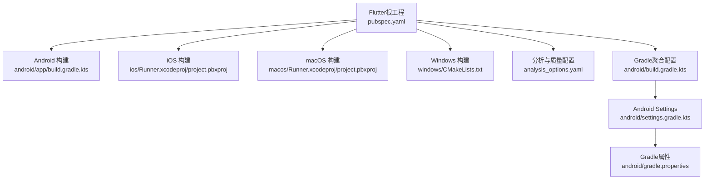
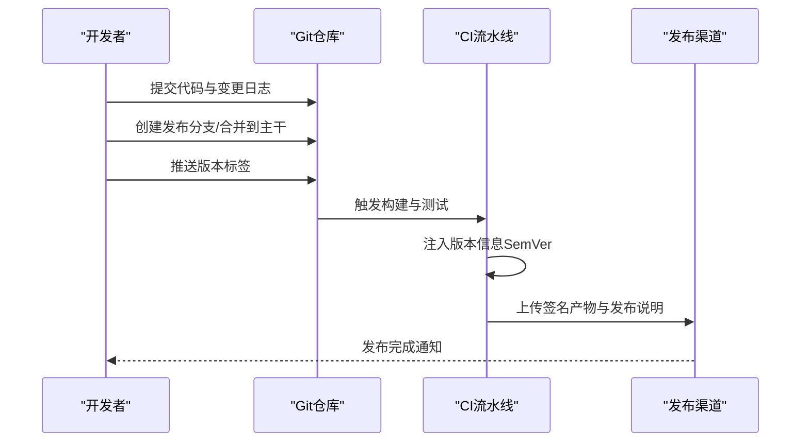
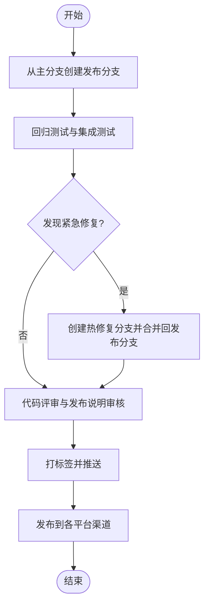
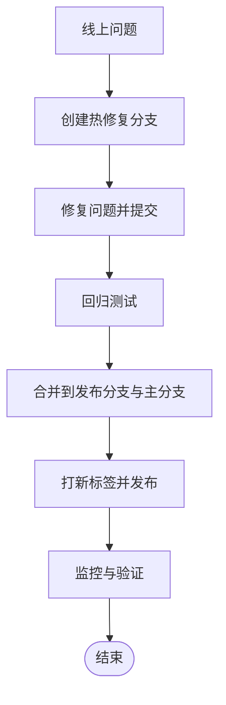
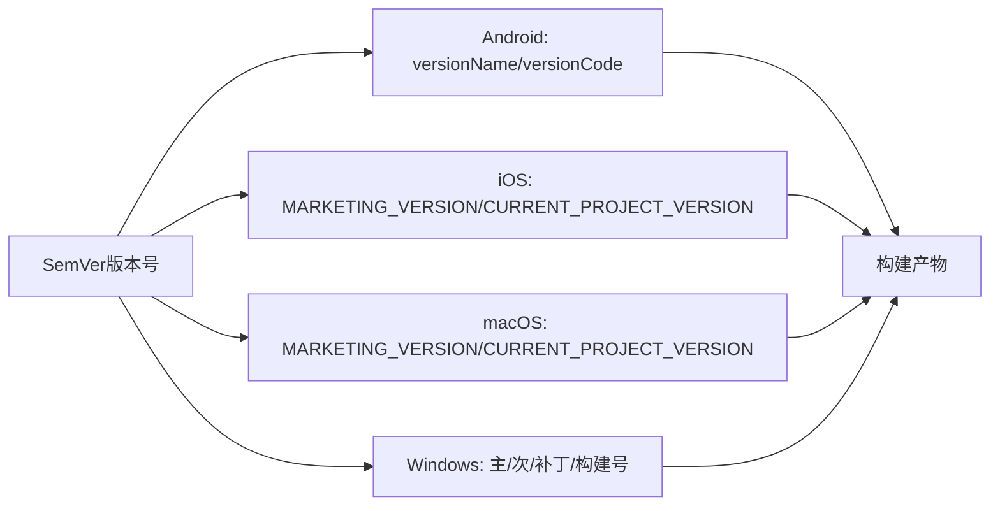
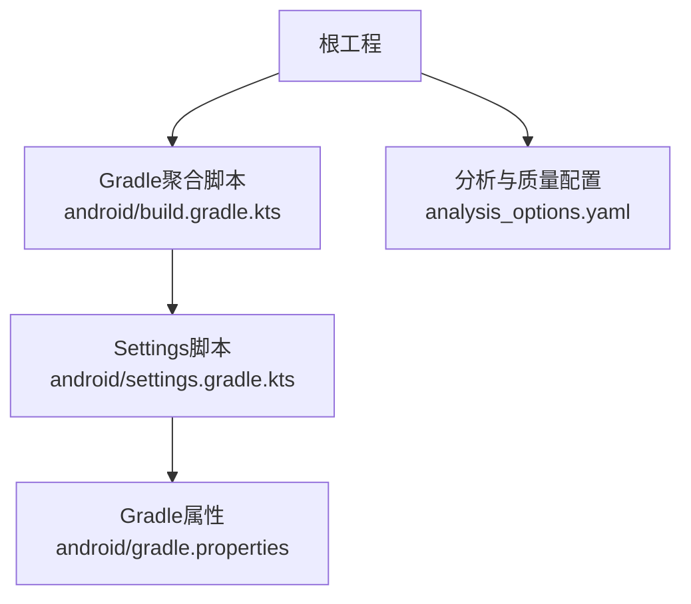

# 版本管理与发布周期

<cite>
**本文引用的文件**   
- [pubspec.yaml](file://pubspec.yaml)
- [android/app/build.gradle.kts](file://android/app/build.gradle.kts)
- [ios/Runner.xcodeproj/project.pbxproj](file://ios/Runner.xcodeproj/project.pbxproj)
- [macos/Runner.xcodeproj/project.pbxproj](file://macos/Runner.xcodeproj/project.pbxproj)
- [windows/CMakeLists.txt](file://windows/CMakeLists.txt)
- [android/build.gradle.kts](file://android/build.gradle.kts)
- [android/settings.gradle.kts](file://android/settings.gradle.kts)
- [android/gradle.properties](file://android/gradle.properties)
- [analysis_options.yaml](file://analysis_options.yaml)
- [README.md](file://README.md)
</cite>

## 目录
1. [简介](#简介)
2. [项目结构](#项目结构)
3. [核心组件](#核心组件)
4. [架构总览](#架构总览)
5. [详细组件分析](#详细组件分析)
6. [依赖关系分析](#依赖关系分析)
7. [性能考量](#性能考量)
8. [故障排查指南](#故障排查指南)
9. [结论](#结论)
10. [附录](#附录)

## 简介
本指南面向Mimo项目的版本管理与发布周期，系统化地阐述以下内容：
- 语义化版本控制（SemVer）在项目中的应用与版本号命名规范
- Git标签管理、分支策略与发布分支创建流程
- 发布周期规划（功能迭代节奏与紧急修复流程）
- 版本兼容性管理（依赖库升级与向后兼容性）
- 版本回滚策略与热修复（Hotfix）流程
- 变更日志维护与发布说明编写规范
- 自动化版本更新与发布流程配置
- 多平台版本同步与一致性保障机制

## 项目结构
Mimo为Flutter跨平台项目，包含Android、iOS、macOS、Windows与Web等多平台构建配置。版本信息主要由Flutter工程的包元数据与各平台原生配置共同决定。

**图表来源**
- [pubspec.yaml](file://pubspec.yaml)
- [android/app/build.gradle.kts](file://android/app/build.gradle.kts)
- [ios/Runner.xcodeproj/project.pbxproj](file://ios/Runner.xcodeproj/project.pbxproj)
- [macos/Runner.xcodeproj/project.pbxproj](file://macos/Runner.xcodeproj/project.pbxproj)
- [windows/CMakeLists.txt](file://windows/CMakeLists.txt)
- [android/build.gradle.kts](file://android/build.gradle.kts)
- [android/settings.gradle.kts](file://android/settings.gradle.kts)
- [android/gradle.properties](file://android/gradle.properties)
- [analysis_options.yaml](file://analysis_options.yaml)

**章节来源**
- [pubspec.yaml:19](file://pubspec.yaml#L19)
- [android/app/build.gradle.kts:29-30](file://android/app/build.gradle.kts#L29-L30)
- [ios/Runner.xcodeproj/project.pbxproj:364](file://ios/Runner.xcodeproj/project.pbxproj#L364)
- [macos/Runner.xcodeproj/project.pbxproj:567](file://macos/Runner.xcodeproj/project.pbxproj#L567)
- [windows/CMakeLists.txt:1-109](file://windows/CMakeLists.txt#L1-L109)
- [android/build.gradle.kts:1-22](file://android/build.gradle.kts#L1-L22)
- [android/settings.gradle.kts:19-23](file://android/settings.gradle.kts#L19-L23)
- [android/gradle.properties:1-4](file://android/gradle.properties#L1-L4)
- [analysis_options.yaml:1-29](file://analysis_options.yaml#L1-L29)

## 核心组件
- 版本源与命名规范
  - Flutter工程版本由包元数据定义，格式为三段制主版本.次版本.修订号+构建元数据，主版本用于破坏性变更，次版本用于向后兼容的功能变更，修订号用于向后兼容的缺陷修复。
  - Android通过versionName与versionCode同步Flutter版本；iOS通过MARKETING_VERSION与CURRENT_PROJECT_VERSION同步；macOS通过MARKETING_VERSION与CURRENT_PROJECT_VERSION同步；Windows通过产品与文件版本的主/次/补丁部分与构建号同步。
- 分支与标签策略
  - 使用Git标签标记发布版本；分支策略采用长期分支与短期特性分支结合，发布分支用于稳定与回归测试。
- 发布说明与变更日志
  - 维护统一的变更日志文件，记录每个版本的新增、修复、变更与废弃项，并在发布时生成发布说明。
- 自动化与一致性
  - 通过CI流水线在构建阶段注入版本信息，确保多平台版本号一致；在发布阶段生成签名产物与发布说明。

**章节来源**
- [pubspec.yaml:19](file://pubspec.yaml#L19)
- [android/app/build.gradle.kts:29-30](file://android/app/build.gradle.kts#L29-L30)
- [ios/Runner.xcodeproj/project.pbxproj:364](file://ios/Runner.xcodeproj/project.pbxproj#L364)
- [macos/Runner.xcodeproj/project.pbxproj:567](file://macos/Runner.xcodeproj/project.pbxproj#L567)
- [windows/CMakeLists.txt:1-109](file://windows/CMakeLists.txt#L1-L109)

## 架构总览
版本管理与发布涉及以下关键环节：版本号来源、平台同步、标签与分支、发布说明、自动化与一致性保障。

**图表来源**
- [pubspec.yaml:19](file://pubspec.yaml#L19)
- [android/app/build.gradle.kts:29-30](file://android/app/build.gradle.kts#L29-L30)
- [ios/Runner.xcodeproj/project.pbxproj:364](file://ios/Runner.xcodeproj/project.pbxproj#L364)
- [macos/Runner.xcodeproj/project.pbxproj:567](file://macos/Runner.xcodeproj/project.pbxproj#L567)
- [windows/CMakeLists.txt:1-109](file://windows/CMakeLists.txt#L1-L109)

## 详细组件分析

### 语义化版本控制（SemVer）与命名规范
- 版本号结构
  - 主版本号：破坏性变更
  - 次版本号：向后兼容的功能新增
  - 修订号：向后兼容的缺陷修复
  - 构建元数据：可选，用于区分构建环境或流水线标识
- 平台映射
  - Android：versionName映射主版本.次版本.修订号；versionCode映射构建号
  - iOS/macOS：MARKETING_VERSION映射主版本.次版本.修订号；CURRENT_PROJECT_VERSION映射构建号
  - Windows：产品版本与文件版本的主/次/补丁部分映射主版本.次版本.修订号；构建号映射构建元数据
- 命名约定
  - 使用稳定的三段制版本号；在发布前锁定依赖版本，避免不稳定版本引入破坏性变更

**章节来源**
- [pubspec.yaml:19](file://pubspec.yaml#L19)
- [android/app/build.gradle.kts:29-30](file://android/app/build.gradle.kts#L29-L30)
- [ios/Runner.xcodeproj/project.pbxproj:364](file://ios/Runner.xcodeproj/project.pbxproj#L364)
- [macos/Runner.xcodeproj/project.pbxproj:567](file://macos/Runner.xcodeproj/project.pbxproj#L567)
- [windows/CMakeLists.txt:1-109](file://windows/CMakeLists.txt#L1-L109)

### Git标签管理与分支策略
- 标签管理
  - 以“v主.次.修”的形式创建标签，如v1.2.3；每次发布前确保标签与版本号一致
  - 标签应包含发布说明摘要与关键变更清单
- 分支策略
  - 主分支：稳定发布通道，仅合并已验证的发布分支
  - 发布分支：从主分支切出，用于紧急修复与回归测试
  - 特性分支：短期存在，完成后合并到主干或发布分支
- 合并与审核
  - 通过Pull Request进行代码评审；合并前确保通过CI与测试

**章节来源**
- [README.md:235-245](file://README.md#L235-L245)

### 发布分支创建流程

**图表来源**
- [README.md:235-245](file://README.md#L235-L245)

### 发布周期规划与节奏
- 迭代节奏
  - 采用固定周期的迭代计划，每个迭代包含需求梳理、开发、测试与评审
- 紧急修复流程
  - 通过发布分支隔离紧急修复，修复完成后回并到主分支与后续发布分支
- 发布说明
  - 每个版本发布前生成发布说明，包含新增功能、修复问题、已知问题与迁移指引

**章节来源**
- [README.md:235-245](file://README.md#L235-L245)

### 版本兼容性管理与依赖升级
- 依赖锁定
  - 在发布前锁定关键依赖版本，避免自动升级引入破坏性变更
- 向后兼容性
  - 严格遵循SemVer；破坏性变更提升主版本；功能新增提升次版本；缺陷修复提升修订号
- 升级策略
  - 重大依赖升级需进行兼容性评估与回归测试；必要时提供迁移指南

**章节来源**
- [pubspec.yaml:30-67](file://pubspec.yaml#L30-L67)

### 版本回滚与热修复（Hotfix）流程

**图表来源**
- [README.md:235-245](file://README.md#L235-L245)

### 变更日志维护与发布说明规范
- 变更日志
  - 按版本维护统一的变更日志文件，记录新增、修复、变更与废弃项
  - 每个条目包含简要描述与影响范围
- 发布说明
  - 每次发布生成发布说明，包含版本号、发布日期、关键变更、已知问题与迁移指引
  - 发布说明随版本标签一同发布

**章节来源**
- [README.md:235-245](file://README.md#L235-L245)

### 自动化版本更新与发布流程配置
- 版本注入
  - CI在构建阶段读取版本信息并注入到各平台配置（Android/iOS/macOS/Windows）
- 构建与签名
  - CI负责多平台构建、签名与产物打包
- 发布
  - CI将发布说明与产物上传到发布渠道，完成自动化发布

**章节来源**
- [android/app/build.gradle.kts:29-30](file://android/app/build.gradle.kts#L29-L30)
- [ios/Runner.xcodeproj/project.pbxproj:364](file://ios/Runner.xcodeproj/project.pbxproj#L364)
- [macos/Runner.xcodeproj/project.pbxproj:567](file://macos/Runner.xcodeproj/project.pbxproj#L567)
- [windows/CMakeLists.txt:1-109](file://windows/CMakeLists.txt#L1-L109)

### 多平台版本同步与一致性保障

**图表来源**
- [pubspec.yaml:19](file://pubspec.yaml#L19)
- [android/app/build.gradle.kts:29-30](file://android/app/build.gradle.kts#L29-L30)
- [ios/Runner.xcodeproj/project.pbxproj:364](file://ios/Runner.xcodeproj/project.pbxproj#L364)
- [macos/Runner.xcodeproj/project.pbxproj:567](file://macos/Runner.xcodeproj/project.pbxproj#L567)
- [windows/CMakeLists.txt:1-109](file://windows/CMakeLists.txt#L1-L109)

## 依赖关系分析
- Gradle聚合与插件管理
  - 通过聚合脚本集中管理构建目录与插件版本，确保子工程与主工程的一致性
- 分析与质量配置
  - 通过分析选项统一代码风格与静态检查规则，提升代码质量与可维护性

**图表来源**
- [android/build.gradle.kts:1-22](file://android/build.gradle.kts#L1-L22)
- [android/settings.gradle.kts:19-23](file://android/settings.gradle.kts#L19-L23)
- [android/gradle.properties:1-4](file://android/gradle.properties#L1-L4)
- [analysis_options.yaml:1-29](file://analysis_options.yaml#L1-L29)

**章节来源**
- [android/build.gradle.kts:1-22](file://android/build.gradle.kts#L1-L22)
- [android/settings.gradle.kts:19-23](file://android/settings.gradle.kts#L19-L23)
- [android/gradle.properties:1-4](file://android/gradle.properties#L1-L4)
- [analysis_options.yaml:1-29](file://analysis_options.yaml#L1-L29)

## 性能考量
- 构建性能
  - 合理设置Gradle JVM参数与缓存，减少构建时间
- 版本一致性
  - 通过CI统一注入版本信息，避免手工配置导致的不一致
- 发布效率
  - 自动化流水线减少人工干预，提高发布效率与稳定性

## 故障排查指南
- 版本不一致
  - 检查各平台配置是否正确映射SemVer；确认CI注入流程是否生效
- 构建失败
  - 查看Gradle聚合与插件版本是否匹配；核对本地属性配置
- 发布异常
  - 核对发布分支与标签状态；检查发布说明与产物完整性

**章节来源**
- [android/gradle.properties:1-4](file://android/gradle.properties#L1-L4)
- [android/settings.gradle.kts:19-23](file://android/settings.gradle.kts#L19-L23)

## 结论
通过建立完善的SemVer体系、严格的Git标签与分支策略、标准化的发布说明与变更日志、以及自动化CI流程，Mimo项目可以实现跨平台版本的高效管理与稳定发布。建议在现有基础上进一步完善热修复流程与依赖升级策略，确保版本演进的可控性与可追溯性。

## 附录
- 参考资料
  - Flutter版本与平台映射说明
  - 各平台版本号含义与设置参考