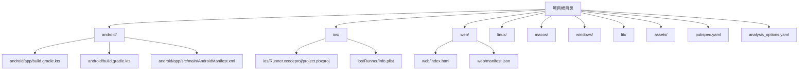
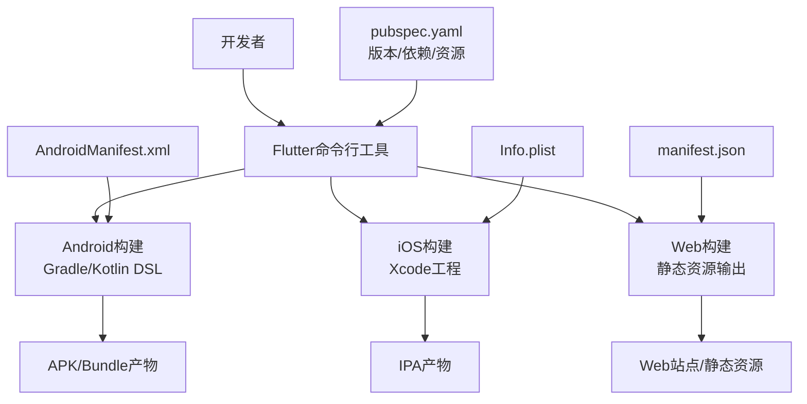
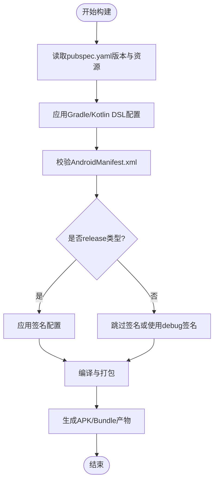
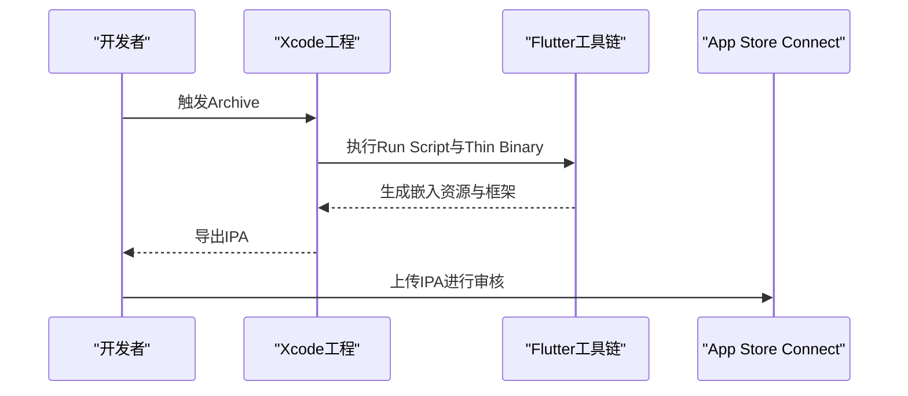
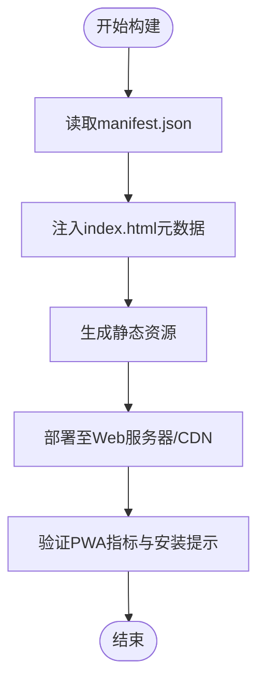
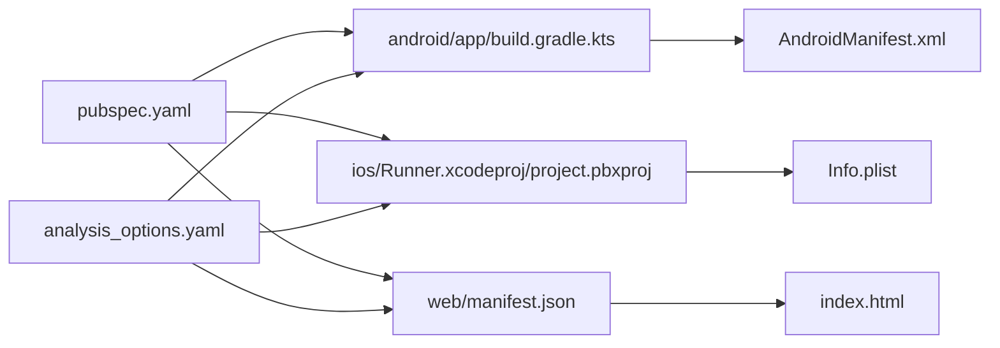

# 部署与发布

<cite>
**本文引用的文件**
- [pubspec.yaml](file://pubspec.yaml)
- [android/build.gradle.kts](file://android/build.gradle.kts)
- [android/app/build.gradle.kts](file://android/app/build.gradle.kts)
- [android/app/src/main/AndroidManifest.xml](file://android/app/src/main/AndroidManifest.xml)
- [ios/Runner.xcodeproj/project.pbxproj](file://ios/Runner.xcodeproj/project.pbxproj)
- [ios/Runner/Info.plist](file://ios/Runner/Info.plist)
- [web/index.html](file://web/index.html)
- [web/manifest.json](file://web/manifest.json)
- [analysis_options.yaml](file://analysis_options.yaml)
</cite>

## 目录
1. [简介](#简介)
2. [项目结构](#项目结构)
3. [核心组件](#核心组件)
4. [架构总览](#架构总览)
5. [详细组件分析](#详细组件分析)
6. [依赖关系分析](#依赖关系分析)
7. [性能考量](#性能考量)
8. [故障排查指南](#故障排查指南)
9. [结论](#结论)
10. [附录](#附录)

## 简介
本文件面向Mimo项目的部署与发布，系统性说明多平台构建流程、自动化部署策略、应用商店发布准备与审核要点、版本管理与发布周期、CI/CD配置思路、构建优化与包体积控制、发布前检查清单、发布后监控与回滚机制，以及发布通知与用户沟通策略，并补充发布后的性能监控与问题追踪方法。

## 项目结构
Mimo采用Flutter跨平台架构，支持Android、iOS、Web、Windows、macOS、Linux等多端。项目根目录包含各平台子工程与公共资源，关键配置集中在pubspec.yaml、各平台的构建脚本与清单文件中。

图表来源
- [pubspec.yaml:1-80](file://pubspec.yaml#L1-L80)
- [android/app/build.gradle.kts:1-45](file://android/app/build.gradle.kts#L1-L45)
- [android/build.gradle.kts:1-22](file://android/build.gradle.kts#L1-L22)
- [android/app/src/main/AndroidManifest.xml:1-46](file://android/app/src/main/AndroidManifest.xml#L1-L46)
- [ios/Runner.xcodeproj/project.pbxproj:1-620](file://ios/Runner.xcodeproj/project.pbxproj#L1-L620)
- [ios/Runner/Info.plist:1-50](file://ios/Runner/Info.plist#L1-L50)
- [web/index.html:1-39](file://web/index.html#L1-L39)
- [web/manifest.json:1-36](file://web/manifest.json#L1-L36)

章节来源
- [pubspec.yaml:1-80](file://pubspec.yaml#L1-L80)
- [android/app/build.gradle.kts:1-45](file://android/app/build.gradle.kts#L1-L45)
- [android/build.gradle.kts:1-22](file://android/build.gradle.kts#L1-L22)
- [android/app/src/main/AndroidManifest.xml:1-46](file://android/app/src/main/AndroidManifest.xml#L1-L46)
- [ios/Runner.xcodeproj/project.pbxproj:1-620](file://ios/Runner.xcodeproj/project.pbxproj#L1-L620)
- [ios/Runner/Info.plist:1-50](file://ios/Runner/Info.plist#L1-L50)
- [web/index.html:1-39](file://web/index.html#L1-L39)
- [web/manifest.json:1-36](file://web/manifest.json#L1-L36)

## 核心组件
- 版本与依赖管理：通过pubspec.yaml统一声明版本号、构建号、依赖库与资源路径，确保多端一致性。
- Android构建：使用Flutter Gradle插件与Kotlin DSL，配置Java 11兼容、命名空间、签名占位与Flutter源路径。
- iOS构建：Xcode工程配置包含Bundle标识、版本信息、部署目标、签名与资源嵌入脚本。
- Web发布：通过index.html与manifest.json提供PWA元数据与图标集，适配浏览器安装与启动体验。
- 质量规范：analysis_options.yaml引入Flutter推荐lint规则，统一代码风格与静态检查。

章节来源
- [pubspec.yaml:1-80](file://pubspec.yaml#L1-L80)
- [android/app/build.gradle.kts:1-45](file://android/app/build.gradle.kts#L1-L45)
- [ios/Runner.xcodeproj/project.pbxproj:1-620](file://ios/Runner.xcodeproj/project.pbxproj#L1-L620)
- [web/index.html:1-39](file://web/index.html#L1-L39)
- [web/manifest.json:1-36](file://web/manifest.json#L1-L36)
- [analysis_options.yaml:1-29](file://analysis_options.yaml#L1-L29)

## 架构总览
下图展示Mimo在多平台的构建与发布关键节点：Flutter引擎生成各端二进制或Web资源；Android/iOS通过各自构建系统完成打包；Web通过静态资源部署；版本与资源由pubspec统一管理。

图表来源
- [pubspec.yaml:1-80](file://pubspec.yaml#L1-L80)
- [android/app/build.gradle.kts:1-45](file://android/app/build.gradle.kts#L1-L45)
- [android/app/src/main/AndroidManifest.xml:1-46](file://android/app/src/main/AndroidManifest.xml#L1-L46)
- [ios/Runner.xcodeproj/project.pbxproj:1-620](file://ios/Runner.xcodeproj/project.pbxproj#L1-L620)
- [ios/Runner/Info.plist:1-50](file://ios/Runner/Info.plist#L1-L50)
- [web/manifest.json:1-36](file://web/manifest.json#L1-L36)

## 详细组件分析

### Android构建与发布
- 版本映射：pubspec.yaml中的version映射到Android的versionName与versionCode（由Flutter插件注入）。
- 构建类型：默认release使用debug签名配置，需在正式发布前替换为正式签名。
- 清单与权限：AndroidManifest.xml定义主Activity、主题、硬件加速与查询意图，确保文本处理能力。
- Gradle目录：顶层build.gradle.kts将所有子工程构建目录统一至根目录，便于缓存与清理。

图表来源
- [pubspec.yaml:19](file://pubspec.yaml#L19)
- [android/app/build.gradle.kts:33-39](file://android/app/build.gradle.kts#L33-L39)
- [android/app/src/main/AndroidManifest.xml:1-46](file://android/app/src/main/AndroidManifest.xml#L1-L46)
- [android/build.gradle.kts:8-21](file://android/build.gradle.kts#L8-L21)

章节来源
- [pubspec.yaml:19](file://pubspec.yaml#L19)
- [android/app/build.gradle.kts:1-45](file://android/app/build.gradle.kts#L1-L45)
- [android/app/src/main/AndroidManifest.xml:1-46](file://android/app/src/main/AndroidManifest.xml#L1-L46)
- [android/build.gradle.kts:1-22](file://android/build.gradle.kts#L1-L22)

### iOS构建与发布
- 版本映射：Info.plist使用$(FLUTTER_BUILD_NAME)与$(FLUTTER_BUILD_NUMBER)，对应pubspec.yaml的version与构建号。
- Bundle标识：PRODUCT_BUNDLE_IDENTIFIER需唯一且与App Store Connect一致。
- 部署目标与设备方向：配置最低系统版本与支持的方向。
- 资源与脚本：Xcode工程包含Run Script与Thin Binary阶段，用于Flutter资源嵌入与二进制瘦身。

图表来源
- [ios/Runner/Info.plist:19-24](file://ios/Runner/Info.plist#L19-L24)
- [ios/Runner.xcodeproj/project.pbxproj:241-255](file://ios/Runner.xcodeproj/project.pbxproj#L241-L255)
- [ios/Runner.xcodeproj/project.pbxproj:224-240](file://ios/Runner.xcodeproj/project.pbxproj#L224-L240)

章节来源
- [ios/Runner/Info.plist:1-50](file://ios/Runner/Info.plist#L1-L50)
- [ios/Runner.xcodeproj/project.pbxproj:1-620](file://ios/Runner.xcodeproj/project.pbxproj#L1-L620)

### Web发布与PWA
- 入口页面：index.html设置base href、iOS meta标签与manifest链接，确保移动端Web应用体验。
- PWA清单：manifest.json定义名称、显示模式、主题色、图标集（含maskable），满足PWA安装条件。
- 构建产物：Flutter Web输出静态资源，部署至CDN或静态托管服务。

图表来源
- [web/index.html:17-33](file://web/index.html#L17-L33)
- [web/manifest.json:1-36](file://web/manifest.json#L1-L36)

章节来源
- [web/index.html:1-39](file://web/index.html#L1-L39)
- [web/manifest.json:1-36](file://web/manifest.json#L1-L36)

### 版本管理与发布周期
- 版本号：采用语义化版本（主.次.修订+构建号），在pubspec.yaml中集中维护。
- 发布节奏：建议按功能里程碑或季度制定发布窗口，配合预发布分支与变更日志。
- 变更记录：在发布前更新changelog，明确破坏性变更、新增功能与修复项。

章节来源
- [pubspec.yaml:19](file://pubspec.yaml#L19)

### 应用商店发布准备与审核要求
- Android：确保应用清单完整、权限最小化、签名正确、混淆与混淆规则（如启用）已配置；发布前进行安全扫描与兼容性测试。
- iOS：Bundle标识唯一、图标与屏幕适配齐全、隐私标签与用途说明完整；遵循App Store审核指南，避免敏感词与误导性描述。
- Web：确保manifest.json有效、HTTPS部署、PWA核心指标达标（如LCP、FID、CLS）。

章节来源
- [android/app/src/main/AndroidManifest.xml:1-46](file://android/app/src/main/AndroidManifest.xml#L1-L46)
- [ios/Runner/Info.plist:1-50](file://ios/Runner/Info.plist#L1-L50)
- [web/manifest.json:1-36](file://web/manifest.json#L1-L36)

### 持续集成与持续部署（CI/CD）
- 构建矩阵：在CI中并行执行Android、iOS、Web构建任务，分别调用相应构建命令。
- 缓存策略：缓存Flutter SDK、依赖与构建缓存目录，缩短流水线时间。
- 安全与签名：密钥与证书通过CI机密管理，避免硬编码；Android使用正式签名，iOS使用Provisioning Profile与证书。
- 自动化发布：成功构建后自动上传至应用商店或发布到CDN；失败时发送通知。

章节来源
- [android/build.gradle.kts:8-21](file://android/build.gradle.kts#L8-L21)
- [analysis_options.yaml:10](file://analysis_options.yaml#L10)

### 构建优化与包体积控制
- 资源优化：在pubspec.yaml中仅声明必要资产，避免冗余图片与音频；对Rive动画与音效进行压缩与裁剪。
- 依赖精简：定期审查dev_dependencies与生产依赖，移除未使用包；优先选择轻量级替代方案。
- 平台特定优化：Android启用R8/ProGuard（如需要），iOS启用bitcode与strip调试符号；Web启用Gzip/Brotli压缩与懒加载。
- 代码质量：开启analysis_options中的推荐规则，减少潜在冗余与低效实现。

章节来源
- [pubspec.yaml:76-79](file://pubspec.yaml#L76-L79)
- [analysis_options.yaml:10](file://analysis_options.yaml#L10)

### 发布前最终检查清单
- 版本与构建号：确认pubspec.yaml版本与平台配置一致。
- 清单与元数据：AndroidManifest.xml、Info.plist、manifest.json字段完整无误。
- 资源与图标：各平台图标尺寸与maskable图标齐全，Web图标符合PWA要求。
- 签名与证书：Android签名与iOS证书/Provisioning Profile有效。
- 测试覆盖：关键功能与回归测试通过，无高危缺陷。
- 文档与合规：隐私政策、用户协议与审核所需材料齐备。

章节来源
- [pubspec.yaml:19](file://pubspec.yaml#L19)
- [android/app/src/main/AndroidManifest.xml:1-46](file://android/app/src/main/AndroidManifest.xml#L1-L46)
- [ios/Runner/Info.plist:1-50](file://ios/Runner/Info.plist#L1-L50)
- [web/manifest.json:1-36](file://web/manifest.json#L1-L36)

### 发布后监控与回滚机制
- 监控指标：关注崩溃率、启动时长、内存占用、网络请求成功率与PWA核心指标。
- 用户反馈：建立反馈渠道与热修复预案，快速响应高优先级问题。
- 回滚策略：保留最近几个稳定版本的产物；出现问题时回滚至上一个已发布版本并发布紧急修复版本。
- 发布通知：通过邮件、应用内公告与社交媒体告知用户更新内容与注意事项。

章节来源
- [analysis_options.yaml:10](file://analysis_options.yaml#L10)

### 发布后的性能监控与问题追踪
- 性能监控：集成性能SDK（如崩溃上报与埋点），持续跟踪关键路径与异常。
- 问题追踪：结合CI构建日志与各平台构建产物，定位问题根因；对重复问题建立知识库与修复模板。
- 迭代改进：基于监控数据优化资源与代码，持续提升用户体验。

章节来源
- [pubspec.yaml:76-79](file://pubspec.yaml#L76-L79)

## 依赖关系分析
- 组件耦合：Android与iOS构建均依赖Flutter工具链与pubspec.yaml中的版本/资源声明；Web构建独立于原生构建但同样受pubspec约束。
- 外部依赖：依赖管理集中在pubspec.yaml，开发期与运行期依赖分离；analysis_options.yaml保证代码质量。

图表来源
- [pubspec.yaml:1-80](file://pubspec.yaml#L1-L80)
- [android/app/build.gradle.kts:1-45](file://android/app/build.gradle.kts#L1-L45)
- [android/app/src/main/AndroidManifest.xml:1-46](file://android/app/src/main/AndroidManifest.xml#L1-L46)
- [ios/Runner.xcodeproj/project.pbxproj:1-620](file://ios/Runner.xcodeproj/project.pbxproj#L1-L620)
- [ios/Runner/Info.plist:1-50](file://ios/Runner/Info.plist#L1-L50)
- [web/manifest.json:1-36](file://web/manifest.json#L1-L36)
- [web/index.html:1-39](file://web/index.html#L1-L39)
- [analysis_options.yaml:10](file://analysis_options.yaml#L10)

章节来源
- [pubspec.yaml:1-80](file://pubspec.yaml#L1-L80)
- [analysis_options.yaml:10](file://analysis_options.yaml#L10)

## 性能考量
- 构建性能：统一构建目录、缓存依赖与SDK、并行构建多端产物。
- 包体积：精简资源与依赖、启用压缩与按需加载、移除未使用代码。
- 启动与运行：优化首帧渲染、减少主线程阻塞、合理使用异步与懒加载。

## 故障排查指南
- Android签名问题：确认release签名配置已替换为正式签名；检查keystore路径与密码。
- iOS签名与证书：确认Provisioning Profile与证书未过期；Bundle标识与Team匹配。
- Web PWA不生效：检查manifest.json字段与图标路径；确认HTTPS与Service Worker注册。
- 版本不一致：核对pubspec.yaml与各平台配置中的version与构建号映射。

章节来源
- [android/app/build.gradle.kts:33-39](file://android/app/build.gradle.kts#L33-L39)
- [ios/Runner.xcodeproj/project.pbxproj:364-378](file://ios/Runner.xcodeproj/project.pbxproj#L364-L378)
- [web/manifest.json:1-36](file://web/manifest.json#L1-L36)
- [pubspec.yaml:19](file://pubspec.yaml#L19)

## 结论
Mimo的部署与发布体系围绕Flutter统一配置与多端构建展开。通过pubspec.yaml集中管理版本与资源，配合Android/iOS/Web各自的构建与清单配置，可实现标准化的多平台交付。建议在CI/CD中落实自动化构建、签名与发布流程，结合性能监控与回滚机制，保障发布质量与用户体验。

## 附录
- 版本号格式参考：主版本.次版本.修订+构建号（例如1.0.0+1）
- 代码质量：遵循analysis_options.yaml中的推荐规则，保持一致的代码风格与静态检查标准