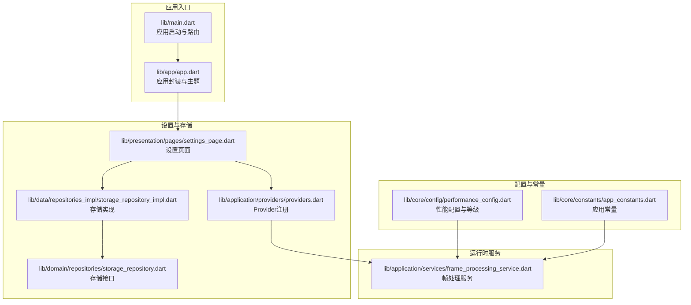
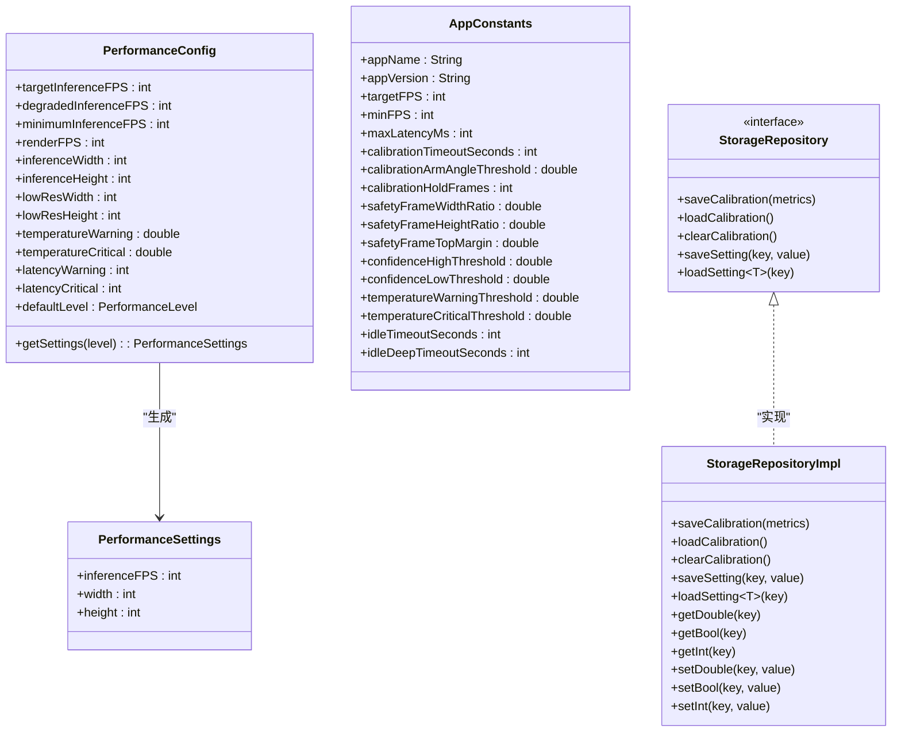
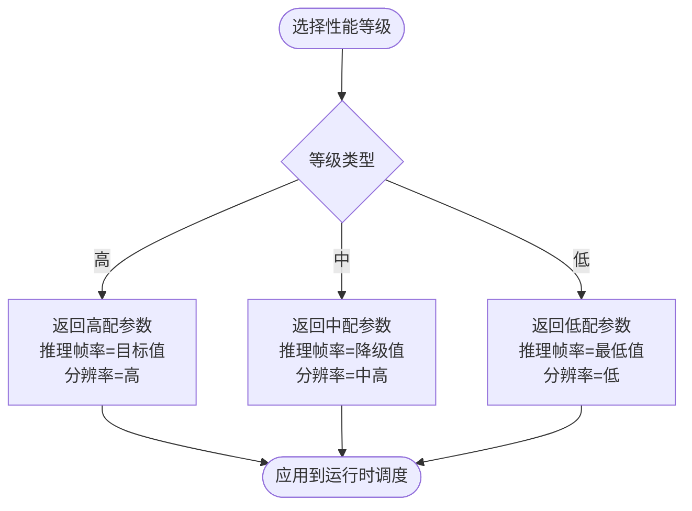
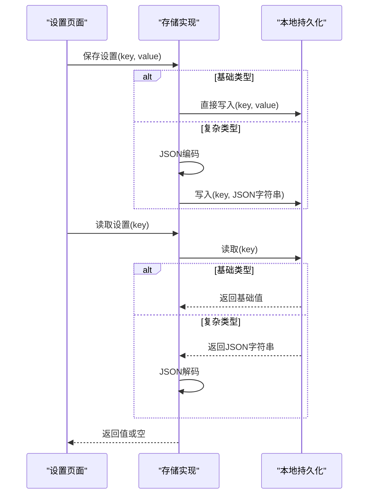
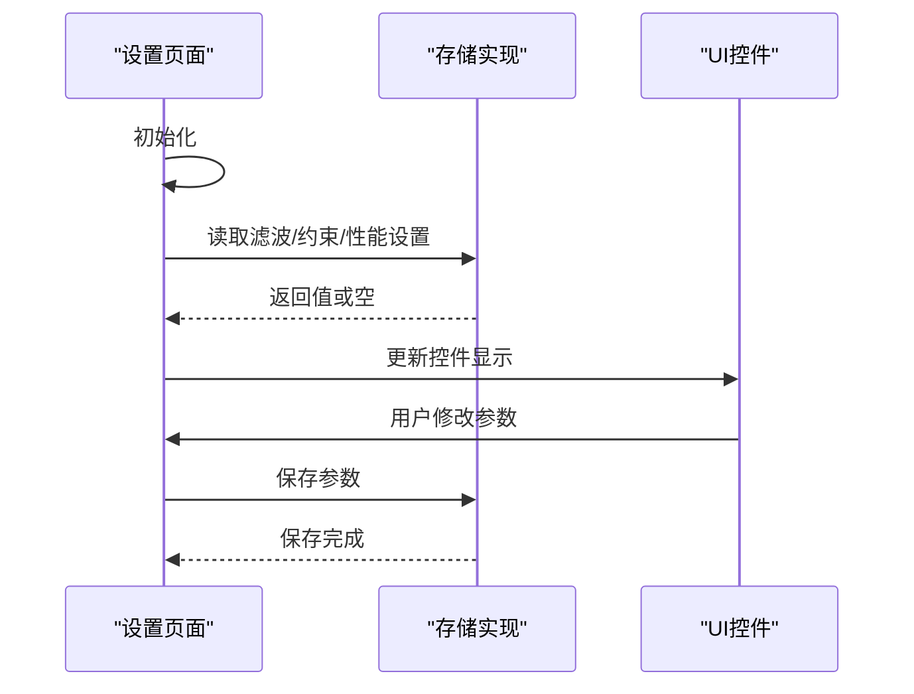
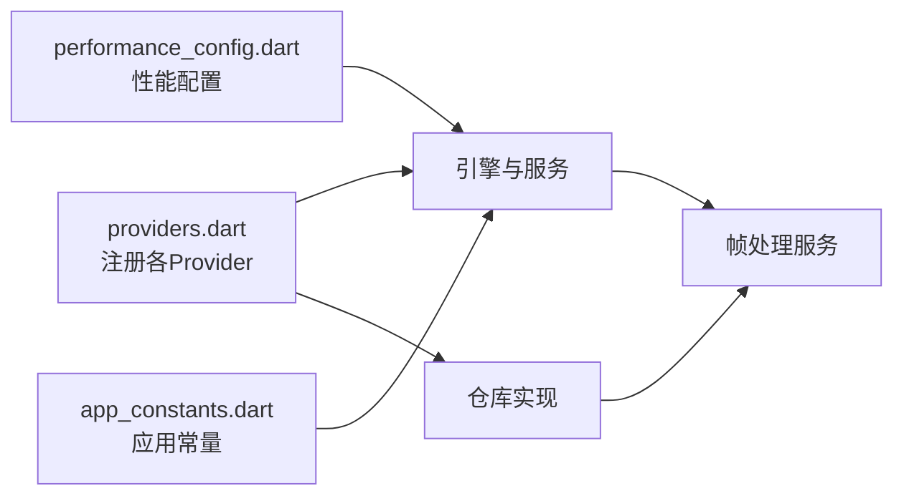
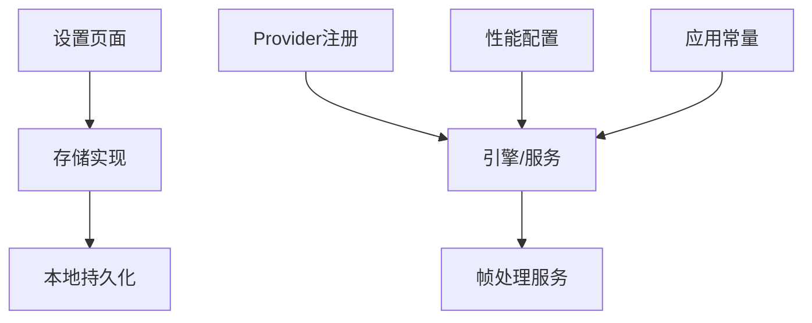

# 配置管理

<cite>
**本文引用的文件**
- [lib/main.dart](file://lib/main.dart)
- [lib/app/app.dart](file://lib/app/app.dart)
- [lib/application/providers/providers.dart](file://lib/application/providers/providers.dart)
- [lib/application/services/frame_processing_service.dart](file://lib/application/services/frame_processing_service.dart)
- [lib/presentation/pages/settings_page.dart](file://lib/presentation/pages/settings_page.dart)
- [lib/data/repositories_impl/storage_repository_impl.dart](file://lib/data/repositories_impl/storage_repository_impl.dart)
- [lib/domain/repositories/storage_repository.dart](file://lib/domain/repositories/storage_repository.dart)
- [lib/core/config/performance_config.dart](file://lib/core/config/performance_config.dart)
- [lib/core/constants/app_constants.dart](file://lib/core/constants/app_constants.dart)
</cite>

## 目录
1. [简介](#简介)
2. [项目结构](#项目结构)
3. [核心组件](#核心组件)
4. [架构总览](#架构总览)
5. [详细组件分析](#详细组件分析)
6. [依赖分析](#依赖分析)
7. [性能考虑](#性能考虑)
8. [故障排查指南](#故障排查指南)
9. [结论](#结论)
10. [附录](#附录)

## 简介
本文件系统性梳理 Mimo 项目的配置管理方案，覆盖应用配置系统的架构与实现策略、性能参数的设置与调优、常量定义的组织与命名规范、环境变量与配置文件的使用方式、配置的动态更新与热重载机制、配置项清单与默认值说明、配置验证与错误处理、安全存储与敏感信息保护、以及配置的版本管理与向后兼容性建议。文档面向开发者与产品/运维人员，既提供高层概览也包含代码级细节与可视化图示。

## 项目结构
Mimo 的配置与设置涉及多层模块协同：
- 应用入口与主题：通过入口文件与应用封装类统一初始化与主题配置。
- 配置常量与性能参数：集中于核心配置模块，提供静态常量与运行时可选的性能等级映射。
- 存储与设置：通过仓储接口与实现，使用本地持久化进行用户设置与校准数据的读写。
- 设置界面：提供用户交互界面，加载并保存用户偏好的关键参数。
- 服务与管线：在运行时根据配置与性能调度器动态调整处理流程。

**图表来源**
- [lib/main.dart:1-34](file://lib/main.dart#L1-L34)
- [lib/app/app.dart:1-27](file://lib/app/app.dart#L1-L27)
- [lib/core/config/performance_config.dart:1-79](file://lib/core/config/performance_config.dart#L1-L79)
- [lib/core/constants/app_constants.dart:1-35](file://lib/core/constants/app_constants.dart#L1-L35)
- [lib/presentation/pages/settings_page.dart:1-232](file://lib/presentation/pages/settings_page.dart#L1-L232)
- [lib/data/repositories_impl/storage_repository_impl.dart:1-115](file://lib/data/repositories_impl/storage_repository_impl.dart#L1-L115)
- [lib/domain/repositories/storage_repository.dart:1-19](file://lib/domain/repositories/storage_repository.dart#L1-L19)
- [lib/application/providers/providers.dart:1-103](file://lib/application/providers/providers.dart#L1-L103)
- [lib/application/services/frame_processing_service.dart:1-254](file://lib/application/services/frame_processing_service.dart#L1-L254)

**章节来源**
- [lib/main.dart:1-34](file://lib/main.dart#L1-L34)
- [lib/app/app.dart:1-27](file://lib/app/app.dart#L1-L27)
- [lib/application/providers/providers.dart:1-103](file://lib/application/providers/providers.dart#L1-L103)

## 核心组件
- 性能配置与等级
  - 提供目标推理帧率、渲染帧率、分辨率、温度与延迟阈值等静态常量，并支持按性能等级返回对应的运行参数。
  - 默认性能等级为高性能，可通过运行时切换。
- 应用常量
  - 包含应用名称、版本、目标/最小帧率、校准超时与阈值、安全框比例、置信度阈值、空闲超时等。
- 存储与设置
  - 通过接口抽象与实现分离，使用本地持久化保存用户设置与校准数据；支持多种类型与 JSON 编解码回退。
- 设置页面
  - 展示并允许用户调整滤波参数、关节约束参数与性能模式；读取与保存设置由存储实现负责。
- Provider 注册
  - 统一注册各领域引擎与服务，形成可注入的依赖图，便于在运行时按需访问配置与设置。

**章节来源**
- [lib/core/config/performance_config.dart:1-79](file://lib/core/config/performance_config.dart#L1-L79)
- [lib/core/constants/app_constants.dart:1-35](file://lib/core/constants/app_constants.dart#L1-L35)
- [lib/data/repositories_impl/storage_repository_impl.dart:1-115](file://lib/data/repositories_impl/storage_repository_impl.dart#L1-L115)
- [lib/presentation/pages/settings_page.dart:1-232](file://lib/presentation/pages/settings_page.dart#L1-L232)
- [lib/application/providers/providers.dart:1-103](file://lib/application/providers/providers.dart#L1-L103)

## 架构总览
配置管理采用“常量层 + 本地存储层 + 运行时调度层”的分层设计：
- 常量层：提供稳定不变的系统默认值与阈值。
- 存储层：负责用户设置与校准数据的持久化与读取。
- 运行时层：根据性能配置与当前设备状态动态调整处理策略。

**图表来源**
- [lib/core/config/performance_config.dart:1-79](file://lib/core/config/performance_config.dart#L1-L79)
- [lib/core/constants/app_constants.dart:1-35](file://lib/core/constants/app_constants.dart#L1-L35)
- [lib/domain/repositories/storage_repository.dart:1-19](file://lib/domain/repositories/storage_repository.dart#L1-L19)
- [lib/data/repositories_impl/storage_repository_impl.dart:1-115](file://lib/data/repositories_impl/storage_repository_impl.dart#L1-L115)

## 详细组件分析

### 性能配置与等级
- 目标与降级帧率：提供目标、降级与最低推理帧率，配合渲染固定帧率与插值策略，确保视觉流畅与处理压力平衡。
- 分辨率策略：高/中/低三种分辨率组合，分别对应不同的推理帧率与宽高，满足不同硬件能力。
- 阈值控制：温度与延迟阈值用于触发性能降级或警告，保障设备安全与体验稳定。
- 默认等级：默认高性能，运行时可切换，切换后由配置模块返回对应的性能设置对象。

**图表来源**
- [lib/core/config/performance_config.dart:36-58](file://lib/core/config/performance_config.dart#L36-L58)

**章节来源**
- [lib/core/config/performance_config.dart:1-79](file://lib/core/config/performance_config.dart#L1-L79)

### 应用常量与阈值
- 应用元信息：名称与版本，便于展示与日志标识。
- 性能阈值：目标帧率、最小帧率、最大延迟，作为运行时性能评估参考。
- 校准相关：超时时间、角度阈值、持续帧数，保证校准过程的稳定性与准确性。
- 安全框与置信度：安全框比例与置信度高低阈值，影响显示与融合策略。
- 空闲超时：普通与深度空闲超时，用于节能与状态管理。

**章节来源**
- [lib/core/constants/app_constants.dart:1-35](file://lib/core/constants/app_constants.dart#L1-L35)

### 存储与设置：接口与实现
- 接口职责：定义校准数据与用户设置的保存、加载与清理操作。
- 实现策略：统一使用本地持久化存储，键名前缀区分设置与校准数据；对复杂类型采用 JSON 编解码；对基础类型直接存取。
- 类型支持：布尔、整数、双精度、字符串与任意对象（JSON）；读取时按泛型类型安全转换。
- 错误处理：解析失败时返回空值，避免崩溃；调用方需判空处理。

**图表来源**
- [lib/data/repositories_impl/storage_repository_impl.dart:41-84](file://lib/data/repositories_impl/storage_repository_impl.dart#L41-L84)
- [lib/domain/repositories/storage_repository.dart:1-19](file://lib/domain/repositories/storage_repository.dart#L1-L19)

**章节来源**
- [lib/data/repositories_impl/storage_repository_impl.dart:1-115](file://lib/data/repositories_impl/storage_repository_impl.dart#L1-L115)
- [lib/domain/repositories/storage_repository.dart:1-19](file://lib/domain/repositories/storage_repository.dart#L1-L19)

### 设置页面：参数加载与保存
- 参数集合：滤波参数（最小截止频率、贝塔、微分截止频率）、关节约束（最大角度变化）、性能模式（高性能开关）与目标帧率。
- 加载逻辑：启动时从存储读取各项设置，若不存在则保留默认值。
- 保存逻辑：用户调整后立即保存至存储，实现即时生效。

**图表来源**
- [lib/presentation/pages/settings_page.dart:34-50](file://lib/presentation/pages/settings_page.dart#L34-L50)
- [lib/presentation/pages/settings_page.dart:190-232](file://lib/presentation/pages/settings_page.dart#L190-L232)
- [lib/data/repositories_impl/storage_repository_impl.dart:41-84](file://lib/data/repositories_impl/storage_repository_impl.dart#L41-L84)

**章节来源**
- [lib/presentation/pages/settings_page.dart:1-232](file://lib/presentation/pages/settings_page.dart#L1-L232)

### Provider 注册与运行时集成
- Provider 注册：集中注册各类仓库、引擎与服务，形成可注入的依赖图。
- 运行时集成：帧处理服务通过 Provider 获取各组件实例，结合性能配置与设置实现动态调度。

**图表来源**
- [lib/application/providers/providers.dart:1-103](file://lib/application/providers/providers.dart#L1-L103)
- [lib/core/config/performance_config.dart:1-79](file://lib/core/config/performance_config.dart#L1-L79)
- [lib/core/constants/app_constants.dart:1-35](file://lib/core/constants/app_constants.dart#L1-L35)
- [lib/application/services/frame_processing_service.dart:1-254](file://lib/application/services/frame_processing_service.dart#L1-L254)

**章节来源**
- [lib/application/providers/providers.dart:1-103](file://lib/application/providers/providers.dart#L1-L103)
- [lib/application/services/frame_processing_service.dart:1-254](file://lib/application/services/frame_processing_service.dart#L1-L254)

## 依赖分析
- 组件耦合
  - 设置页面依赖存储实现；存储实现依赖本地持久化库；Provider 注册集中管理依赖注入。
  - 帧处理服务通过 Provider 获取引擎与仓库，间接依赖配置与常量。
- 外部依赖
  - 本地持久化库用于设置与校准数据存储；相机与姿态检测库用于实时处理。
- 循环依赖
  - 代码结构清晰，未发现循环依赖迹象；Provider 注册位于独立文件，避免相互引用。

**图表来源**
- [lib/presentation/pages/settings_page.dart:1-232](file://lib/presentation/pages/settings_page.dart#L1-L232)
- [lib/data/repositories_impl/storage_repository_impl.dart:1-115](file://lib/data/repositories_impl/storage_repository_impl.dart#L1-L115)
- [lib/application/providers/providers.dart:1-103](file://lib/application/providers/providers.dart#L1-L103)
- [lib/application/services/frame_processing_service.dart:1-254](file://lib/application/services/frame_processing_service.dart#L1-L254)
- [lib/core/config/performance_config.dart:1-79](file://lib/core/config/performance_config.dart#L1-L79)
- [lib/core/constants/app_constants.dart:1-35](file://lib/core/constants/app_constants.dart#L1-L35)

**章节来源**
- [lib/application/providers/providers.dart:1-103](file://lib/application/providers/providers.dart#L1-L103)
- [lib/application/services/frame_processing_service.dart:1-254](file://lib/application/services/frame_processing_service.dart#L1-L254)

## 性能考虑
- 帧率与分辨率权衡
  - 高性能等级：目标推理帧率与高分辨率，适合高端设备；中/低等级自动降低帧率与分辨率，避免卡顿。
- 温度与延迟监控
  - 当温度接近或超过临界值、延迟超过阈值时，应触发降级策略，减少推理负载。
- 渲染与插值
  - 固定渲染帧率配合插值，提升视觉流畅度，同时允许推理帧率动态调整。
- 设置项调优建议
  - 滤波参数：在稳定与平滑之间折衷；过高会引入延迟，过低易抖动。
  - 关节约束：根据用户身体尺寸与动作范围调整，避免误触发。
  - 高性能模式：仅在设备散热良好且性能充足时启用。

[本节为通用性能指导，无需特定文件来源]

## 故障排查指南
- 设置读取为空
  - 现象：设置页面未显示预期值。
  - 排查：确认存储实现是否正确写入；检查键名是否一致；确认 JSON 解码是否异常。
- 设置保存失败
  - 现象：修改设置后重启失效。
  - 排查：检查本地持久化库可用性；确认写入路径权限；避免并发写入冲突。
- 校准数据异常
  - 现象：校准后无法进入追踪或数据不准确。
  - 排查：检查校准数据序列化/反序列化；确认存储键名与格式；验证归一化与角度计算链路。
- 性能不稳定
  - 现象：帧率波动或设备发热。
  - 排查：核对性能等级与阈值；检查降级逻辑是否触发；优化滤波与分辨率设置。

**章节来源**
- [lib/data/repositories_impl/storage_repository_impl.dart:76-84](file://lib/data/repositories_impl/storage_repository_impl.dart#L76-L84)
- [lib/application/services/frame_processing_service.dart:134-148](file://lib/application/services/frame_processing_service.dart#L134-L148)

## 结论
Mimo 的配置管理以清晰的分层设计实现了常量与运行时参数的解耦：常量层提供稳定默认值，存储层负责用户设置与校准数据的持久化，运行时层依据性能配置与阈值动态调度。设置页面提供了直观的交互入口，结合 Provider 注册形成可扩展的依赖注入体系。整体方案具备良好的可维护性与可扩展性，为后续功能演进与性能优化奠定了坚实基础。

[本节为总结性内容，无需特定文件来源]

## 附录

### 配置项清单与默认值说明
- 性能配置
  - 目标推理帧率：30
  - 降级推理帧率：15
  - 最低推理帧率：5
  - 渲染帧率：60（固定，配合插值）
  - 推理分辨率：640×480（高）
  - 低分辨率：320×240（低）
  - 温度阈值：警告 42°C，临界 45°C
  - 延迟阈值：警告 100ms，临界 120ms
  - 默认性能等级：高性能
- 应用常量
  - 应用名称：Mimo
  - 应用版本：1.0.0
  - 目标帧率：30
  - 最小帧率：15
  - 最大延迟：120ms
  - 校准超时：30 秒
  - 校准角度阈值：60°
  - 校准持续帧数：30 帧
  - 安全框宽高比：宽 0.6，高 0.8，顶部边距 0.1
  - 置信度阈值：高 0.6，低 0.3
  - 温度阈值：警告 45°C，临界 50°C
  - 空闲超时：普通 30 秒，深度 120 秒
- 设置页面参数
  - 滤波参数：最小截止频率、贝塔、微分截止频率
  - 关节约束：最大角度变化
  - 性能模式：高性能开关
  - 目标帧率：30（用户可调）

**章节来源**
- [lib/core/config/performance_config.dart:5-34](file://lib/core/config/performance_config.dart#L5-L34)
- [lib/core/constants/app_constants.dart:5-35](file://lib/core/constants/app_constants.dart#L5-L35)
- [lib/presentation/pages/settings_page.dart:16-26](file://lib/presentation/pages/settings_page.dart#L16-L26)

### 环境变量与配置文件使用方式
- 现状：项目中未发现显式的环境变量与配置文件使用代码。
- 建议：可在应用启动阶段引入环境变量读取与配置文件解析，优先级为：命令行/环境变量 > 配置文件 > 内置默认值；对敏感信息采用加密存储并在运行时解密。

[本节为建议性内容，无需特定文件来源]

### 动态更新与热重载机制
- 现状：设置页面支持即时保存与读取，但未见全局热重载或配置监听机制。
- 建议：引入配置变更监听（如基于 Provider 的状态订阅），在设置变更后触发局部刷新或重启相关处理管线，确保新参数生效。

[本节为建议性内容，无需特定文件来源]

### 配置验证与错误处理机制
- 类型与格式验证：基础类型直接写入；复杂类型通过 JSON 编解码，失败时返回空值。
- 错误处理：读取失败返回空，调用方需判空；异常捕获与日志输出有助于定位问题。
- 建议：增加参数范围校验与默认值回退策略，提升健壮性。

**章节来源**
- [lib/data/repositories_impl/storage_repository_impl.dart:76-84](file://lib/data/repositories_impl/storage_repository_impl.dart#L76-L84)

### 安全存储与敏感信息保护
- 现状：设置与校准数据以明文形式存储，未见加密处理。
- 建议：对敏感字段（如用户标识、校准数据）采用加密存储；在内存中仅保留解密后的必要片段；定期清理临时数据。

[本节为建议性内容，无需特定文件来源]

### 版本管理与向后兼容性
- 现状：应用版本常量为 1.0.0，未见配置版本号与迁移策略。
- 建议：引入配置版本号；在升级时执行迁移脚本，将旧配置转换为新格式；对新增字段提供默认值，确保旧版本数据兼容。

[本节为建议性内容，无需特定文件来源]