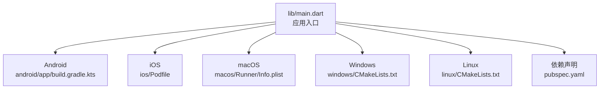
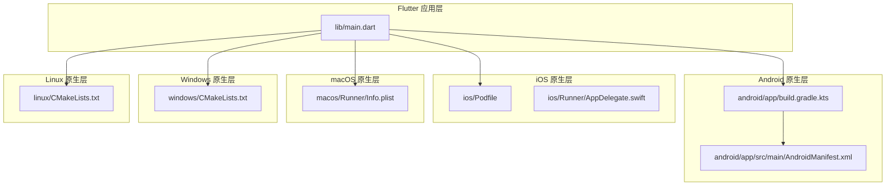
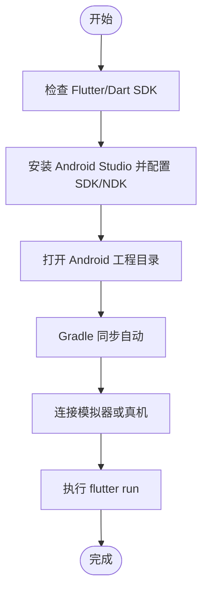
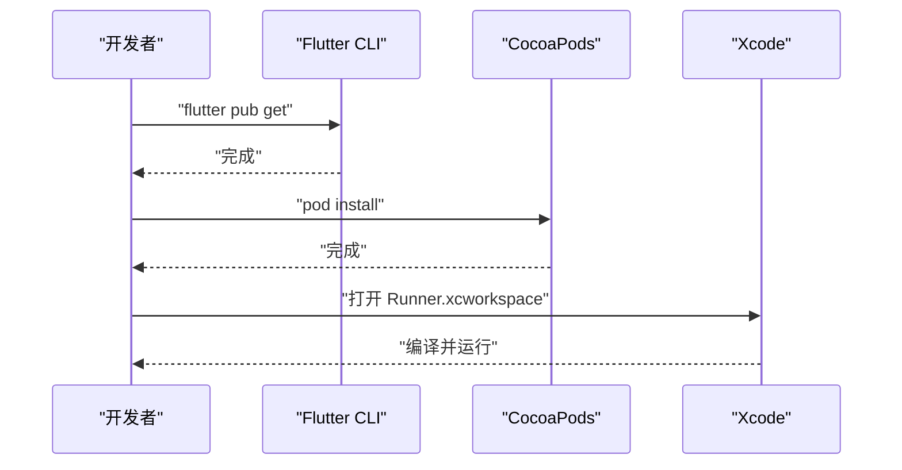
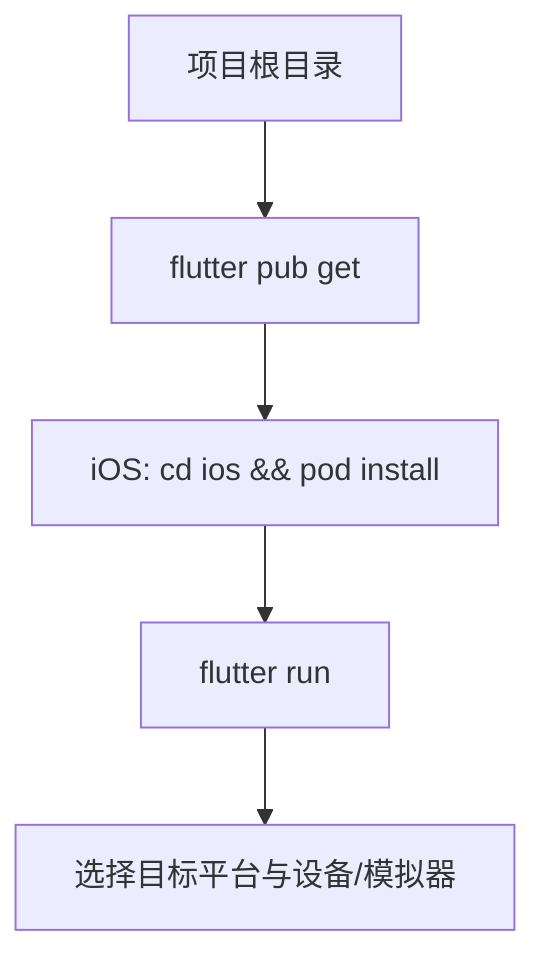
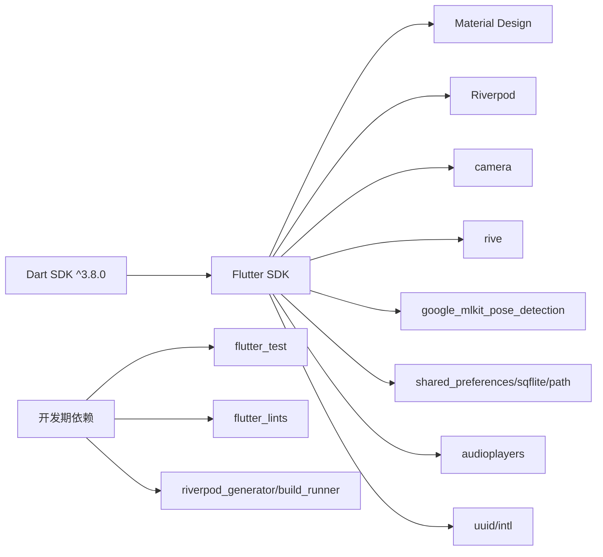

# 快速开始

<cite>
**本文引用的文件**
- [pubspec.yaml](file://pubspec.yaml)
- [main.dart](file://lib/main.dart)
- [AndroidManifest.xml](file://android/app/src/main/AndroidManifest.xml)
- [build.gradle.kts（应用）](file://android/app/build.gradle.kts)
- [build.gradle.kts（根）](file://android/build.gradle.kts)
- [gradle.properties](file://android/gradle.properties)
- [Podfile（iOS）](file://ios/Podfile)
- [AppDelegate.swift](file://ios/Runner/AppDelegate.swift)
- [CMakeLists.txt（Linux）](file://linux/CMakeLists.txt)
- [CMakeLists.txt（Windows）](file://windows/CMakeLists.txt)
- [Info.plist（macOS）](file://macos/Runner/Info.plist)
- [analysis_options.yaml](file://analysis_options.yaml)
</cite>

## 目录
1. [简介](#简介)
2. [项目结构](#项目结构)
3. [核心组件](#核心组件)
4. [架构总览](#架构总览)
5. [详细组件分析](#详细组件分析)
6. [依赖分析](#依赖分析)
7. [性能注意事项](#性能注意事项)
8. [故障排查指南](#故障排查指南)
9. [结论](#结论)
10. [附录](#附录)

## 简介
本指南面向首次参与 Mimo 项目的开发者，帮助你在 Windows、macOS、Linux 三大平台上快速完成开发环境搭建、依赖安装与项目运行，并提供常见问题的排查方法。Mimo 是一款基于 Flutter 的跨平台应用，结合摄像头与 AI 姿态识别，驱动 Rive 动画角色进行实时互动。

## 项目结构
Mimo 采用 Flutter 多平台工程组织，包含 Android、iOS、macOS、Windows、Linux 子工程以及 Flutter 核心代码与资源。关键入口为 Flutter 应用入口文件，负责初始化路由与主题。

图表来源
- [main.dart:1-34](file://lib/main.dart#L1-L34)
- [build.gradle.kts（应用）:1-45](file://android/app/build.gradle.kts#L1-L45)
- [Podfile（iOS）:1-44](file://ios/Podfile#L1-L44)
- [Info.plist（macOS）:1-33](file://macos/Runner/Info.plist#L1-L33)
- [CMakeLists.txt（Windows）:1-109](file://windows/CMakeLists.txt#L1-L109)
- [CMakeLists.txt（Linux）:1-129](file://linux/CMakeLists.txt#L1-L129)
- [pubspec.yaml:1-80](file://pubspec.yaml#L1-L80)

章节来源
- [main.dart:1-34](file://lib/main.dart#L1-L34)
- [pubspec.yaml:1-80](file://pubspec.yaml#L1-L80)

## 核心组件
- 应用入口与路由
  - 应用入口位于 lib/main.dart，初始化 ProviderScope 并配置 MaterialApp 的标题、主题与路由表，初始路由指向校准页。
- 依赖声明
  - pubspec.yaml 声明了 Flutter SDK 版本、核心依赖（Riverpod、camera、rive、google_mlkit_pose_detection、shared_preferences、sqflite、path、audioplayers、uuid、intl）以及开发期依赖（flutter_test、flutter_lints、riverpod_generator、build_runner）。
- 资源与资产
  - assets/rive 与 assets/sounds 通过 pubspec.yaml 的 flutter.assets 字段声明，供应用加载使用。
- 分析规则
  - analysis_options.yaml 引入 Flutter 推荐 Lints，确保代码风格与质量。

章节来源
- [main.dart:1-34](file://lib/main.dart#L1-L34)
- [pubspec.yaml:1-80](file://pubspec.yaml#L1-L80)
- [analysis_options.yaml:1-29](file://analysis_options.yaml#L1-L29)

## 架构总览
Mimo 的运行时由 Flutter 应用驱动，Android/iOS/macOS/Windows/Linux 通过各自原生层（Gradle/Kotlin、CocoaPods/Xcode、CMake）集成 Flutter 引擎与插件生态，最终渲染 Rive 动画并与摄像头、MLKit 等能力协作。

图表来源
- [main.dart:1-34](file://lib/main.dart#L1-L34)
- [build.gradle.kts（应用）:1-45](file://android/app/build.gradle.kts#L1-L45)
- [AndroidManifest.xml:1-46](file://android/app/src/main/AndroidManifest.xml#L1-L46)
- [Podfile（iOS）:1-44](file://ios/Podfile#L1-L44)
- [AppDelegate.swift:1-14](file://ios/Runner/AppDelegate.swift#L1-L14)
- [Info.plist（macOS）:1-33](file://macos/Runner/Info.plist#L1-L33)
- [CMakeLists.txt（Windows）:1-109](file://windows/CMakeLists.txt#L1-L109)
- [CMakeLists.txt（Linux）:1-129](file://linux/CMakeLists.txt#L1-L129)

## 详细组件分析

### Android 环境与运行
- SDK 与构建配置
  - 应用构建脚本引入 Kotlin 与 Flutter Gradle 插件，compileSdk/targetSdk/minSdk 由 Flutter 统一管理，Java/Kotlin 目标版本为 11。
  - 根级 build.gradle.kts 配置仓库源与构建目录，统一清理任务。
  - gradle.properties 启用 AndroidX/Jetifier，并设置 JVM 参数。
- 权限与清单
  - AndroidManifest.xml 声明应用 Activity、主题、硬件加速与查询意图，确保 Flutter 嵌入引擎可用。
- 运行步骤
  - 使用 Android Studio 或命令行执行 flutter run，选择 Android 设备或模拟器。
  - 如需发布，release 构建使用 debug 签名配置以便调试运行。

图表来源
- [build.gradle.kts（应用）:1-45](file://android/app/build.gradle.kts#L1-L45)
- [build.gradle.kts（根）:1-22](file://android/build.gradle.kts#L1-L22)
- [gradle.properties:1-4](file://android/gradle.properties#L1-L4)
- [AndroidManifest.xml:1-46](file://android/app/src/main/AndroidManifest.xml#L1-L46)

章节来源
- [build.gradle.kts（应用）:1-45](file://android/app/build.gradle.kts#L1-L45)
- [build.gradle.kts（根）:1-22](file://android/build.gradle.kts#L1-L22)
- [gradle.properties:1-4](file://android/gradle.properties#L1-L4)
- [AndroidManifest.xml:1-46](file://android/app/src/main/AndroidManifest.xml#L1-L46)

### iOS 环境与运行
- CocoaPods 与 Xcode 工作空间
  - Podfile 使用 flutter_tools 的 podhelper，调用 flutter_ios_podfile_setup 并安装 iOS Pods。
  - 若缺失 Generated.xcconfig 或 FLUTTER_ROOT 未找到，需先执行 flutter pub get。
- 应用委托
  - AppDelegate.swift 调用 GeneratedPluginRegistrant.register 注册插件，确保插件可用。
- 运行步骤
  - 使用 Xcode 打开 Runner.xcworkspace，选择 iOS 模拟器或真机，点击运行。
  - 首次运行需执行 flutter pub get 与 pod install。

图表来源
- [Podfile（iOS）:1-44](file://ios/Podfile#L1-L44)
- [AppDelegate.swift:1-14](file://ios/Runner/AppDelegate.swift#L1-L14)

章节来源
- [Podfile（iOS）:1-44](file://ios/Podfile#L1-L44)
- [AppDelegate.swift:1-14](file://ios/Runner/AppDelegate.swift#L1-L14)

### macOS 环境与运行
- Info.plist
  - Info.plist 定义 Bundle 信息、最低系统版本等元数据，确保应用在 macOS 上正确运行。
- 运行步骤
  - 使用 Xcode 打开 Runner.xcworkspace，选择 macOS 目标，点击运行。

章节来源
- [Info.plist（macOS）:1-33](file://macos/Runner/Info.plist#L1-L33)

### Windows 环境与运行
- CMake 配置
  - CMakeLists.txt 定义构建类型、编译选项、Flutter 工具集成与资源安装规则。
- 运行步骤
  - 使用 VS 或命令行执行 flutter run，选择 Windows 目标运行。

章节来源
- [CMakeLists.txt（Windows）:1-109](file://windows/CMakeLists.txt#L1-L109)

### Linux 环境与运行
- CMake 配置
  - CMakeLists.txt 定义 GTK 依赖、构建类型、Flutter 集成与资源安装规则。
- 运行步骤
  - 使用命令行执行 flutter run，选择 Linux 目标运行。

章节来源
- [CMakeLists.txt（Linux）:1-129](file://linux/CMakeLists.txt#L1-L129)

### 依赖安装与运行
- Flutter 依赖
  - 在项目根目录执行 flutter pub get，拉取 pubspec.yaml 中声明的依赖。
- iOS Pods
  - 在 ios 目录执行 pod install，安装 Podfile 中声明的依赖。
- 运行应用
  - 在项目根目录执行 flutter run，选择目标平台与设备/模拟器。

图表来源
- [pubspec.yaml:1-80](file://pubspec.yaml#L1-L80)
- [Podfile（iOS）:1-44](file://ios/Podfile#L1-L44)

章节来源
- [pubspec.yaml:1-80](file://pubspec.yaml#L1-L80)
- [Podfile（iOS）:1-44](file://ios/Podfile#L1-L44)

## 依赖分析
- 语言与框架
  - Dart SDK 版本要求 ^3.8.0，Flutter SDK 作为依赖被声明。
- UI 与状态管理
  - 使用 Material Design 与 Riverpod 进行状态管理。
- 摄像头与动画
  - camera 插件用于摄像头预览；rive 用于动画渲染。
- AI 与本地存储
  - google_mlkit_pose_detection 用于姿态识别；shared_preferences、sqflite、path 用于本地存储。
- 音效与工具
  - audioplayers 用于音效播放；uuid、intl 用于标识与国际化。
- 开发期工具
  - flutter_test、flutter_lints、riverpod_generator、build_runner 用于测试、代码规范与生成器。

图表来源
- [pubspec.yaml:21-67](file://pubspec.yaml#L21-L67)

章节来源
- [pubspec.yaml:21-67](file://pubspec.yaml#L21-L67)

## 性能注意事项
- Android
  - gradle.properties 中已设置较大的 JVM 堆与 Metaspace，有助于大型工程编译与运行。
- iOS
  - Podfile 中通过 flutter_ios_podfile_setup 与 post_install 配置构建设置，确保插件与构建一致性。
- 跨平台
  - 项目包含 Windows、Linux、macOS 的 CMake 配置，注意各平台的构建类型与资源安装路径。

章节来源
- [gradle.properties:1-4](file://android/gradle.properties#L1-L4)
- [Podfile（iOS）:39-43](file://ios/Podfile#L39-L43)
- [CMakeLists.txt（Windows）:1-109](file://windows/CMakeLists.txt#L1-L109)
- [CMakeLists.txt（Linux）:1-129](file://linux/CMakeLists.txt#L1-L129)
- [Info.plist（macOS）:1-33](file://macos/Runner/Info.plist#L1-L33)

## 故障排查指南
- iOS Pods 安装失败或找不到 FLUTTER_ROOT
  - 现象：Podfile 提示 Generated.xcconfig 不存在或未找到 FLUTTER_ROOT。
  - 处理：先在项目根目录执行 flutter pub get，再在 ios 目录执行 pod install。
- Android 构建异常
  - 现象：minSdk/targetSdk/compileSdk 与环境不匹配。
  - 处理：确认 Flutter SDK 版本与 Android Gradle 插件兼容，必要时升级 Android Studio 与 SDK。
- 设备/模拟器未检测到
  - 现象：flutter devices 无设备。
  - 处理：重启 ADB、开启开发者选项与 USB 调试、重新连接设备或启动模拟器。
- macOS 运行报错
  - 现象：Info.plist 缺少必要键或最低系统版本不满足。
  - 处理：检查 Info.plist 中的系统版本键值，确保与目标 macOS 版本一致。
- Linux 运行报错
  - 现象：GTK 依赖缺失或 CMake 版本不满足。
  - 处理：安装 GTK 依赖与满足 CMake 最低版本要求，重新执行 flutter run。

章节来源
- [Podfile（iOS）:13-26](file://ios/Podfile#L13-L26)
- [build.gradle.kts（应用）:8-31](file://android/app/build.gradle.kts#L8-L31)
- [Info.plist（macOS）:23-24](file://macos/Runner/Info.plist#L23-L24)
- [CMakeLists.txt（Linux）:54-56](file://linux/CMakeLists.txt#L54-L56)

## 结论
按照本指南完成 Flutter SDK、平台工具链与依赖安装后，即可在 Windows、macOS、Linux 上顺利运行 Mimo 项目。遇到问题时，优先检查 Flutter 与平台工具链版本、依赖安装是否完整以及设备/模拟器连通性。完成基础运行后，可进一步探索应用的页面路由与核心功能模块。

## 附录
- 快速命令清单
  - Flutter 依赖安装：在项目根目录执行 flutter pub get。
  - iOS Pods 安装：在 ios 目录执行 pod install。
  - 运行应用：在项目根目录执行 flutter run，选择目标平台与设备/模拟器。
- 资源与资产
  - assets/rive 与 assets/sounds 通过 pubspec.yaml 声明，确保运行时可加载。

章节来源
- [pubspec.yaml:76-79](file://pubspec.yaml#L76-L79)
- [main.dart:1-34](file://lib/main.dart#L1-L34)