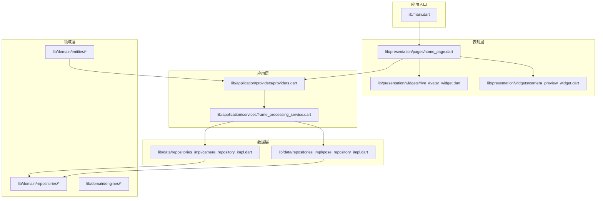
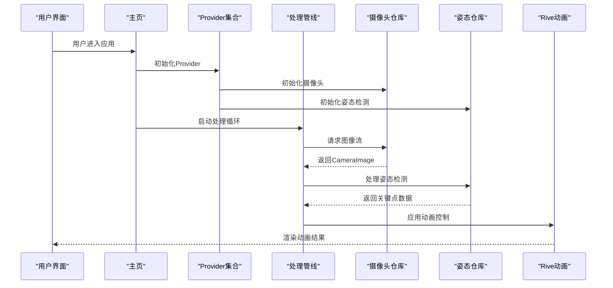
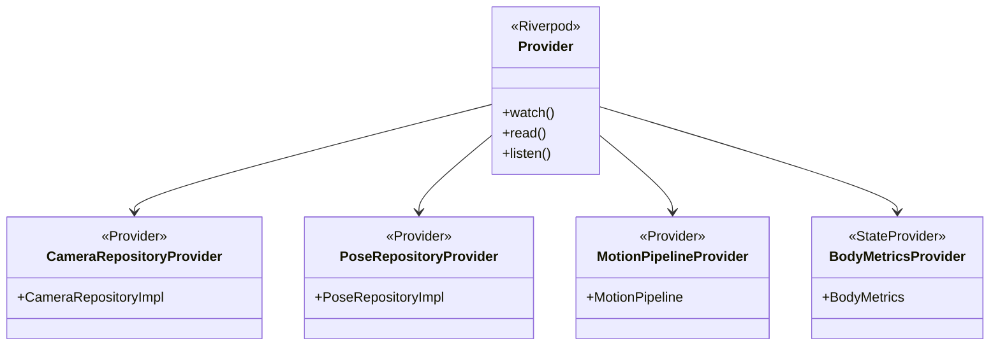
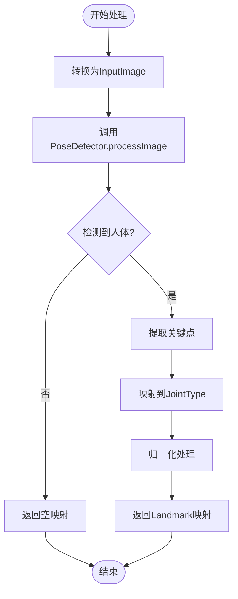
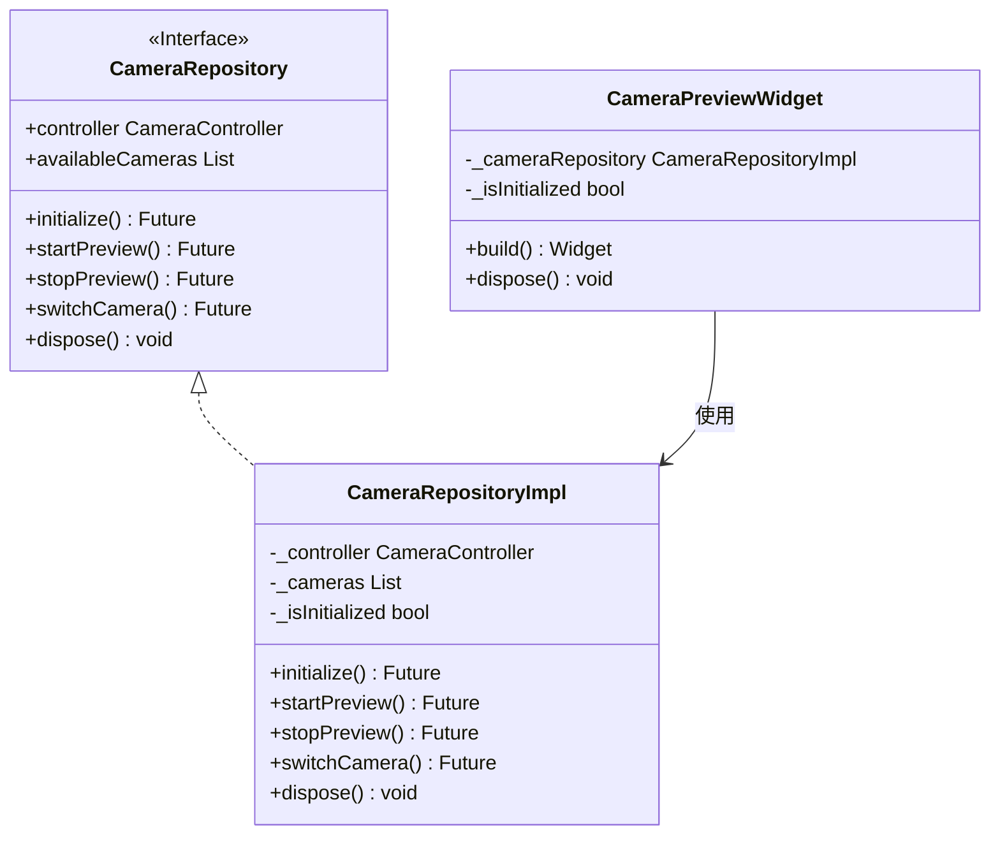
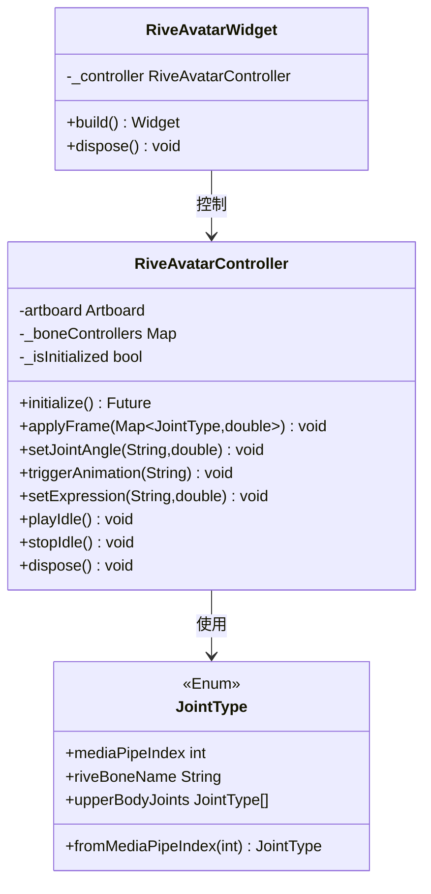
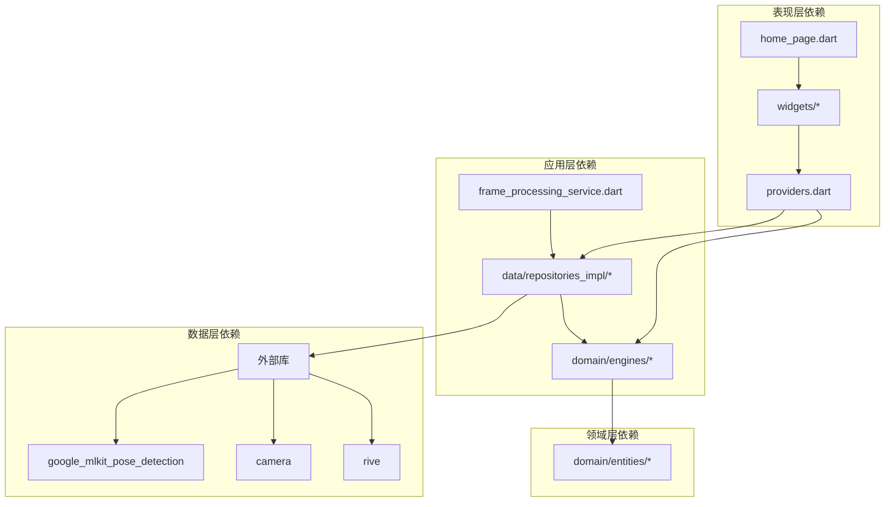

# 技术栈概览

<cite>
**本文档引用的文件**
- [pubspec.yaml](file://pubspec.yaml)
- [main.dart](file://lib/main.dart)
- [providers.dart](file://lib/application/providers/providers.dart)
- [pose_repository.dart](file://lib/domain/repositories/pose_repository.dart)
- [pose_repository_impl.dart](file://lib/data/repositories_impl/pose_repository_impl.dart)
- [camera_repository.dart](file://lib/domain/repositories/camera_repository.dart)
- [camera_repository_impl.dart](file://lib/data/repositories_impl/camera_repository_impl.dart)
- [rive_avatar_widget.dart](file://lib/presentation/widgets/rive_avatar_widget.dart)
- [camera_preview_widget.dart](file://lib/presentation/widgets/camera_preview_widget.dart)
- [home_page.dart](file://lib/presentation/pages/home_page.dart)
- [body_metrics.dart](file://lib/domain/entities/body_metrics.dart)
- [joint_type.dart](file://lib/domain/entities/joint_type.dart)
- [frame_processing_service.dart](file://lib/application/services/frame_processing_service.dart)
- [AppDelegate.swift](file://ios/Runner/AppDelegate.swift)
- [MainActivity.kt](file://android/app/src/main/kotlin/com/mimo/mimo_app/MainActivity.kt)
- [index.html](file://web/index.html)
- [analysis_options.yaml](file://analysis_options.yaml)
</cite>

## 目录
1. [简介](#简介)
2. [项目结构](#项目结构)
3. [核心技术组件](#核心技术组件)
4. [架构总览](#架构总览)
5. [详细组件分析](#详细组件分析)
6. [依赖关系分析](#依赖关系分析)
7. [性能考虑](#性能考虑)
8. [故障排除指南](#故障排除指南)
9. [结论](#结论)
10. [附录：学习路径与参考资料](#附录学习路径与参考资料)

## 简介
本项目基于Flutter 3.8.0+构建，采用Dart语言实现跨平台应用，集成了Google ML Kit进行AI视觉识别（姿态检测），通过Rive动画系统实现2D角色驱动，配合Riverpod进行状态管理，形成完整的实时2D动捕互动体验。该技术栈在保证高性能的同时，提供了良好的可维护性与扩展性。

## 项目结构
项目采用按职责分层的目录组织方式，主要分为以下层次：
- application：应用层，包含Provider定义、服务与处理管线
- domain：领域层，包含实体、仓库接口与业务引擎
- data：数据层，包含仓库实现与外部依赖集成
- presentation：表现层，包含页面与UI组件
- lib/main.dart：应用入口
- 平台适配：android、ios、web、linux、macos、windows

**图表来源**
- [main.dart:1-34](file://lib/main.dart#L1-L34)
- [home_page.dart:1-215](file://lib/presentation/pages/home_page.dart#L1-L215)
- [providers.dart:1-103](file://lib/application/providers/providers.dart#L1-L103)

**章节来源**
- [main.dart:1-34](file://lib/main.dart#L1-L34)
- [home_page.dart:1-215](file://lib/presentation/pages/home_page.dart#L1-L215)
- [providers.dart:1-103](file://lib/application/providers/providers.dart#L1-L103)

## 核心技术组件
本项目采用的关键技术栈及其作用如下：

### Flutter 3.8.0+
- 跨平台UI框架，支持Android、iOS、Web、Linux、macOS、Windows多端部署
- 提供高性能渲染引擎与丰富的Material Design组件库
- 支持热重载，提升开发效率

### Dart 3.8.0+
- 强类型、面向对象的现代编程语言
- 支持空安全、泛型、异步编程等特性
- 与Flutter深度集成，提供流畅的开发体验

### Google ML Kit 姿态识别
- 基于MediaPipe的AI视觉识别能力
- 实现实时人体关键点检测与姿态分析
- 支持多人检测与高精度关键点定位

### Rive 动画系统
- 专业的2D动画创作与运行时系统
- 支持骨骼动画、形状变形与交互式动画
- 与Flutter无缝集成，提供流畅的动画渲染

### Riverpod 状态管理
- 基于Provider的现代化状态管理方案
- 提供细粒度的状态订阅与响应式更新
- 支持测试友好与类型安全

### 摄像头与媒体处理
- Flutter Camera插件提供跨平台摄像头访问
- 支持NV21图像格式与硬件加速
- 集成图像流处理与预览渲染

**章节来源**
- [pubspec.yaml:21-78](file://pubspec.yaml#L21-L78)
- [pose_repository_impl.dart:1-204](file://lib/data/repositories_impl/pose_repository_impl.dart#L1-L204)
- [rive_avatar_widget.dart:1-118](file://lib/presentation/widgets/rive_avatar_widget.dart#L1-L118)

## 架构总览
项目采用分层架构设计，通过Provider实现依赖注入与状态管理，形成清晰的数据流向：

**图表来源**
- [home_page.dart:24-36](file://lib/presentation/pages/home_page.dart#L24-L36)
- [providers.dart:72-83](file://lib/application/providers/providers.dart#L72-L83)
- [frame_processing_service.dart:108-121](file://lib/application/services/frame_processing_service.dart#L108-L121)

## 详细组件分析

### 状态管理系统（Riverpod）
项目采用Riverpod作为核心状态管理方案，通过Provider实现依赖注入与状态分离：

**图表来源**
- [providers.dart:16-103](file://lib/application/providers/providers.dart#L16-L103)

### 姿态检测引擎
姿态检测模块基于Google ML Kit实现，支持实时关键点检测与数据转换：

**图表来源**
- [pose_repository_impl.dart:38-71](file://lib/data/repositories_impl/pose_repository_impl.dart#L38-L71)
- [pose_repository_impl.dart:149-170](file://lib/data/repositories_impl/pose_repository_impl.dart#L149-L170)

### 摄像头集成
摄像头模块提供统一的设备抽象与图像流管理：

**图表来源**
- [camera_repository.dart:4-28](file://lib/domain/repositories/camera_repository.dart#L4-L28)
- [camera_repository_impl.dart:5-97](file://lib/data/repositories_impl/camera_repository_impl.dart#L5-L97)
- [camera_preview_widget.dart:8-76](file://lib/presentation/widgets/camera_preview_widget.dart#L8-L76)

### Rive动画驱动
Rive动画模块负责将姿态数据转换为角色动画控制：

**图表来源**
- [rive_avatar_widget.dart:9-71](file://lib/presentation/widgets/rive_avatar_widget.dart#L9-L71)
- [joint_type.dart:4-57](file://lib/domain/entities/joint_type.dart#L4-L57)

**章节来源**
- [providers.dart:1-103](file://lib/application/providers/providers.dart#L1-L103)
- [pose_repository_impl.dart:1-204](file://lib/data/repositories_impl/pose_repository_impl.dart#L1-L204)
- [camera_repository_impl.dart:1-97](file://lib/data/repositories_impl/camera_repository_impl.dart#L1-L97)
- [rive_avatar_widget.dart:1-118](file://lib/presentation/widgets/rive_avatar_widget.dart#L1-L118)
- [joint_type.dart:1-66](file://lib/domain/entities/joint_type.dart#L1-L66)

## 依赖关系分析
项目依赖关系呈现清晰的分层结构，各层之间通过接口解耦：

**图表来源**
- [providers.dart:1-103](file://lib/application/providers/providers.dart#L1-L103)
- [home_page.dart:1-215](file://lib/presentation/pages/home_page.dart#L1-L215)
- [pubspec.yaml:30-60](file://pubspec.yaml#L30-L60)

**章节来源**
- [pubspec.yaml:30-60](file://pubspec.yaml#L30-L60)
- [providers.dart:1-103](file://lib/application/providers/providers.dart#L1-L103)

## 性能考虑
项目在性能优化方面采取了多项措施：

### 实时处理优化
- 使用CameraImage流进行实时图像处理
- 采用异步处理避免阻塞UI线程
- 实现帧率监控与动态调整

### 内存管理
- 及时释放摄像头与ML Kit资源
- 使用弱引用避免内存泄漏
- 合理的动画资源管理

### 跨平台兼容性
- 统一的抽象层确保多平台一致性
- 平台特定优化与适配
- 资源文件的统一管理

## 故障排除指南
常见问题及解决方案：

### 摄像头权限问题
- 确认Android Manifest与Info.plist中权限声明
- 检查运行时权限请求流程
- 验证相机设备可用性

### ML Kit初始化失败
- 检查网络连接与Google Play服务
- 验证模型下载与缓存
- 查看日志输出定位具体错误

### Rive动画异常
- 确认Rive文件正确导入
- 检查骨骼命名与映射关系
- 验证动画资源完整性

**章节来源**
- [camera_repository_impl.dart:20-47](file://lib/data/repositories_impl/camera_repository_impl.dart#L20-L47)
- [pose_repository_impl.dart:46-71](file://lib/data/repositories_impl/pose_repository_impl.dart#L46-L71)
- [rive_avatar_widget.dart:20-25](file://lib/presentation/widgets/rive_avatar_widget.dart#L20-L25)

## 结论
Mimo项目采用的技术栈在跨平台移动应用开发中展现了优秀的平衡性：既保证了高性能的实时处理能力，又提供了良好的开发体验与可维护性。Flutter + Dart的组合确保了多平台一致的用户体验，Google ML Kit与Rive的集成实现了先进的AI视觉识别与动画渲染能力，而Riverpod则为复杂的状态管理提供了清晰的架构基础。

## 附录：学习路径与参考资料

### 技术栈学习路径
1. **Flutter基础**
   - Flutter官方文档与教程
   - 跨平台开发概念与最佳实践

2. **Dart语言**
   - Dart官方语言指南
   - 异步编程与并发模型

3. **AI视觉识别**
   - Google ML Kit官方文档
   - MediaPipe姿态检测原理
   - 计算机视觉基础

4. **动画系统**
   - Rive官方教程
   - 2D动画原理与技术

5. **状态管理**
   - Riverpod官方文档
   - 现代状态管理模式

### 开发工具链
- Flutter SDK 3.8.0+
- Android Studio/VS Code
- Xcode (iOS开发)
- Android Studio (Android开发)
- Web开发环境

### 多平台支持
- Android: API 21+ (minSdkVersion)
- iOS: iOS 12.0+
- Web: PWA支持
- 桌面平台: Linux/macOS/Windows

**章节来源**
- [pubspec.yaml:21-22](file://pubspec.yaml#L21-L22)
- [AppDelegate.swift:1-14](file://ios/Runner/AppDelegate.swift#L1-L14)
- [MainActivity.kt:1-6](file://android/app/src/main/kotlin/com/mimo/mimo_app/MainActivity.kt#L1-L6)
- [index.html:1-39](file://web/index.html#L1-L39)