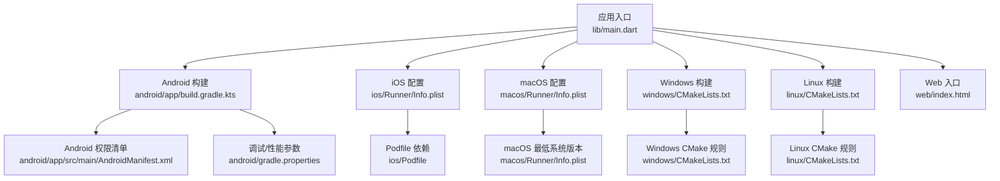
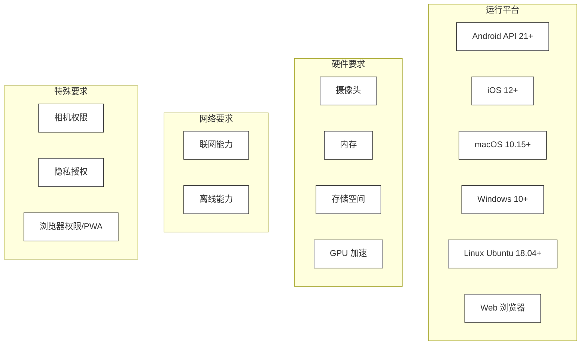
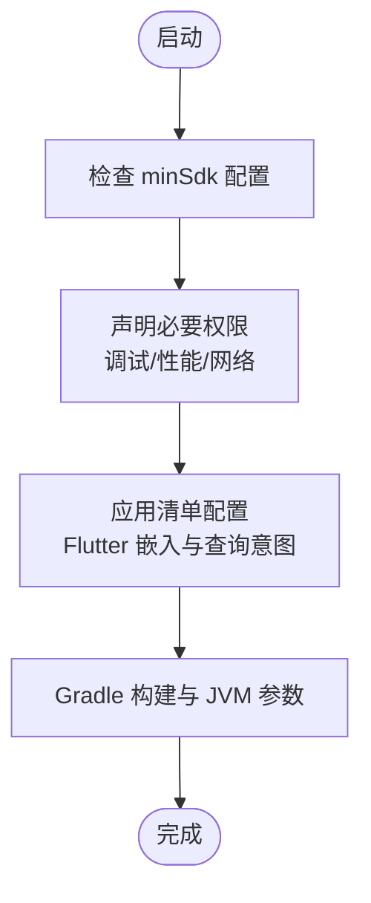
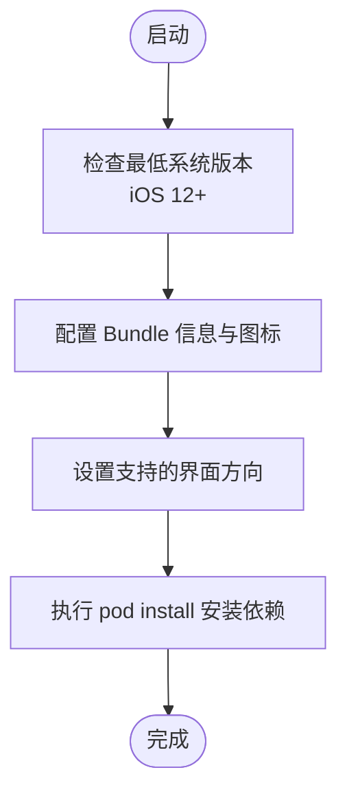
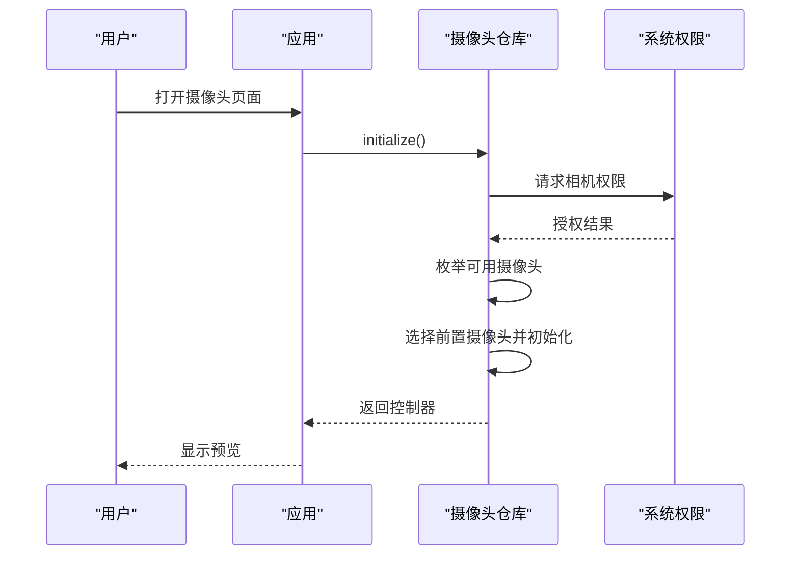
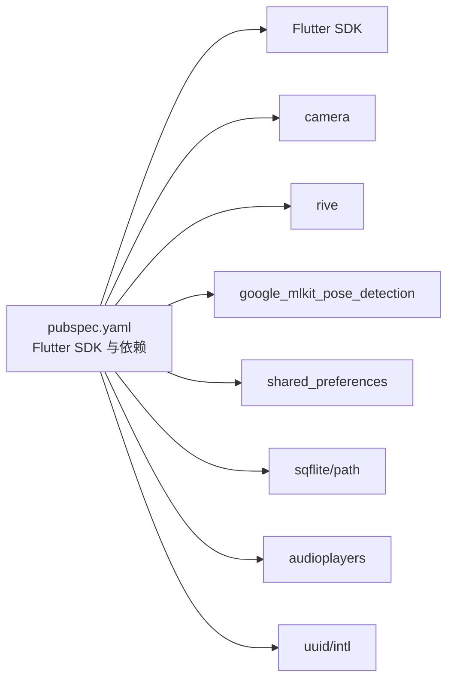
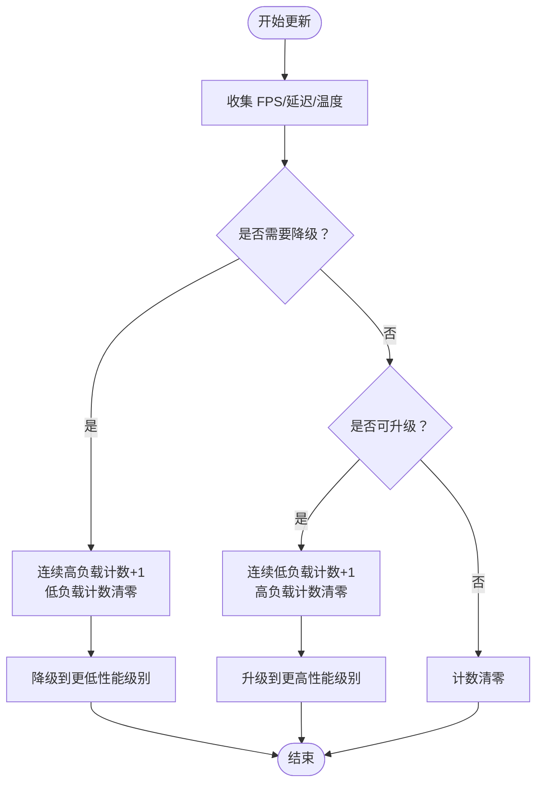

# 系统要求

<cite>
**本文引用的文件**
- [pubspec.yaml](file://pubspec.yaml)
- [android/app/build.gradle.kts](file://android/app/build.gradle.kts)
- [android/app/src/main/AndroidManifest.xml](file://android/app/src/main/AndroidManifest.xml)
- [android/app/src/debug/AndroidManifest.xml](file://android/app/src/debug/AndroidManifest.xml)
- [android/app/src/profile/AndroidManifest.xml](file://android/app/src/profile/AndroidManifest.xml)
- [android/gradle.properties](file://android/gradle.properties)
- [ios/Runner/Info.plist](file://ios/Runner/Info.plist)
- [ios/Podfile](file://ios/Podfile)
- [macos/Runner/Info.plist](file://macos/Runner/Info.plist)
- [web/index.html](file://web/index.html)
- [linux/CMakeLists.txt](file://linux/CMakeLists.txt)
- [windows/CMakeLists.txt](file://windows/CMakeLists.txt)
- [lib/data/repositories_impl/camera_repository_impl.dart](file://lib/data/repositories_impl/camera_repository_impl.dart)
- [lib/domain/repositories/camera_repository.dart](file://lib/domain/repositories/camera_repository.dart)
- [lib/presentation/widgets/camera_preview_widget.dart](file://lib/presentation/widgets/camera_preview_widget.dart)
- [lib/domain/engines/performance/performance_scheduler.dart](file://lib/domain/engines/performance/performance_scheduler.dart)
- [lib/core/config/performance_config.dart](file://lib/core/config/performance_config.dart)
- [lib/data/repositories_impl/storage_repository_impl.dart](file://lib/data/repositories_impl/storage_repository_impl.dart)
- [lib/domain/repositories/storage_repository.dart](file://lib/domain/repositories/storage_repository.dart)
- [lib/presentation/pages/settings_page.dart](file://lib/presentation/pages/settings_page.dart)
- [lib/main.dart](file://lib/main.dart)
</cite>

## 目录
1. [简介](#简介)
2. [项目结构](#项目结构)
3. [核心组件](#核心组件)
4. [架构总览](#架构总览)
5. [详细组件分析](#详细组件分析)
6. [依赖关系分析](#依赖关系分析)
7. [性能考虑](#性能考虑)
8. [故障排除指南](#故障排除指南)
9. [结论](#结论)
10. [附录](#附录)

## 简介
本文件为 Mimo 应用的系统要求文档，覆盖运行与开发所需的核心系统条件、平台差异、硬件与网络要求、性能基准与推荐配置，并给出常见问题排查建议。Mimo 是一款基于 Flutter 的跨平台应用，支持 Android、iOS、macOS、Windows、Linux 和 Web 平台。

## 项目结构
Mimo 采用 Flutter 跨平台架构，按平台分目录组织构建配置与原生集成点：
- Android：Gradle 构建、Kotlin 主入口、AndroidManifest 权限声明
- iOS/macOS：Xcode 工程、Info.plist 配置、Pod 依赖管理
- Windows/Linux：CMake 构建、系统库依赖检查
- Web：HTML 入口、manifest、PWA 支持
- 应用逻辑：lib 下按领域分层（core、domain、data、presentation、app）

**图表来源**
- [lib/main.dart:1-34](file://lib/main.dart#L1-L34)
- [android/app/build.gradle.kts:1-45](file://android/app/build.gradle.kts#L1-L45)
- [android/app/src/main/AndroidManifest.xml:1-46](file://android/app/src/main/AndroidManifest.xml#L1-L46)
- [android/gradle.properties:1-4](file://android/gradle.properties#L1-L4)
- [ios/Runner/Info.plist:1-50](file://ios/Runner/Info.plist#L1-L50)
- [ios/Podfile:1-44](file://ios/Podfile#L1-L44)
- [macos/Runner/Info.plist:1-33](file://macos/Runner/Info.plist#L1-L33)
- [windows/CMakeLists.txt:1-109](file://windows/CMakeLists.txt#L1-L109)
- [linux/CMakeLists.txt:1-129](file://linux/CMakeLists.txt#L1-L129)
- [web/index.html:1-39](file://web/index.html#L1-L39)

**章节来源**
- [lib/main.dart:1-34](file://lib/main.dart#L1-L34)
- [android/app/build.gradle.kts:1-45](file://android/app/build.gradle.kts#L1-L45)
- [ios/Runner/Info.plist:1-50](file://ios/Runner/Info.plist#L1-L50)
- [macos/Runner/Info.plist:1-33](file://macos/Runner/Info.plist#L1-L33)
- [windows/CMakeLists.txt:1-109](file://windows/CMakeLists.txt#L1-L109)
- [linux/CMakeLists.txt:1-129](file://linux/CMakeLists.txt#L1-L129)
- [web/index.html:1-39](file://web/index.html#L1-L39)

## 核心组件
- 摄像头子系统：通过 camera 依赖实现多平台摄像头访问与预览流控制
- 存储子系统：使用 shared_preferences 实现轻量配置与校准数据持久化
- 性能调度：根据 FPS、延迟与温度动态调整推理分辨率与帧率
- 跨平台渲染：Rive 动画渲染与 Flutter UI 组合

**章节来源**
- [lib/data/repositories_impl/camera_repository_impl.dart:1-54](file://lib/data/repositories_impl/camera_repository_impl.dart#L1-L54)
- [lib/domain/repositories/camera_repository.dart:1-28](file://lib/domain/repositories/camera_repository.dart#L1-L28)
- [lib/data/repositories_impl/storage_repository_impl.dart:1-39](file://lib/data/repositories_impl/storage_repository_impl.dart#L1-L39)
- [lib/domain/repositories/storage_repository.dart:1-19](file://lib/domain/repositories/storage_repository.dart#L1-L19)
- [lib/domain/engines/performance/performance_scheduler.dart:1-194](file://lib/domain/engines/performance/performance_scheduler.dart#L1-L194)
- [lib/core/config/performance_config.dart:1-79](file://lib/core/config/performance_config.dart#L1-L79)

## 架构总览
Mimo 的系统要求由以下维度构成：
- 运行时平台与最低版本：Android API 21+、iOS 12+、macOS 10.15+、Windows 10+、Linux Ubuntu 18.04+、Web 浏览器兼容性
- 硬件要求：摄像头、内存、存储空间、GPU 加速
- 网络要求：在线功能（如模型下载）与离线功能（本地推理）
- 特殊权限与授权：Android 相机权限、iOS 隐私授权、Web 权限与 PWA
- 开发环境：Flutter SDK、Xcode、Android Studio、CMake、Visual Studio

[本图为概念性总览，不直接映射具体源码文件，故无“图表来源”]

## 详细组件分析

### Android 平台要求
- 最低系统版本：由 Gradle 配置中的 minSdk 决定，当前使用 Flutter 统一配置，通常对应 Android API 21+
- 权限与清单：
  - 调试/性能相关权限在调试与 profile 清单中声明
  - 应用清单包含 Flutter 嵌入元数据与查询意图声明
- 构建与 JVM 参数：启用 AndroidX/Jetifier，Gradle JVM 内存参数优化

**图表来源**
- [android/app/build.gradle.kts:27-28](file://android/app/build.gradle.kts#L27-L28)
- [android/app/src/debug/AndroidManifest.xml:1-7](file://android/app/src/debug/AndroidManifest.xml#L1-L7)
- [android/app/src/profile/AndroidManifest.xml:1-7](file://android/app/src/profile/AndroidManifest.xml#L1-L7)
- [android/app/src/main/AndroidManifest.xml:1-46](file://android/app/src/main/AndroidManifest.xml#L1-L46)
- [android/gradle.properties:1-4](file://android/gradle.properties#L1-L4)

**章节来源**
- [android/app/build.gradle.kts:1-45](file://android/app/build.gradle.kts#L1-L45)
- [android/app/src/main/AndroidManifest.xml:1-46](file://android/app/src/main/AndroidManifest.xml#L1-L46)
- [android/app/src/debug/AndroidManifest.xml:1-7](file://android/app/src/debug/AndroidManifest.xml#L1-L7)
- [android/app/src/profile/AndroidManifest.xml:1-7](file://android/app/src/profile/AndroidManifest.xml#L1-L7)
- [android/gradle.properties:1-4](file://android/gradle.properties#L1-L4)

### iOS 平台要求
- 最低系统版本：Info.plist 中 LSMinimumSystemVersion 对应 iOS 12+
- 应用信息与界面方向：Bundle 信息、启动页、主 Storyboard、支持的方向
- 依赖管理：Podfile 使用 Flutter 生成的 Xcode 配置，确保依赖正确安装

**图表来源**
- [ios/Runner/Info.plist:23-47](file://ios/Runner/Info.plist#L23-L47)
- [ios/Podfile:1-44](file://ios/Podfile#L1-L44)

**章节来源**
- [ios/Runner/Info.plist:1-50](file://ios/Runner/Info.plist#L1-L50)
- [ios/Podfile:1-44](file://ios/Podfile#L1-L44)

### macOS 平台要求
- 最低系统版本：Info.plist 中 LSMinimumSystemVersion 对应 macOS 10.15+
- 应用标识与主窗口：Bundle 信息、菜单栏与主窗口配置

**章节来源**
- [macos/Runner/Info.plist:1-33](file://macos/Runner/Info.plist#L1-L33)

### Windows 平台要求
- 最低系统版本：Windows 10+
- 构建系统：CMake 最低版本与编译特性（C++17），安装规则与资源复制

**章节来源**
- [windows/CMakeLists.txt:1-109](file://windows/CMakeLists.txt#L1-L109)

### Linux 平台要求
- 最低系统版本：Ubuntu 18.04+
- 构建系统：CMake 最低版本与 GTK 依赖检查，安装规则与资源复制

**章节来源**
- [linux/CMakeLists.txt:1-129](file://linux/CMakeLists.txt#L1-L129)

### Web 平台要求
- 浏览器兼容性：现代浏览器支持，PWA 清单与图标
- 启动脚本：通过 flutter_bootstrap.js 引导

**章节来源**
- [web/index.html:1-39](file://web/index.html#L1-L39)

### 摄像头与权限要求
- 摄像头访问：通过 camera 依赖实现，初始化时枚举可用摄像头并选择前置摄像头作为默认
- 权限与授权：
  - Android：需相机权限；应用清单中声明查询意图
  - iOS：需相机与隐私授权；Info.plist 中声明用途
  - Web：需媒体设备权限与 HTTPS 环境

**图表来源**
- [lib/data/repositories_impl/camera_repository_impl.dart:1-54](file://lib/data/repositories_impl/camera_repository_impl.dart#L1-L54)
- [lib/domain/repositories/camera_repository.dart:1-28](file://lib/domain/repositories/camera_repository.dart#L1-L28)
- [lib/presentation/widgets/camera_preview_widget.dart:1-49](file://lib/presentation/widgets/camera_preview_widget.dart#L1-L49)
- [android/app/src/main/AndroidManifest.xml:1-46](file://android/app/src/main/AndroidManifest.xml#L1-L46)
- [ios/Runner/Info.plist:1-50](file://ios/Runner/Info.plist#L1-L50)

**章节来源**
- [lib/data/repositories_impl/camera_repository_impl.dart:1-54](file://lib/data/repositories_impl/camera_repository_impl.dart#L1-L54)
- [lib/domain/repositories/camera_repository.dart:1-28](file://lib/domain/repositories/camera_repository.dart#L1-L28)
- [lib/presentation/widgets/camera_preview_widget.dart:1-49](file://lib/presentation/widgets/camera_preview_widget.dart#L1-L49)
- [android/app/src/main/AndroidManifest.xml:1-46](file://android/app/src/main/AndroidManifest.xml#L1-L46)
- [ios/Runner/Info.plist:1-50](file://ios/Runner/Info.plist#L1-L50)

### 存储与设置
- 轻量存储：使用 shared_preferences 存储校准数据与用户设置
- 设置项示例：滤波参数、运动学参数、高性能模式开关等

**章节来源**
- [lib/data/repositories_impl/storage_repository_impl.dart:1-39](file://lib/data/repositories_impl/storage_repository_impl.dart#L1-L39)
- [lib/domain/repositories/storage_repository.dart:1-19](file://lib/domain/repositories/storage_repository.dart#L1-L19)
- [lib/presentation/pages/settings_page.dart:52-63](file://lib/presentation/pages/settings_page.dart#L52-L63)

## 依赖关系分析
- 运行时依赖：Flutter SDK、camera、rive、google_mlkit_pose_detection、shared_preferences、sqflite、intl、uuid、audioplayers 等
- 开发工具：Flutter SDK 版本在 pubspec 中定义；Android 使用 Gradle/Kotlin；iOS 使用 CocoaPods；Windows/Linux 使用 CMake

**图表来源**
- [pubspec.yaml:21-80](file://pubspec.yaml#L21-L80)

**章节来源**
- [pubspec.yaml:1-80](file://pubspec.yaml#L1-L80)

## 性能考虑
- 目标与阈值：
  - 推理帧率目标：30 FPS；降级后 15 FPS；最低 5 FPS
  - 渲染帧率：固定 60 FPS（使用插值）
  - 推理分辨率：高分辨率 640×480，低分辨率 320×240
  - 温度阈值：警告 42°C，临界 45°C
  - 延迟阈值：警告 100ms，临界 120ms
- 自适应策略：
  - 连续高负载帧数达到阈值触发降级
  - 连续低负载帧数达到阈值触发升级
  - 可强制设置性能级别并重置

**图表来源**
- [lib/domain/engines/performance/performance_scheduler.dart:90-146](file://lib/domain/engines/performance/performance_scheduler.dart#L90-L146)
- [lib/core/config/performance_config.dart:25-31](file://lib/core/config/performance_config.dart#L25-L31)

**章节来源**
- [lib/domain/engines/performance/performance_scheduler.dart:1-194](file://lib/domain/engines/performance/performance_scheduler.dart#L1-L194)
- [lib/core/config/performance_config.dart:1-79](file://lib/core/config/performance_config.dart#L1-L79)

## 故障排除指南
- 摄像头无法初始化
  - 检查平台权限：Android 需相机权限；iOS 需隐私授权；Web 需媒体权限与 HTTPS
  - 查看摄像头枚举与默认前置摄像头选择逻辑
- 性能抖动或卡顿
  - 关注温度、延迟与 FPS 指标，确认是否触发了自动降级
  - 调整设置项（滤波参数、高性能模式）后重启应用
- 存储读写异常
  - 校准数据与设置项保存失败时，检查 shared_preferences 初始化与键名一致性

**章节来源**
- [lib/data/repositories_impl/camera_repository_impl.dart:19-47](file://lib/data/repositories_impl/camera_repository_impl.dart#L19-L47)
- [lib/domain/engines/performance/performance_scheduler.dart:28-40](file://lib/domain/engines/performance/performance_scheduler.dart#L28-L40)
- [lib/data/repositories_impl/storage_repository_impl.dart:11-32](file://lib/data/repositories_impl/storage_repository_impl.dart#L11-L32)

## 结论
- 运行要求：Android API 21+、iOS 12+、macOS 10.15+、Windows 10+、Linux Ubuntu 18.04+、Web 浏览器
- 硬件与网络：至少 1 个可用摄像头；建议具备 GPU 加速；联网用于在线功能，离线可进行本地推理
- 特殊要求：Android/iOS/Web 的相机/媒体权限与隐私授权；Web 需 HTTPS 与 PWA 支持
- 开发环境：Flutter SDK 版本在 pubspec 中定义；Android 使用 Gradle/Kotlin；iOS 使用 CocoaPods；Windows/Linux 使用 CMake
- 性能基准：目标推理 30 FPS，自动降级至 15/5 FPS，温度与延迟阈值用于自适应调节

[本节为总结性内容，不直接分析具体文件，故无“章节来源”]

## 附录

### 平台最低版本对照表
- Android：API 21+
- iOS：12+
- macOS：10.15+
- Windows：10+
- Linux：Ubuntu 18.04+
- Web：现代浏览器（支持媒体与 PWA）

**章节来源**
- [android/app/build.gradle.kts:27-28](file://android/app/build.gradle.kts#L27-L28)
- [ios/Runner/Info.plist:23-24](file://ios/Runner/Info.plist#L23-L24)
- [macos/Runner/Info.plist:23-24](file://macos/Runner/Info.plist#L23-L24)
- [windows/CMakeLists.txt:1-109](file://windows/CMakeLists.txt#L1-L109)
- [linux/CMakeLists.txt:1-129](file://linux/CMakeLists.txt#L1-L129)
- [web/index.html:1-39](file://web/index.html#L1-L39)

### 硬件与存储建议
- 摄像头：至少 1 个可用摄像头，推荐前置摄像头用于应用默认使用
- 内存：建议 ≥ 2GB RAM（实际取决于平台与并发任务）
- 存储空间：应用体积较小，主要消耗来自缓存与日志，建议保留 50MB+ 可用空间
- GPU 加速：建议启用硬件加速以提升渲染与推理性能

[本节为通用建议，不直接分析具体文件，故无“章节来源”]

### 网络与离线能力
- 在线功能：模型下载、云端同步（如适用）
- 离线能力：本地推理与基础 UI 功能可在无网络环境下运行
- Web：PWA 清单与图标支持离线体验

**章节来源**
- [web/index.html:17-33](file://web/index.html#L17-L33)

### 开发环境要求
- Flutter SDK：版本在 pubspec 中定义
- Android：Android Studio + Gradle/Kotlin
- iOS：Xcode + CocoaPods
- Windows：Visual Studio + CMake
- Linux：GTK 开发库 + CMake

**章节来源**
- [pubspec.yaml:21-22](file://pubspec.yaml#L21-L22)
- [android/app/build.gradle.kts:1-6](file://android/app/build.gradle.kts#L1-L6)
- [ios/Podfile:1-44](file://ios/Podfile#L1-L44)
- [windows/CMakeLists.txt:1-109](file://windows/CMakeLists.txt#L1-L109)
- [linux/CMakeLists.txt:1-129](file://linux/CMakeLists.txt#L1-L129)