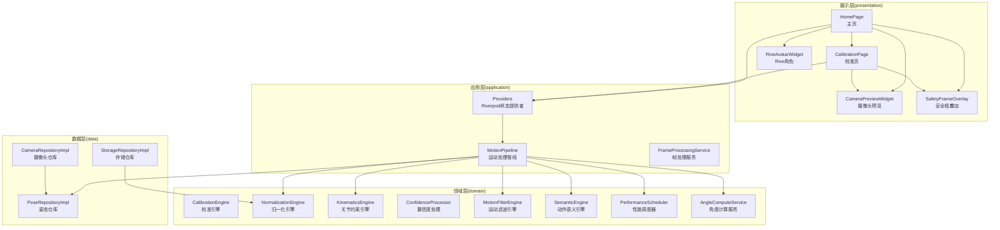
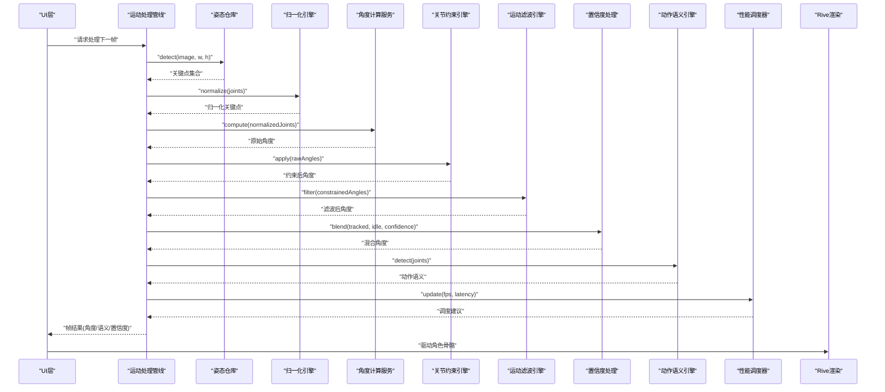
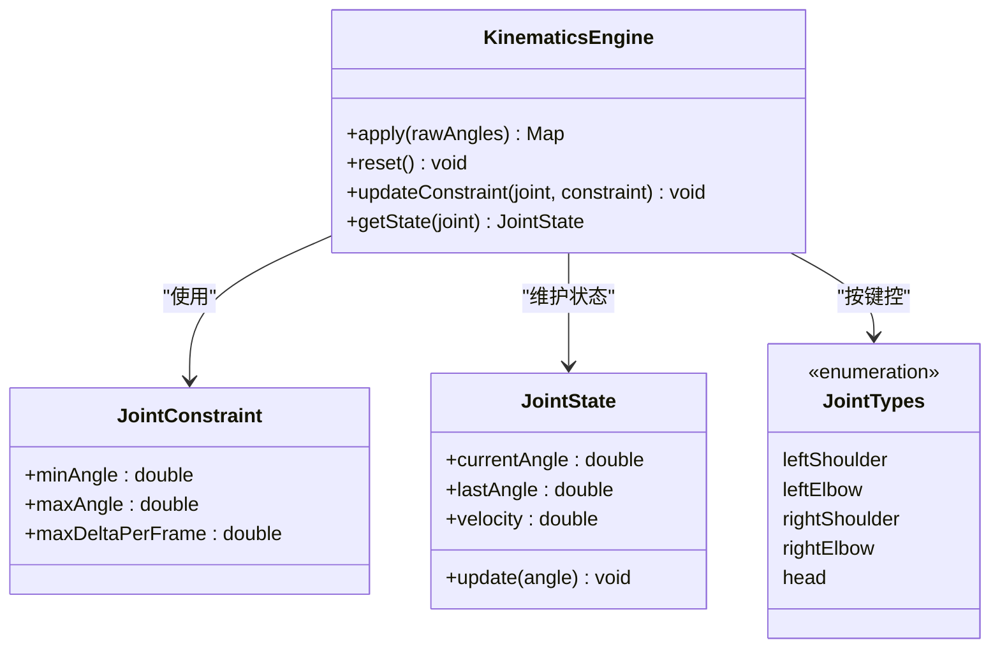
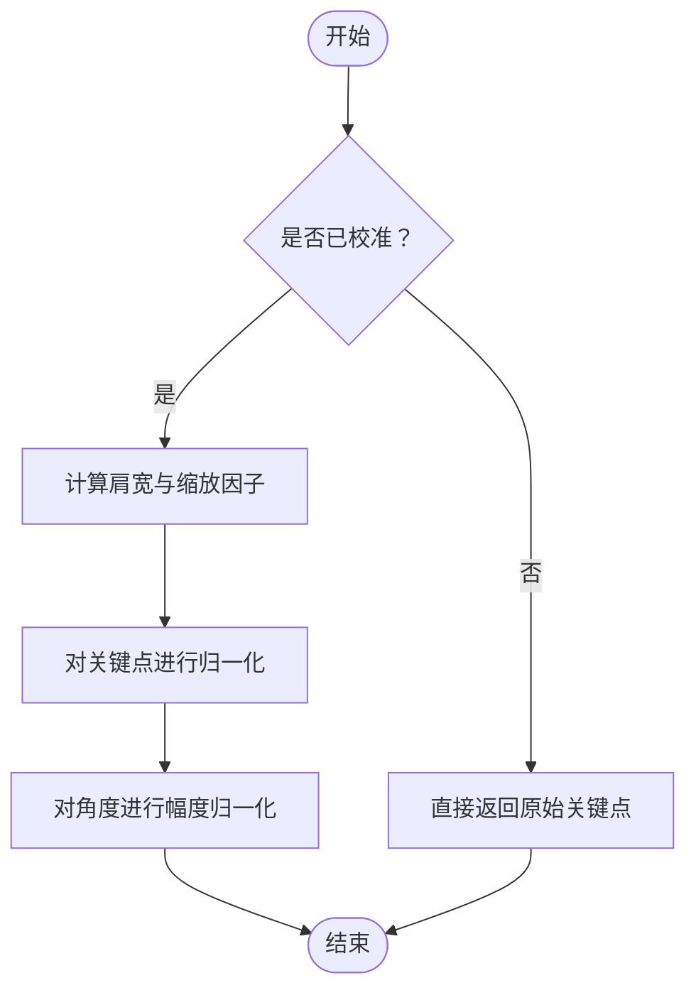
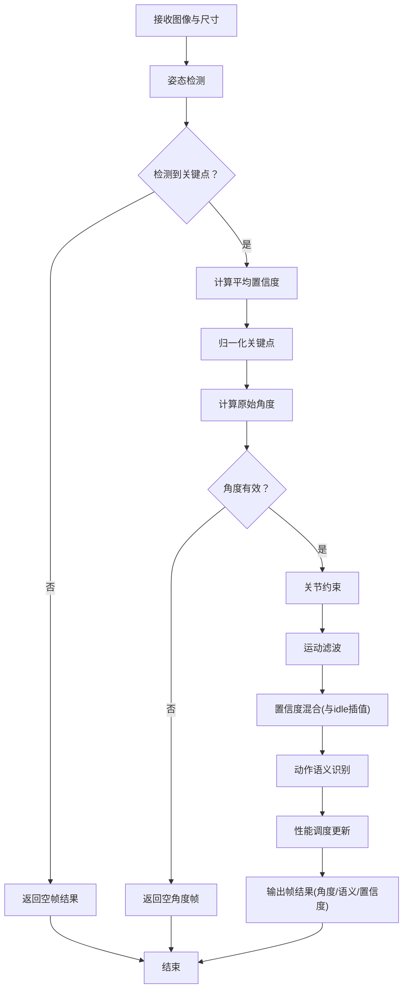
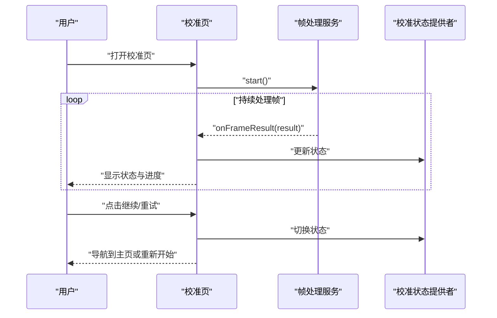
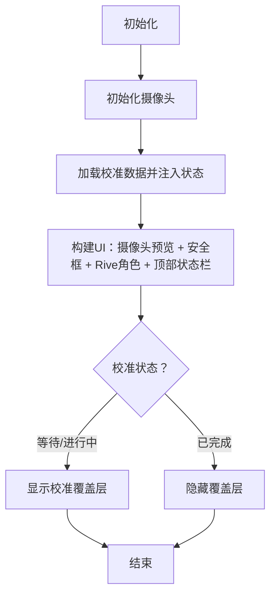
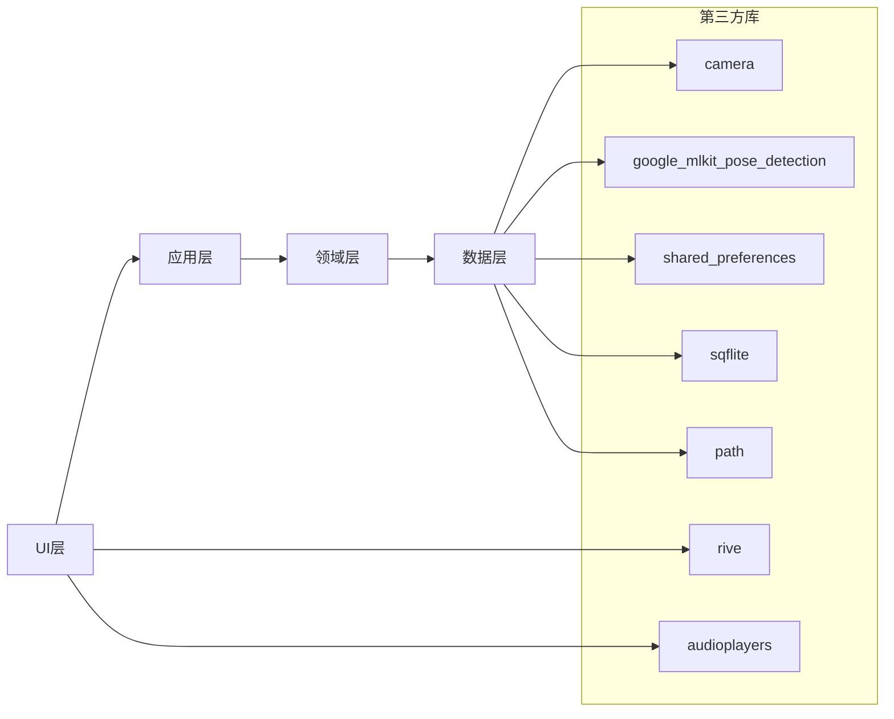

# 项目介绍

<cite>
**本文引用的文件**
- [pubspec.yaml](file://pubspec.yaml)
- [README.md](file://README.md)
- [main.dart](file://lib/main.dart)
- [motion_pipeline.dart](file://lib/application/pipeline/motion_pipeline.dart)
- [kinematics_engine.dart](file://lib/domain/engines/kinematics/kinematics_engine.dart)
- [normalization_engine.dart](file://lib/domain/engines/normalization/normalization_engine.dart)
- [calibration_page.dart](file://lib/presentation/pages/calibration_page.dart)
- [home_page.dart](file://lib/presentation/pages/home_page.dart)
</cite>

## 目录
1. [简介](#简介)
2. [项目结构](#项目结构)
3. [核心组件](#核心组件)
4. [架构总览](#架构总览)
5. [详细组件分析](#详细组件分析)
6. [依赖关系分析](#依赖关系分析)
7. [性能考量](#性能考量)
8. [故障排查指南](#故障排查指南)
9. [结论](#结论)
10. [附录](#附录)

## 简介
Mimo 是一款基于 AI 视觉识别的实时 2D 动作捕捉互动工具，通过手机摄像头捕捉用户肢体动作，并由内置卡通角色实时模仿，带来“人动图动”的趣味交互体验。项目强调零门槛使用（仅需手机摄像头）、极低延迟（端到端延迟目标 ≤ 120ms）、本地隐私处理（所有计算在设备本地完成）、以及角色情感化反馈与生动表现。

Mimo 的技术路线围绕 Clean Architecture 与 Flutter 跨平台框架构建，结合 Google ML Kit（或 MediaPipe）进行姿态识别，使用 Rive 渲染引擎驱动角色动画，配合摄像头采集、置信度处理、角度计算、运动学约束、归一化与滤波等模块，形成完整的实时动作捕捉与驱动管线。同时，项目提供个性化校准（T-Pose）、安全操作区、待机动画、音效反馈、性能调度等能力，覆盖儿童与家庭娱乐、短视频创作、康复与体感教学、体育教学等多个场景。

## 项目结构
Mimo 采用 Clean Architecture 分层组织，主要分为以下层次：
- presentation：UI 页面与部件（主页、校准页、摄像头预览、Rive 角色、安全框叠加层等）
- application：应用编排层（运动处理管线、状态提供者、帧处理服务等）
- domain：领域层（引擎与实体，如关节约束、归一化、置信度处理、语义识别、性能调度等）
- data：数据层（仓库实现，如摄像头、姿态检测、本地存储等）
- core：核心通用能力（未在当前上下文中展开）
- main.dart：应用入口，路由初始化与主题配置

图表来源
- [main.dart:7-33](file://lib/main.dart#L7-L33)
- [motion_pipeline.dart:14-51](file://lib/application/pipeline/motion_pipeline.dart#L14-L51)
- [home_page.dart:9-88](file://lib/presentation/pages/home_page.dart#L9-L88)
- [calibration_page.dart:9-112](file://lib/presentation/pages/calibration_page.dart#L9-L112)

章节来源
- [main.dart:7-33](file://lib/main.dart#L7-L33)
- [pubspec.yaml:30-67](file://pubspec.yaml#L30-L67)

## 核心组件
- 实时人体姿态检测：通过摄像头采集图像，调用姿态检测仓库执行推理，输出关键点集合（包含可见度信息）。
- AI 驱动的动作捕捉：将关键点映射为关节角度，结合归一化、关节约束、滤波与置信度混合，驱动 Rive 角色。
- 个性化校准：基于 T-Pose 引导用户完成初始姿态采集，计算肩宽与角度偏移，形成个体化驱动参数。
- 多平台支持：基于 Flutter 跨平台框架，支持 Android/iOS/Web/Linux/macOS/Windows 等多端部署。
- 性能与稳定性：集成 One Euro Filter、运动学约束、置信度插值、安全区、待机动画与性能调度，保障低延迟与顺滑体验。
- 隐私与本地处理：所有摄像头数据与推理过程在本地完成，不上传任何数据，符合儿童隐私合规要求。

章节来源
- [README.md:32-47](file://README.md#L32-L47)
- [README.md:114-144](file://README.md#L114-L144)
- [README.md:99-104](file://README.md#L99-L104)

## 架构总览
Mimo 的 Clean Architecture 将关注点分离，展示层负责 UI 与交互，应用层负责编排与状态，领域层封装业务规则与算法，数据层对接底层实现。核心数据流如下：

图表来源
- [motion_pipeline.dart:53-130](file://lib/application/pipeline/motion_pipeline.dart#L53-L130)
- [normalization_engine.dart:72-125](file://lib/domain/engines/normalization/normalization_engine.dart#L72-L125)
- [kinematics_engine.dart:31-81](file://lib/domain/engines/kinematics/kinematics_engine.dart#L31-L81)

## 详细组件分析

### 关节运动学引擎（KinematicsEngine）
职责：对原始角度施加人体生物力学约束，限制角度范围与单帧变化量，防止反向弯曲与突变，提升动作自然度与稳定性。

图表来源
- [kinematics_engine.dart:9-95](file://lib/domain/engines/kinematics/kinematics_engine.dart#L9-L95)

章节来源
- [kinematics_engine.dart:6-87](file://lib/domain/engines/kinematics/kinematics_engine.dart#L6-L87)

### 人体归一化引擎（NormalizationEngine）
职责：基于 T-Pose 校准得到的肩宽与肢体长度，计算缩放因子，对关键点与角度进行归一化，使不同体型用户的动作幅度达到一致体验。

图表来源
- [normalization_engine.dart:18-125](file://lib/domain/engines/normalization/normalization_engine.dart#L18-L125)

章节来源
- [normalization_engine.dart:6-143](file://lib/domain/engines/normalization/normalization_engine.dart#L6-L143)

### 运动处理管线（MotionPipeline）
职责：串联姿态检测、归一化、角度计算、关节约束、滤波、置信度混合、动作语义识别与性能调度，形成完整的帧处理闭环。

图表来源
- [motion_pipeline.dart:53-130](file://lib/application/pipeline/motion_pipeline.dart#L53-L130)

章节来源
- [motion_pipeline.dart:14-141](file://lib/application/pipeline/motion_pipeline.dart#L14-L141)

### 校准与引导（CalibrationPage）
职责：引导用户完成 T-Pose 校准，实时反馈状态（等待检测、检测到人体、T-Pose 检测、校准中、成功、失败），并在成功后跳转主页。

图表来源
- [calibration_page.dart:25-51](file://lib/presentation/pages/calibration_page.dart#L25-L51)
- [calibration_page.dart:114-182](file://lib/presentation/pages/calibration_page.dart#L114-L182)
- [calibration_page.dart:281-286](file://lib/presentation/pages/calibration_page.dart#L281-L286)

章节来源
- [calibration_page.dart:9-286](file://lib/presentation/pages/calibration_page.dart#L9-L286)

### 主页与实时互动（HomePage）
职责：加载摄像头预览、叠加安全框、展示 Rive 角色层，顶部显示 FPS 等状态信息；根据校准状态决定是否显示校准覆盖层。

图表来源
- [home_page.dart:24-36](file://lib/presentation/pages/home_page.dart#L24-L36)
- [home_page.dart:38-88](file://lib/presentation/pages/home_page.dart#L38-L88)

章节来源
- [home_page.dart:9-215](file://lib/presentation/pages/home_page.dart#L9-L215)

## 依赖关系分析
- 技术栈与第三方库：Flutter SDK、Riverpod（状态管理）、camera（摄像头）、rive（动画渲染）、google_mlkit_pose_detection（姿态识别）、shared_preferences/sqflite/path（本地存储）、audioplayers（音效）、uuid/intl（工具类）。
- 逻辑依赖：UI 通过 Riverpod 与应用层交互；应用层编排领域引擎；领域引擎依赖数据层仓库；数据层对接底层实现（摄像头、ML 推理、文件系统）。

图表来源
- [pubspec.yaml:30-67](file://pubspec.yaml#L30-L67)

章节来源
- [pubspec.yaml:30-67](file://pubspec.yaml#L30-L67)

## 性能考量
- 延迟目标：端到端延迟 ≤ 120ms（P90），渲染帧率 60 FPS（插值），推理帧率 20–30 FPS（可降级至 15）。
- 降采样与热管理：设备温度 > 45°C 时降低推理频率至 15 FPS；空闲 30 秒降至 5 FPS；空闲 2 分钟释放摄像头。
- 滤波与稳定性：采用 One Euro Filter 抗抖，结合速度限制、单帧变化量限制与置信度插值，减少突变与卡顿。
- 资源占用：CPU 占用 ≤ 40%（中端机），内存占用 ≤ 300MB（运行 30 分钟后），电池消耗 ≤ 20%/小时（4000mAh）。

章节来源
- [README.md:75-84](file://README.md#L75-L84)
- [README.md:86-91](file://README.md#L86-L91)
- [README.md:4-47](file://README.md#L4-L47)

## 故障排查指南
- 校准失败：检查光照条件（充足光线）、T-Pose 是否标准（双臂与躯干夹角 > 60° 且持续 1 秒）、摄像头是否被遮挡；必要时重试或使用默认参数。
- 动作不自然：确认关节约束与滤波参数是否生效；检查置信度插值策略是否启用；适当提高滤波强度或降低动作幅度。
- 延迟过大：检查设备温度与性能调度是否处于降级模式；尝试降低分辨率或减少后台应用；确保摄像头预览与推理帧率稳定。
- 隐私与权限：首次启动需弹出隐私说明并获得摄像头授权；应用退后台应自动释放摄像头资源；不得越权访问相册、麦克风等。

章节来源
- [README.md:221-232](file://README.md#L221-L232)
- [README.md:99-104](file://README.md#L99-L104)

## 结论
Mimo 以 Clean Architecture 与 Flutter 跨平台为核心，结合 AI 视觉识别与 Rive 动画渲染，实现了低门槛、低延迟、高稳定性的实时 2D 动作捕捉互动体验。通过个性化校准、归一化与运动学约束、置信度插值与性能调度等关键技术，项目在儿童娱乐、短视频创作、康复训练与体育教学等领域具备显著的应用潜力与商业价值。对于初学者，Mimo 的清晰分层与模块化设计有助于快速理解与二次开发。

## 附录
- 技术选型与逻辑架构参考：README 第 4 章“技术架构”与第 4.2 节“逻辑架构图”。
- 功能清单与验收标准：README 第 2 章“功能需求”与第 9 章“验收标准”。

章节来源
- [README.md:114-144](file://README.md#L114-L144)
- [README.md:32-47](file://README.md#L32-L47)
- [README.md:261-276](file://README.md#L261-L276)