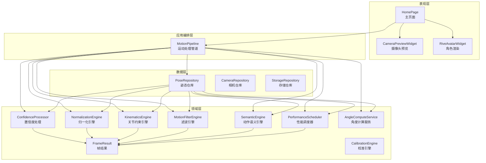
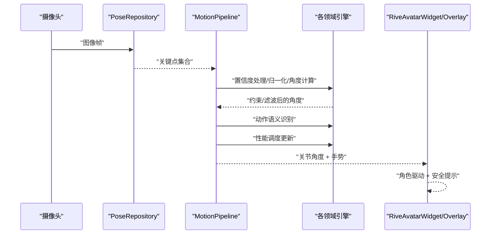
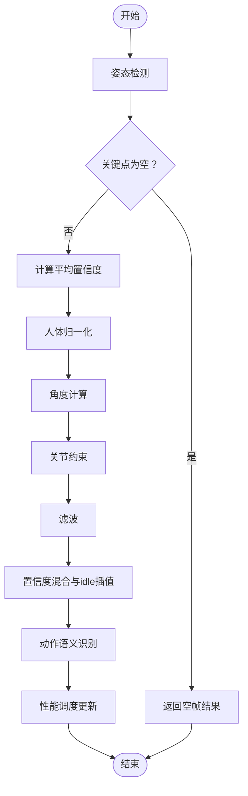
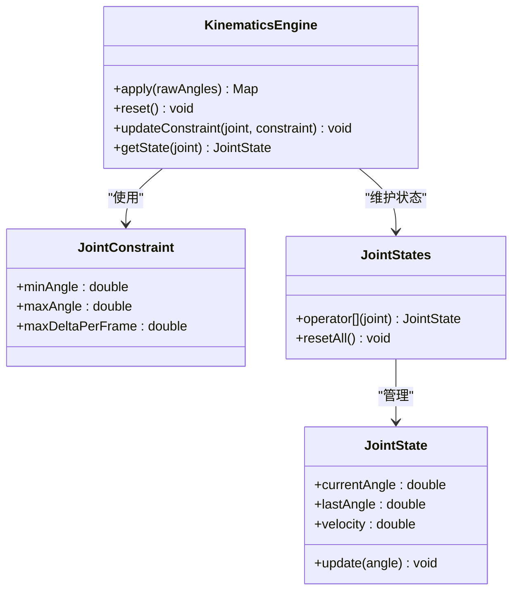
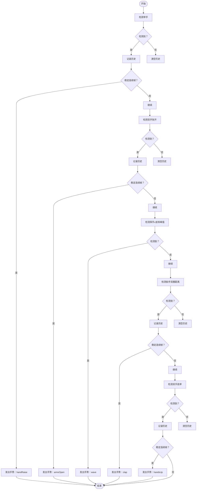
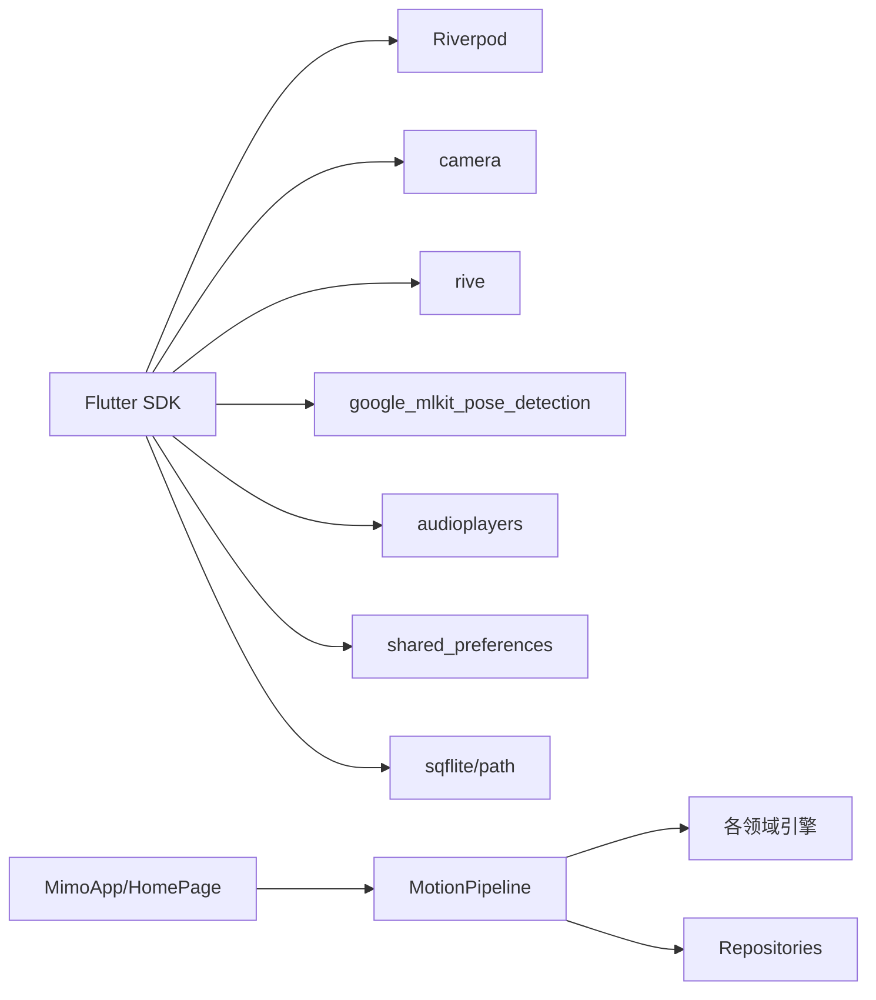

# 项目概述

<cite>
**本文引用的文件**
- [pubspec.yaml](file://pubspec.yaml)
- [README.md](file://README.md)
- [lib/main.dart](file://lib/main.dart)
- [lib/app/app.dart](file://lib/app/app.dart)
- [lib/application/pipeline/motion_pipeline.dart](file://lib/application/pipeline/motion_pipeline.dart)
- [lib/domain/entities/frame_result.dart](file://lib/domain/entities/frame_result.dart)
- [lib/domain/engines/kinematics/kinematics_engine.dart](file://lib/domain/engines/kinematics/kinematics_engine.dart)
- [lib/domain/engines/semantic/semantic_engine.dart](file://lib/domain/engines/semantic/semantic_engine.dart)
- [lib/presentation/pages/home_page.dart](file://lib/presentation/pages/home_page.dart)
</cite>

## 目录
1. [简介](#简介)
2. [项目结构](#项目结构)
3. [核心组件](#核心组件)
4. [架构总览](#架构总览)
5. [详细组件分析](#详细组件分析)
6. [依赖关系分析](#依赖关系分析)
7. [性能考量](#性能考量)
8. [故障排查指南](#故障排查指南)
9. [结论](#结论)
10. [附录](#附录)

## 简介
Mimo 是一款基于 AI 视觉识别的实时 2D 动作捕捉互动工具，通过手机摄像头采集用户上半身姿态，驱动 Rive 角色进行同步表演。其核心价值在于“零门槛、低延迟、本地化、可扩展”，既适合儿童与家庭娱乐，也能支撑短视频创作与康复/教育轻度应用。项目采用 Flutter 跨平台框架，结合 Google ML Kit（或 mediapipe_flutter）进行姿态识别，配合 One Euro Filter 等算法实现低抖动、高跟手的动作驱动，并通过状态管理与分层架构保障可维护性与可演进性。

- 产品定位：AI 视觉识别实时 2D 动捕互动工具
- 核心价值：零门槛、实时反馈（端到端延迟 < 120ms）、角色生动、隐私安全（本地计算）
- 技术愿景：构建“稳定、自然、好玩”的动作驱动引擎，为后续角色商城、多人派对、开发者 API 等扩展打下坚实基础

章节来源
- [README.md:1-30](file://README.md#L1-L30)
- [pubspec.yaml:1-80](file://pubspec.yaml#L1-L80)

## 项目结构
Mimo 采用“领域驱动 + 分层架构”的组织方式，代码按职责划分为 presentation（表现层）、application（应用编排层）、domain（领域层）、data（数据层）、core（基础设施）等模块，辅以 assets 资源与多平台工程目录（android/ios/web 等）。

- 应用入口与主题：lib/main.dart 与 lib/app/app.dart
- 页面与控件：lib/presentation/pages 与 widgets
- 应用编排：lib/application/pipeline/motion_pipeline.dart
- 领域模型与引擎：lib/domain/entities 与 engines
- 数据与仓储：lib/data/repositories_impl 与 datasources
- 核心依赖：Flutter、Riverpod、camera、rive、google_mlkit_pose_detection、audioplayers 等

图表来源
- [lib/presentation/pages/home_page.dart:1-214](file://lib/presentation/pages/home_page.dart#L1-L214)
- [lib/application/pipeline/motion_pipeline.dart:1-141](file://lib/application/pipeline/motion_pipeline.dart#L1-L141)
- [lib/domain/entities/frame_result.dart:1-93](file://lib/domain/entities/frame_result.dart#L1-L93)

章节来源
- [lib/app/app.dart:1-27](file://lib/app/app.dart#L1-L27)
- [lib/main.dart:1-123](file://lib/main.dart#L1-L123)
- [pubspec.yaml:30-80](file://pubspec.yaml#L30-L80)

## 核心组件
- 运动处理管道（MotionPipeline）：串联姿态检测、置信度处理、归一化、角度计算、关节约束、滤波、语义识别与性能调度，统一输出帧结果
- 关节运动学引擎（KinematicsEngine）：对原始角度施加角度范围与单帧变化量限制，保证动作符合人体生物力学
- 动作语义引擎（SemanticEngine）：识别举手、双手张开、挥手、拍手、双手高举等手势，用于触发音效与表情反馈
- 帧结果实体（FrameResult）：承载关节角度、手势、置信度与时间戳，支持空帧与复制扩展
- 主页面（HomePage）：组织摄像头预览、安全框叠加、角色渲染与顶部状态栏，协调校准覆盖层

章节来源
- [lib/application/pipeline/motion_pipeline.dart:1-141](file://lib/application/pipeline/motion_pipeline.dart#L1-L141)
- [lib/domain/engines/kinematics/kinematics_engine.dart:1-95](file://lib/domain/engines/kinematics/kinematics_engine.dart#L1-L95)
- [lib/domain/engines/semantic/semantic_engine.dart:1-221](file://lib/domain/engines/semantic/semantic_engine.dart#L1-L221)
- [lib/domain/entities/frame_result.dart:1-93](file://lib/domain/entities/frame_result.dart#L1-L93)
- [lib/presentation/pages/home_page.dart:1-214](file://lib/presentation/pages/home_page.dart#L1-L214)

## 架构总览
Mimo 的整体架构遵循“输入 → 处理 → 输出 → 反馈”的闭环：摄像头采集图像帧，通过姿态仓库进行推理，得到关键点；随后由置信度处理、归一化、角度计算、关节约束与滤波等步骤生成稳定的关节角度；语义引擎识别手势，性能调度器根据实时指标动态调整推理频率；最终将角度与手势驱动到 Rive 角色与 UI 叠加层，形成“人动，图动”的即时反馈。

图表来源
- [lib/application/pipeline/motion_pipeline.dart:53-130](file://lib/application/pipeline/motion_pipeline.dart#L53-L130)
- [lib/presentation/pages/home_page.dart:41-87](file://lib/presentation/pages/home_page.dart#L41-L87)

章节来源
- [README.md:114-174](file://README.md#L114-L174)

## 详细组件分析

### 运动处理管道（MotionPipeline）
- 职责：编排整个帧处理流水线，串联姿态检测、置信度处理、归一化、角度计算、关节约束、滤波、语义识别与性能调度
- 关键流程：
  - 姿态检测 → 计算平均置信度 → 归一化 → 角度计算 → 关节约束 → 滤波 → 置信度混合（与 idle 插值）→ 语义识别 → 性能调度更新
  - 空帧处理：返回空帧结果，用于 idle 状态
- 复杂度：每帧 O(N)（N 为关节数），主要瓶颈在姿态检测与滤波

图表来源
- [lib/application/pipeline/motion_pipeline.dart:61-130](file://lib/application/pipeline/motion_pipeline.dart#L61-L130)

章节来源
- [lib/application/pipeline/motion_pipeline.dart:1-141](file://lib/application/pipeline/motion_pipeline.dart#L1-L141)

### 关节运动学引擎（KinematicsEngine）
- 职责：对单关节施加角度范围与单帧变化量限制，防止反向弯曲与突变，保证动作自然
- 关键点：
  - 角度范围限制（度数转弧度）
  - 单帧最大变化量限制
  - 状态缓存（currentAngle/velocity），用于约束与平滑
- 复杂度：O(J)（J 为参与约束的关节数）

图表来源
- [lib/domain/engines/kinematics/kinematics_engine.dart:1-95](file://lib/domain/engines/kinematics/kinematics_engine.dart#L1-L95)

章节来源
- [lib/domain/engines/kinematics/kinematics_engine.dart:1-95](file://lib/domain/engines/kinematics/kinematics_engine.dart#L1-L95)

### 动作语义引擎（SemanticEngine）
- 职责：识别举手、双手张开、挥手、拍手、双手高举等手势，用于触发音效、表情与互动反馈
- 关键点：
  - 基于关键点坐标与置信度阈值
  - 使用历史记录与稳定帧数判定，避免误触
  - 挥手检测使用 x 坐标序列的峰值计数
- 复杂度：O(F)（F 为历史帧长度）

图表来源
- [lib/domain/engines/semantic/semantic_engine.dart:32-221](file://lib/domain/engines/semantic/semantic_engine.dart#L32-L221)

章节来源
- [lib/domain/engines/semantic/semantic_engine.dart:1-221](file://lib/domain/engines/semantic/semantic_engine.dart#L1-L221)

### 帧结果实体（FrameResult）
- 职责：封装单帧处理结果，包含关节角度、手势、置信度与时间戳，支持空帧与复制扩展
- 关键点：
  - empty 工厂方法用于 idle 状态
  - hasValidData/isIdle 等便捷判断
  - copyWith 支持不可变更新

章节来源
- [lib/domain/entities/frame_result.dart:1-93](file://lib/domain/entities/frame_result.dart#L1-L93)

### 主页面（HomePage）
- 职责：组织 UI 布局（角色层、摄像头层、安全框叠加、顶部状态栏），协调初始化与校准覆盖层
- 关键点：
  - 初始化摄像头与加载校准数据
  - 根据校准状态显示覆盖层
  - 展示 FPS 指示与设置入口

章节来源
- [lib/presentation/pages/home_page.dart:1-214](file://lib/presentation/pages/home_page.dart#L1-L214)

## 依赖关系分析
- 技术栈与组件依赖：
  - Flutter 与 Riverpod：跨平台 UI 与状态管理
  - camera：摄像头预览与图像采集
  - rive：矢量动画渲染
  - google_mlkit_pose_detection：姿态识别
  - audioplayers：音效播放
  - shared_preferences/sqflite/path：本地存储
- 业务依赖：
  - MotionPipeline 依赖各领域引擎与仓库
  - Presentation 层依赖应用编排层与领域模型

图表来源
- [pubspec.yaml:30-80](file://pubspec.yaml#L30-L80)
- [lib/app/app.dart:10-26](file://lib/app/app.dart#L10-L26)
- [lib/presentation/pages/home_page.dart:41-87](file://lib/presentation/pages/home_page.dart#L41-L87)

章节来源
- [pubspec.yaml:30-80](file://pubspec.yaml#L30-L80)
- [lib/app/app.dart:1-27](file://lib/app/app.dart#L1-L27)

## 性能考量
- 目标指标：
  - 端到端延迟 ≤ 120ms（P90）
  - 推理帧率 20~30 FPS（可降级至 15）
  - 渲染帧率 60 FPS（插值）
  - CPU 占用 ≤ 40%（中端机）
- 已实现策略：
  - One Euro Filter 与关节约束降低抖动
  - 置信度混合（与 idle 插值）提升自然度
  - 性能调度器根据 FPS 与延迟动态调整
- 建议优化方向（来自需求文档）：
  - 组合滤波（One Euro + 速度滤波 + 死区）
  - 动态滤波参数随速度自适应
  - 自适应性能调度器（基于温度趋势、推理耗时、FPS）
  - 人体尺度归一化（肩宽比例、手臂长度缩放）

章节来源
- [README.md:75-111](file://README.md#L75-L111)
- [README.md:470-501](file://README.md#L470-L501)
- [README.md:557-580](file://README.md#L557-L580)

## 故障排查指南
- 常见问题与定位思路：
  - 校准失败率高：检查 T-Pose 引导与自动检测逻辑，确保光照充足、动作稳定
  - 动作抖动/僵硬：检查滤波参数与关节约束是否生效，确认置信度混合策略
  - 多人/背景干扰：确认仅跟踪中心最近的人体骨架，必要时引入 tracking ID 稳定性判断
  - 发热降频：确认性能调度器在温度趋势升高时提前降级，避免过热后才降级
- 埋点与日志：
  - 记录 app_start、camera_granted、calibration_success/fail、pose_track_start、jitter_event、overheat_warning、session_end 等事件
  - 本地存储校准参数与用户设置，便于复现与回溯

章节来源
- [README.md:177-211](file://README.md#L177-L211)
- [README.md:86-92](file://README.md#L86-L92)
- [README.md:581-600](file://README.md#L581-L600)

## 结论
Mimo 以“稳定、自然、好玩”为目标，构建了从摄像头采集到 Rive 角色驱动的完整管线。通过分层架构与模块化引擎，项目在可维护性与可扩展性上具备良好基础。面向未来，建议优先补齐“关节约束系统、人体尺度归一化、渐进式置信度控制、基础动作语义、动态滤波与自适应性能调度器”，以进一步提升真实世界下的稳定性与用户体验，并为角色商城、多人派对、开发者 API 等功能预留接口。

## 附录
- 版本与里程碑：
  - v1.0（需求文档版本）：MVP 需求基线，明确功能、性能与隐私要求
  - 开发里程碑：6 周 MVP 计划，涵盖环境搭建、集成、优化与内测
- 术语表：
  - T-Pose：双臂侧平举的标准站姿，用于校准初始角度
  - 关键点丢失：MediaPipe 输出的 visibility 低于阈值
  - 端到端延迟：从真实动作发生到角色动作渲染完成的耗时
  - 降采样：降低 AI 推理的帧率以减少计算负载

章节来源
- [README.md:294-296](file://README.md#L294-L296)
- [README.md:235-245](file://README.md#L235-L245)
- [README.md:286-293](file://README.md#L286-L293)